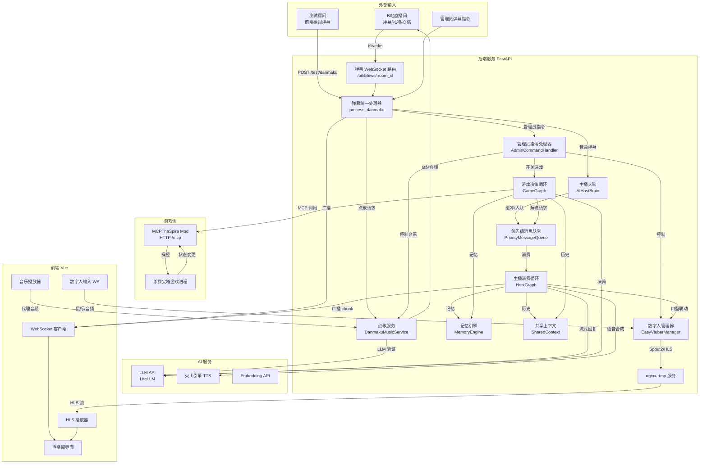

# 业务流程总览

本文档梳理 FeinaLive 系统的主要业务场景、涉及角色、全局业务流程图，以及各流程节点的高层说明。各场景的详细流程见同目录下其他文档。

---

## 一、系统定位

FeinaLive 是一个 7×24 小时无人值守的虚拟主播直播系统，核心能力包括：

- **AI 主播对话**：实时响应 B 站弹幕，LLM 生成风格化回复并 TTS 语音播报
- **数字人渲染**：EasyVtuber 驱动 Live2D 风格虚拟形象，口型与语音同步
- **弹幕点歌**：观众通过弹幕点歌，LLM 验证后入队自动播放
- **游戏 AI 自动化**：通过 MCP 协议操控《杀戮尖塔》，AI 自主决策并解说
- **管理员控制**：管理员通过弹幕指令控制主播行为、音乐、游戏开关
- **直播推流**：nginx-rtmp 提供 HLS 直播流，前端实时播放

---

## 二、涉及角色

| 角色 | 标识 | 说明 |
|------|------|------|
| 观众 | B 站直播间访客 | 发送弹幕、礼物、点歌，与 AI 主播互动 |
| AI 主播 | Host | 由 LLM 驱动的虚拟主播人格，负责对话与解说 |
| 数字人 | Avatar | EasyVtuber 渲染的虚拟形象，是主播的视觉载体 |
| 管理员 | `admin_uid` / `admin_username` | 通过弹幕指令控制系统行为，默认 UID `378810242` |
| 游戏 AI | GameGraph | 自动游玩游戏的智能体，与主播协同 |
| MCP 服务 | MCPServer | 游戏内 Mod 暴露的 HTTP 接口，供 AI 操控游戏 |
| 后端服务 | FastAPI | 中心枢纽，连接 B 站、AI、数字人、前端 |
| 前端 | Vue 3 | 直播间控制台，展示弹幕、视频、音乐、配置 |

---

## 三、主要业务场景

| 编号 | 场景 | 触发方 | 核心流程文档 |
|------|------|--------|--------------|
| B1 | 弹幕接收与分发 | 观众发送弹幕 | [01-弹幕接收与分发流程](./01-弹幕接收与分发流程.md) |
| B2 | AI 主播对话 | 弹幕触发 | [02-AI主播对话流程](./02-AI主播对话流程.md) |
| B3 | 弹幕点歌 | 观众发送"点歌 xxx" | [03-弹幕点歌流程](./03-弹幕点歌流程.md) |
| B4 | 游戏 AI 自动化 | 管理员 `/mcp 1` | [04-游戏AI自动化流程](./04-游戏AI自动化流程.md) |
| B5 | 数字人渲染 | 系统启动 | [05-数字人渲染流程](./05-数字人渲染流程.md) |
| B6 | 管理员指令控制 | 管理员发送 `/xxx` | [06-管理员指令流程](./06-管理员指令流程.md) |
| B7 | 礼物感谢 | 观众送礼 | 见 B2 文档中礼物处理章节 |
| B8 | 直播推流 | 系统启动 nginx | 见 B5 文档中推流章节 |

---

## 四、全局业务流程图

下图展示系统启动后各业务场景的协同关系与数据流向。

---

## 五、流程节点高层说明

### 5.1 弹幕接入节点

| 节点 | 功能 | 涉及角色 | 业务逻辑 |
|------|------|----------|----------|
| B 站弹幕客户端 | 建立 WebSocket 连接到 B 站直播间 | BilibiliClient | 使用 blivedm 库，需 SESSDATA 凭证获取完整用户信息 |
| 弹幕 WebSocket 路由 | 接收前端 WebSocket 连接，转发弹幕 | WSRouter | 按 room_id 管理连接，弹幕广播给所有连接 |
| 弹幕统一处理器 | 弹幕分发中枢 | DanmakuHandler | 区分管理员指令、点歌、普通弹幕，分别路由 |

### 5.2 AI 主播节点

| 节点 | 功能 | 涉及角色 | 业务逻辑 |
|------|------|----------|----------|
| 主播大脑 | 弹幕缓冲与轮询 | HostBrain | 合并同用户连续弹幕，按优先级入队 |
| 优先级消息队列 | 消息调度 | MsgQueue | 动态优先级（饥饿升级/洪流降级）、频率限制、用户冷却 |
| 主播消费循环 | 消费队列生成回复 | HostGraph | 区分弹幕/礼物/解说请求，构建 prompt 调 LLM |
| LLM 流式生成 | 生成风格化回复 | LLM | 按"菲娜"人设，40 字以内，禁 emoji |
| TTS 句级合成 | 语音合成 | TTS | 火山引擎声音复刻，按句并行合成 |
| 数字人口型联动 | 驱动口型 | EasyVtuberMgr | TTS 播放时 set_speaking(True)，音频电平驱动嘴部 |

### 5.3 点歌节点

| 节点 | 功能 | 涏及角色 | 业务逻辑 |
|------|------|----------|----------|
| 点歌拦截 | 识别点歌弹幕 | MusicService | 匹配"点歌/来一首/播放"前缀或 BV 号 |
| 歌曲解析 | 获取音频直链 | BilibiliMusicClient | 优先匹配预备歌单，否则搜索 UP 主视频 |
| LLM 验证 | 判断是否为音乐 | LLM | 时长 60-480 秒，分析标题/简介/热门评论 |
| 播放队列 | 队列管理 | MusicQueue | 用户限 2 首，队列上限 5 首，自动播放循环 |
| 音频代理 | 转发音频流 | MusicRouter | 加 Referer 头绕过 B 站防盗链 |

### 5.4 游戏 AI 节点

| 节点 | 功能 | 涉及角色 | 业务逻辑 |
|------|------|----------|----------|
| 游戏管理器 | 统一启停 | GameManager | 管理 GameGraph 与 HostGraph 生命周期 |
| 游戏决策循环 | 状态机决策 | GameGraph | 收集状态→回合守卫→构建 prompt→LLM 决策→工具执行 |
| MCP 适配器 | 协议适配 | SlayTheSpireAdapter | 统一状态格式，分发 14 种动作 |
| MCP 服务 | 游戏内 HTTP 服务 | MCPServer | JSON-RPC 2.0，17 个工具，线程安全 |
| 解说协调 | 主播与游戏协同 | CommentaryCoordinator | 合并解说请求，限流，等待主播播报完成 |

### 5.5 数字人节点

| 节点 | 功能 | 涉及角色 | 业务逻辑 |
|------|------|----------|----------|
| 输入进程 | 采集姿态数据 | InputClient | 支持 hybrid/osf/mouse/audio/debug 等输入 |
| 推理进程 | 模型推理 | ModelClientProcess | THA3/THA4 模型，ONNX/TensorRT 加速 |
| 输出 | 画面输出 | Spout2/pyvirtualcam | 透明通道输出到 OBS 或虚拟摄像头 |
| 推流 | HLS 直播流 | NginxService | nginx-rtmp 接收推流，输出 HLS |

### 5.6 管理员控制节点

| 节点 | 功能 | 涉及角色 | 业务逻辑 |
|------|------|----------|----------|
| 指令解析 | 识别 `/xxx` 指令 | AdminHandler | 基于 UID/用户名鉴权 |
| 指令执行 | 分发执行 | AdminHandler | 控制主播状态、音乐、游戏、数字人 |
| 状态回调 | 通知子系统 | Callbacks | face_mode/volume/pause/mcp 等回调 |

---

## 六、业务场景关联说明

### 6.1 弹幕是系统核心入口

所有观众交互都通过弹幕进入系统。`process_danmaku` 是统一分发中枢，按优先级顺序处理：
1. 管理员指令（最高优先级，直接拦截）
2. 点歌请求（拦截，不进入 AI 回复）
3. 普通弹幕（广播 + 推入 AI 主播缓冲区）

### 6.2 AI 主播与游戏 AI 协同

当游戏 AI 启用时，两个 Graph 并行运行：
- **GameGraph** 负责游戏决策，通过 `commentary_request` 消息请求主播解说
- **HostGraph** 消费队列，生成解说话术并 TTS 播报
- **SharedContext** 作为两者共享层，存储历史与三层记忆
- **CommentaryCoordinator** 协调解说请求的合并、限流与 ACK 等待

### 6.3 数字人与音频联动

数字人口型由两条路径驱动：
- **TTS 音频电平**：LLM store 的 AudioPlayer 通过 AnalyserNode 计算电平，经 `/avatar/input` WebSocket 发送给 EasyVtuber
- **直接音频输入**：EasyVtuber 的 audio/hybrid 输入模式可直接采集系统音频

### 6.4 测试房间机制

`use_test_room` 配置启用后，前端可通过 `/test/danmaku` 发送模拟弹幕，走完整 `process_danmaku` 流程，便于无 B 站连接时调试。

---

## 七、关键配置项速查

| 配置项 | 说明 | 默认值 |
|--------|------|--------|
| `bilibili.room_id` | B 站直播间 ID | 0 |
| `bilibili.sessdata` | B 站登录凭证 | 空 |
| `default_room_id` | 默认房间 ID（AI 主播隔离） | 0 |
| `admin.uid` | 管理员 UID | 378810242 |
| `game.enabled` | 是否启用游戏 AI | false |
| `game.mcp_url` | MCP 服务地址 | http://127.0.0.1:8080 |
| `easyvtuber.enabled` | 是否启用数字人 | true |
| `llm.model` | 通用 LLM 模型 | - |
| `host.model` | 主播 LLM 模型 | - |
| `tts.provider` | TTS 提供商 | volcano |

> 完整配置说明见 [系统架构 - 技术栈选型说明](../02-系统架构/01-技术栈选型说明.md) 与 `backend/config.example.yaml`。
