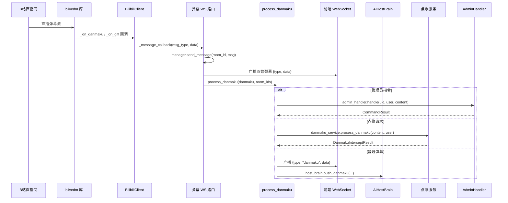
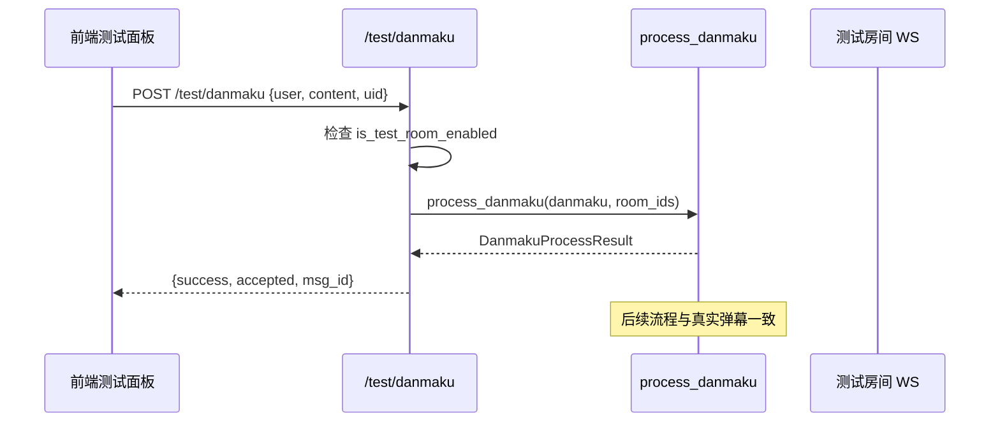
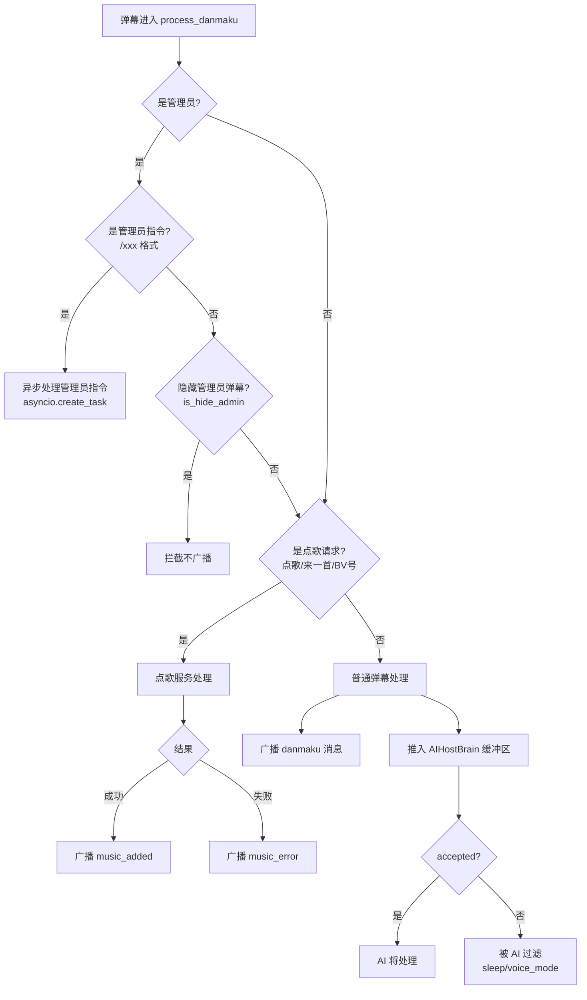

# 弹幕接收与分发流程

本文档详细描述 B 站弹幕从接入到分发的完整流程，包括真实弹幕与测试弹幕两条路径。

---

## 一、流程图

### 1.1 真实弹幕接入流程



### 1.2 测试弹幕流程



### 1.3 弹幕分发决策流程



---

## 二、流程节点详解

### 2.1 B 站弹幕客户端连接

**涉及文件**：`backend/apps/live/bilibili/client.py`

**节点功能**：建立到 B 站直播间的 WebSocket 连接，接收实时弹幕流。

**业务逻辑**：
1. 前端通过 `/bilibili/ws/{room_id}` 连接后端 WebSocket
2. 后端检查该 room_id 是否已有 `BilibiliClient`，无则创建
3. `BilibiliClient.connect()` 创建 `blivedm.BLiveClient`：
   - 若配置了 `bilibili_sessdata`：创建带 CookieJar 的 aiohttp session，传入 SESSDATA 凭证，可获取完整用户名和 UID
   - 无 SESSDATA：用户名会被 B 站遮蔽为"UID:xxx"，UID 为 0
4. `CustomHandler` 继承 `blivedm.BaseHandler`，注册回调：
   - `_on_danmaku`：弹幕消息 → 构造 `DanmakuData` → 异步回调
   - `_on_gift`：礼物消息 → 构造 `GiftData` → 异步回调
   - `_on_heartbeat`：心跳（空实现）
   - `_on_buy_guard` / `_on_super_chat`：空实现

**涉及角色**：B 站直播间、blivedm 库、BilibiliClient

**关键数据结构**：
```python
# DanmakuData
{
    "uid": 12345,
    "user": "用户名",
    "content": "弹幕内容",
    "timestamp": "2026-04-09T10:30:00",
    "color": "#FFFFFF",
    "medal_level": 5,
    "medal_name": "粉丝牌",
    "privilege_type": 0
}

# GiftData
{
    "uid": 12345,
    "uname": "用户名",
    "gift_name": "辣条",
    "num": 1,
    "total_coin": 100
}
```

### 2.2 弹幕 WebSocket 路由

**涉及文件**：`backend/apps/live/bilibili/router.py`

**节点功能**：管理前端 WebSocket 连接，桥接 B 站弹幕到前端，并触发弹幕处理。

**业务逻辑**：
1. 前端连接 `ws://host/bilibili/ws/{room_id}`
2. `manager.connect(websocket, room_id)` 接受连接并注册到 ConnectionManager
3. 若该 room_id 无 BilibiliClient，创建并设置回调 `on_message`：
   - 收到弹幕/礼物消息 → `manager.send_message(room_id, message)` 广播到前端
   - 收到弹幕 → 构造 `ProcessDanmakuData` → 调用 `process_danmaku(...)`
   - 收到礼物 → 计算优先级 → 构造 `Message` → 入消息队列（`msg_type="gift_thanks"`）
4. 启动 BilibiliClient 连接 B 站
5. 循环接收前端 WebSocket 文本（保持连接）
6. 前端断开时 `manager.disconnect(room_id)`，若该房间无其他连接则关闭 BilibiliClient

**涉及角色**：前端 WebSocket、ConnectionManager、BilibiliClient、process_danmaku

**关键端点**：
- `WebSocket /bilibili/ws/{room_id}`：弹幕流
- `WebSocket /bilibili/ws/test/{room_id}`：测试用，不连接 B 站
- `GET /bilibili/sessdata/verify`：验证 SESSDATA 有效性
- `POST /bilibili/sessdata/update`：更新 SESSDATA 配置

### 2.3 弹幕统一处理器

**涉及文件**：`backend/apps/live/danmaku_handler.py`

**节点功能**：弹幕分发的核心中枢，按类型路由到不同处理逻辑。

**业务逻辑**（按优先级顺序）：

1. **管理员指令拦截**
   - 判断条件：`admin_handler.is_admin(uid)` 或 `is_admin_by_username(user)` 且 `is_admin_command(content)`（匹配 `^/(\w+)\s*(\S*)$`）
   - 处理：`asyncio.create_task(admin_handler.handle(uid, username, content))` 异步执行
   - 返回：`intercepted=True`，不继续后续流程

2. **管理员弹幕过滤**
   - 判断条件：管理员非指令弹幕 且 `should_filter_admin_danmaku(uid, username)`（`is_hide_admin=True`）
   - 处理：拦截不广播
   - 返回：`intercepted=True`

3. **点歌拦截**
   - 判断条件：`danmaku_service.is_music_request(content)`（匹配"点歌/来一首/播放"前缀或包含 BV 号）
   - 处理：`danmaku_service.process_danmaku(content, user)`
   - 结果广播：
     - 成功：`{"type": "music_added", "data": {"user", "title", "artist"}}`
     - 失败：`{"type": "music_error", "data": {"user", "content", "error"}}`
   - 返回：`intercepted=True`

4. **普通弹幕处理**
   - 广播：`{"type": "danmaku", "data": {"id", "uid", "user", "uname", "content", "msg", "timestamp"}}`
   - 推入 AI 主播：`host_brain.push_danmaku(msg_id, user, content, uid)`
   - 返回：`accepted`（由 HostBrain 决定是否接受）

**涉及角色**：AdminHandler、DanmakuMusicService、AIHostBrain、ConnectionManager

**关键数据结构**：
```python
@dataclass
class DanmakuData:
    msg_id: str
    user: str
    content: str
    uid: int
    timestamp: str

@dataclass
class DanmakuProcessResult:
    success: bool
    intercepted: bool
    music_item: Optional[dict]
    music_error: Optional[str]
    accepted: bool
```

### 2.4 礼物处理

**涉及文件**：`backend/apps/live/bilibili/router.py`、`backend/apps/ai/messaging/dynamic_priority.py`

**节点功能**：礼物消息按价值计算优先级，入消息队列等待主播感谢。

**业务逻辑**：
1. 收到礼物消息 → 构造 `GiftData`
2. 调用 `get_priority_manager().get_gift_priority(total_coin)` 计算优先级：
   - `total_coin >= 10000`（如舰长）→ `PRIORITY_HIGHEST`
   - `total_coin >= 5000` → `PRIORITY_HIGH`
   - `total_coin >= 1000` → `PRIORITY_NORMAL`
   - `total_coin >= 100` → `PRIORITY_LOW`
   - 其他 → `PRIORITY_DISPOSABLE`
3. 构造 `Message(msg_type="gift_thanks", priority=..., expire_at=60s, allow_skip=True)`
4. 入 `PriorityMessageQueue`，由 HostGraph 消费生成感谢话术

---

## 三、消息格式规范

### 3.1 后端 → 前端消息

**弹幕消息**：
```json
{
  "type": "danmaku",
  "data": {
    "id": "22608112_1234567890",
    "uid": 12345,
    "user": "用户名",
    "uname": "用户名",
    "content": "弹幕内容",
    "msg": "弹幕内容",
    "timestamp": "2026-04-09T10:30:00"
  }
}
```

**礼物消息**：
```json
{
  "type": "gift",
  "data": {
    "user": "用户名",
    "giftName": "辣条",
    "giftCount": 1,
    "timestamp": "2026-04-09T10:30:00"
  }
}
```

**点歌结果消息**：
```json
{"type": "music_added", "data": {"user": "用户名", "title": "歌名", "artist": "歌手"}}
{"type": "music_error", "data": {"user": "用户名", "content": "原始弹幕", "error": "失败原因"}}
```

**音乐控制消息**（管理员指令触发）：
```json
{"type": "music_control", "data": {"action": "volume|pause|next|rm", ...}}
```

### 3.2 测试弹幕请求

**请求**：
```http
POST /test/danmaku
Content-Type: application/json

{"user": "测试用户", "content": "你好", "uid": 0}
```

**响应**：
```json
{
  "success": true,
  "accepted": true,
  "msg_id": "test_1712634200000",
  "user": "测试用户",
  "content": "你好",
  "uid": 0,
  "music_intercepted": false,
  "timestamp": "2026-04-09T10:30:00"
}
```

---

## 四、异常与边界情况

| 场景 | 处理方式 |
|------|----------|
| SESSDATA 缺失 | 警告日志，用户名被遮蔽，UID 为 0，管理员鉴权可能失效 |
| SESSDATA 失效 | 前端弹出 `SessdataWarningModal`，引导用户更新 |
| B 站连接断开 | blivedm 自动重连，前端 WebSocket 断线 5 秒重连 |
| 测试房间未启用 | `/test/danmaku` 返回错误，提示需先 `/testroom 1` |
| 管理员指令格式错误 | AdminHandler 返回 `success=False`，前端通知警告 |
| 弹幕缓冲区满（20 条） | 丢弃最旧弹幕，仅保留最新 20 条 |

---

## 五、相关文档

- [AI 主播对话流程](./02-AI主播对话流程.md)：普通弹幕推入 HostBrain 后的处理
- [弹幕点歌流程](./03-弹幕点歌流程.md)：点歌拦截后的详细流程
- [管理员指令流程](./06-管理员指令流程.md)：管理员指令的完整处理
- [接口设计规范 - WebSocket](../02-系统架构/04-接口设计规范.md)：WebSocket 端点规范
