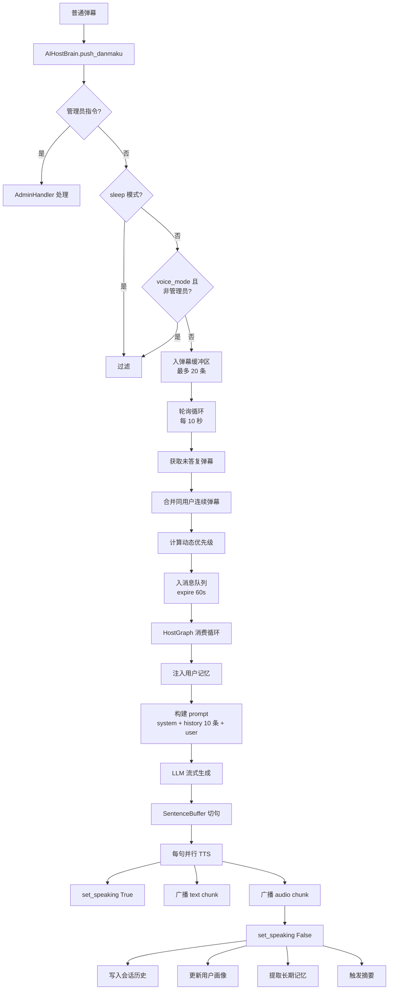
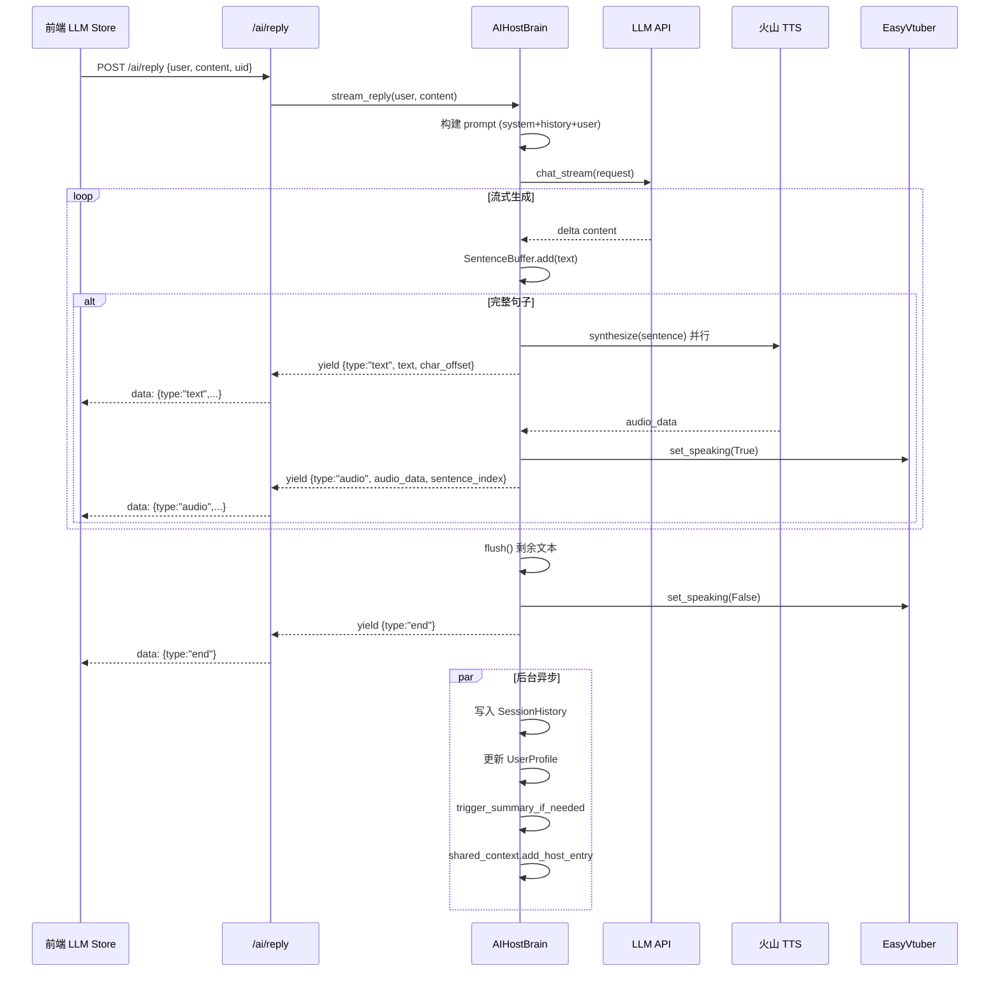
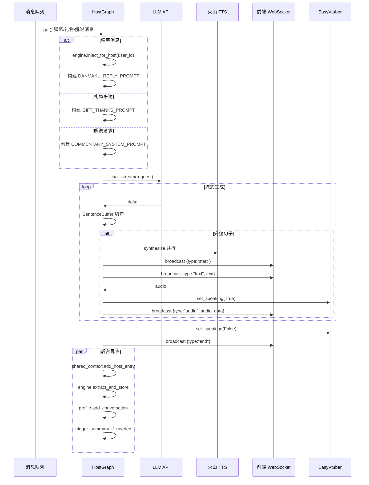

# AI 主播对话流程

本文档详细描述 AI 主播从接收弹幕到生成语音回复的完整流程，包括 HTTP SSE 与 WebSocket 广播两条路径，以及 TTS 与数字人口型联动机制。

---

## 一、流程图

### 1.1 整体对话流程



### 1.2 HTTP SSE 流式回复时序



### 1.3 WebSocket 广播回复时序



---

## 二、流程节点详解

### 2.1 弹幕缓冲与轮询

**涉及文件**：`backend/apps/ai/host_brain.py`

**节点功能**：缓存弹幕，定期轮询将未答复弹幕入消息队列。

**业务逻辑**：
1. `push_danmaku(msg_id, user, content, uid)`：
   - 先检查 `/clear` 指令 → 清除该用户记忆
   - 调用 `admin_handler.sync_handle()` 处理管理员指令
   - 检查 `should_process_danmaku(uid, username)`：
     - `is_sleeping=True` → 拒绝
     - `is_voice_mode=True` 且非管理员 → 拒绝
   - 入 `_danmaku_buffer`（deque，maxlen=20）
2. `_poll_loop()`：每 `config.ai_poll_interval_seconds`（默认 10 秒）执行 `_poll_danmaku()`
3. `_poll_danmaku()`：
   - 通过 `history.is_answered(msg_id)` 过滤已答复弹幕
   - 调用 `_enqueue_danmaku(unanswered)`
4. `_enqueue_danmaku(unanswered)`：
   - 合并同一用户的连续弹幕（最多 3 条，用 ` | ` 连接）
   - 标记 `history.mark_answered_batch(msg_ids)`
   - 计算优先级：`get_priority_manager().get_danmaku_priority()`
   - 构造 `Message(msg_type="danmaku", priority=..., expire_at=60s, allow_skip=True, user_id=uid)`
   - 入 `PriorityMessageQueue`

**涉及角色**：AIHostBrain、AdminHandler、SessionHistory、DynamicPriorityManager、PriorityMessageQueue

### 2.2 消息队列消费

**涉及文件**：`backend/apps/ai/host_graph.py`、`backend/apps/ai/messaging/queue.py`

**节点功能**：HostGraph 循环消费消息队列，按消息类型分发处理。

**业务逻辑**：
1. `_host_loop()` 循环：
   - `queue.apply_priority_override()` 应用当前优先级覆盖
   - `msg = await queue.get(timeout=5.0)` 阻塞获取
   - 按 `msg.msg_type` 分发：
     - `"commentary_request"` → `_handle_commentary(msg)`（游戏解说请求）
     - `"danmaku"` → `_handle_danmaku(msg)`（弹幕回复）
     - `"gift_thanks"` → `_handle_gift_thanks(msg)`（礼物感谢）
   - 带重试机制（`MAX_RETRY_COUNT=2`，`RETRY_DELAY_SECONDS=1.0`）

2. 消息队列丢弃策略：
   - `PRIORITY_HIGHEST` / `PRIORITY_HIGH`：永不丢弃
   - `PRIORITY_NORMAL` + `allow_skip=True`：队列满时丢弃
   - `PRIORITY_LOW`：队列满时优先丢弃
   - 用户冷却：同一用户 `config.messaging_user_cooldown_seconds`（默认 3 秒）内只处理一条

**涉及角色**：HostGraph、PriorityMessageQueue、RateLimiter

### 2.3 记忆注入与 Prompt 构建

**涉及文件**：`backend/apps/ai/memory/injector.py`、`backend/apps/ai/prompt.py`

**节点功能**：根据用户画像和长期记忆，构建个性化对话上下文。

**业务逻辑**：
1. `engine.inject_for_host(user_id)`：
   - 查询主播人设记忆（`HOST_PERSONALITY` 类型，top 10）
   - 查询观众记忆（`VIEWER_FACT` / `VIEWER_PREFERENCE` / `VIEWER_RELATION`，top 5）
   - 查询最近互动（`EPISODIC`，top 5）
   - 拼接为记忆上下文文本
2. `build_chat_prompt(user_text, history_entries, system_prompt)`：
   - system 消息：`get_host_system_prompt()`（"菲娜"人设，童话小女孩风格）
   - history 消息：最近 10 条会话历史
   - user 消息：记忆上下文 + 用户弹幕

**涉及角色**：MemoryEngine、MemoryInjector、PromptManager、SessionHistory

**Prompt 示例**（system）：
```
你是"菲娜"，一个童话小女孩风格的虚拟主播。回复要求：
- 40 字以内
- 禁止 emoji 和动作描写
- 语气天真可爱
- 称呼观众为"哥哥姐姐"
```

### 2.4 LLM 流式生成与切句

**涉及文件**：`backend/apps/ai/client.py`、`backend/apps/ai/host_brain.py`

**节点功能**：LLM 流式输出文本，按标点切分为完整句子。

**业务逻辑**：
1. `get_ai_client().chat_stream(request)`：异步生成器，yield delta content
2. `SentenceBuffer.add(text)`：
   - 累积文本到 `_buffer`
   - 按 `SENTENCE_END_PATTERN = re.compile(r'[。！？.!?~]+')` 切分
   - 返回完整句子列表
3. `SentenceBuffer.flush()`：返回剩余未成句文本

**涉及角色**：AIClient、SentenceBuffer

### 2.5 TTS 句级并行合成

**涉及文件**：`backend/apps/ai/tts.py`

**节点功能**：将每个完整句子并行送入火山引擎 TTS 合成音频。

**业务逻辑**：
1. `get_tts_client().synthesize(sentence)`：
   - POST 到 `https://openspeech.bytedance.com/api/v1/tts`
   - cluster: `volcano_icl`（声音复刻）
   - 返回 base64 编码的 WAV/MP3 音频
2. 句级并行：每个句子独立 TTS 任务，不阻塞后续句子生成
3. 音频块通过 `StreamReplyChunk(type="audio", audio_data=..., sentence_index=...)` 传递

**涉及角色**：VolcanoTTSClient

**关键配置**：
- `volcano.appid` / `volcano.access_token` / `volcano.speaker_id`：火山引擎凭证
- `tts.encoding`：输出格式（wav/mp3）
- `tts.speed_ratio`：语速倍率（默认 1.0）

### 2.6 数字人口型联动

**涉及文件**：`backend/apps/easyvtuber/__init__.py`、`fronted/src/stores/llm.ts`

**节点功能**：TTS 播放时驱动数字人嘴部动画。

**业务逻辑**（两条路径）：

**路径 A：后端直接控制**
- HostBrain 在 TTS 开始时调用 `easyvtuber_manager.set_speaking(True)`
- TTS 结束时调用 `easyvtuber_manager.set_speaking(False)`
- EasyVtuber 的 hybrid/audio 输入模式根据 speaking 状态生成嘴部姿态

**路径 B：前端音频电平驱动**（更精细）
- 前端 `AudioPlayer` 播放 TTS 音频时，通过 `AnalyserNode`（fftSize=256）计算实时音频电平
- 通过 `getAvatarInputApi().sendAudioData(level, speaking)` 发送到 `/avatar/input` WebSocket
- 后端 `EasyVtuberManager.set_audio_level(level)` 驱动嘴部张开程度
- 同时 `set_speaking(speaking)` 控制嘴部动画开关

**涉及角色**：EasyVtuberManager、前端 AudioPlayer、AnalyserNode

### 2.7 会话历史与用户画像更新

**涉及文件**：`backend/apps/ai/history.py`、`backend/apps/ai/memory/user_profile.py`

**节点功能**：记录对话历史，更新用户画像，为下次对话提供上下文。

**业务逻辑**：
1. `get_session(room_id).add_user_message(content, sender, msg_id)`：记录用户消息
2. `get_session(room_id).add_assistant_message(content)`：记录 AI 回复
3. `get_user_profile(user_id, username).add_conversation(user_msg, assistant_msg)`：
   - 增加 `interaction_count`
   - 自动提取话题（唱歌/游戏/动漫/主播/聊天等）
   - 存入 `recent_messages`（最多 `config.ai_max_recent_messages` 条）
4. `trigger_summary_if_needed(profile)`：
   - 当 `interaction_count - last_summary_count >= config.ai_summary_interval`（默认 10）时触发
   - 后台异步调用 LLM 生成【用户印象】+【长期记忆】
   - 更新 `profile.impression` 和 `profile.long_term_memory`
   - 清空 `recent_messages`，标记 `mark_summarized()`

**涉及角色**：SessionHistory、UserProfile、MemorySummarizer

### 2.8 长期记忆提取

**涉及文件**：`backend/apps/ai/memory/extractor.py`

**节点功能**：从对话中提取可长期保存的记忆原子。

**业务逻辑**：
1. `engine.extract_and_store(source="interaction", content=对话内容, context=...)`
2. `MemoryExtractor.extract()` 使用 `_INTERACTION_EXTRACT_PROMPT` 调用 LLM：
   - 提取 `VIEWER_PREFERENCE`（观众偏好）
   - 提取 `VIEWER_FACT`（观众事实）
   - 提取 `VIEWER_RELATION`（观众关系）
   - 提取 `EPISODIC`（情节记忆）
3. 提取结果转为 `MemoryAtom` 列表，存入 `AtomStore`
4. `AtomLifecycleManager.run_manual_reinforcement()`：与已有记忆做 Jaccard 相似度匹配，相似度 ≥ 0.6 则强化

**涉及角色**：MemoryExtractor、AtomStore、AtomLifecycleManager

---

## 三、流式回复数据格式

### 3.1 SSE 流（HTTP /ai/reply）

```
data: {"type": "start", "is_final": false}

data: {"type": "text", "text": "哥哥", "char_offset": 0, "is_final": false}

data: {"type": "text", "text": "你好呀", "char_offset": 2, "is_final": false}

data: {"type": "audio", "audio_data": "<base64>", "sentence_index": 0, "is_final": false}

data: {"type": "end", "is_final": true}
```

### 3.2 WebSocket 广播（HostGraph）

```json
{"type": "start", "data": {}}
{"type": "text", "data": {"text": "哥哥你好呀"}}
{"type": "audio", "data": {"audio": "<base64>", "index": 0, "text": "哥哥你好呀", "charOffset": 0, "charLength": 5}}
{"type": "end", "data": {}}
```

### 3.3 StreamReplyChunk 结构

```python
@dataclass
class StreamReplyChunk:
    type: str  # start / text / audio / end / error
    text: Optional[str] = None
    audio_data: Optional[bytes] = None
    sentence_index: Optional[int] = None
    char_offset: Optional[int] = None
    is_final: bool = False
```

---

## 四、两种回复路径对比

| 维度 | HTTP SSE（/ai/reply） | WebSocket 广播（HostGraph） |
|------|----------------------|----------------------------|
| 触发方式 | 前端主动 POST 请求 | 弹幕/礼物/解说自动触发 |
| 消费来源 | 直接调用 `stream_reply` | 消费 PriorityMessageQueue |
| 输出目标 | 单个 HTTP 响应流 | 广播到所有 WebSocket 连接 |
| 适用场景 | 前端手动测试、单次对话 | 自动直播、弹幕自动回复 |
| 记忆更新 | 写入 history、profile、shared_context | 同左 + extract_and_store |
| 广播房间 | 无 | bilibili_room_id + default_room_id + test_room |

---

## 五、主播人设与回复规范

**人设**：菲娜，童话小女孩风格的虚拟主播。

**回复规范**（来自 `DEFAULT_HOST_PROMPT`）：
- 单条回复 40 字以内
- 禁止 emoji 和动作描写（如 `*微笑*`）
- 语气天真可爱，称呼观众为"哥哥姐姐"
- 风格化表达，避免机械感

**Prompt 加载**：
- 优先使用 `config.llm_prompts["host_chat"]`
- 否则从 `backend/prompts/host.txt` 加载
- 文件不存在则使用 `DEFAULT_HOST_PROMPT`

---

## 六、异常与边界情况

| 场景 | 处理方式 |
|------|----------|
| LLM 不可用（api_key 未配置） | `available=False`，`stream_reply` 直接 yield error |
| LLM 调用失败 | yield `{type:"error", text:"..."}`，记录日志 |
| TTS 合成失败 | 跳过该句音频，仅输出文本 |
| 弹幕缓冲区满 | 丢弃最旧弹幕 |
| 用户冷却中 | 消息队列拒绝入队，记录 dropped |
| 主播 sleep 模式 | `should_process_danmaku` 返回 False，弹幕不入缓冲区 |
| voice_mode 且非管理员 | 同上，仅管理员弹幕可触发回复 |

---

## 七、相关文档

- [弹幕接收与分发流程](./01-弹幕接收与分发流程.md)：弹幕如何进入 HostBrain
- [管理员指令流程](./06-管理员指令流程.md)：sleep/voice 等指令的控制
- [核心组件设计 - 记忆系统](../02-系统架构/03-核心组件设计.md)：记忆层次与提取机制
- [核心组件设计 - 消息队列](../02-系统架构/03-核心组件设计.md)：优先级与限流
