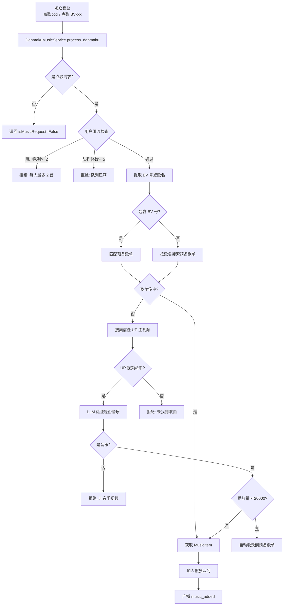
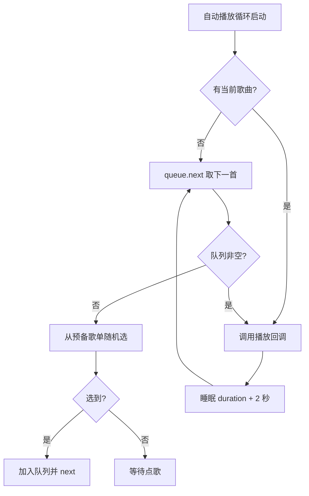
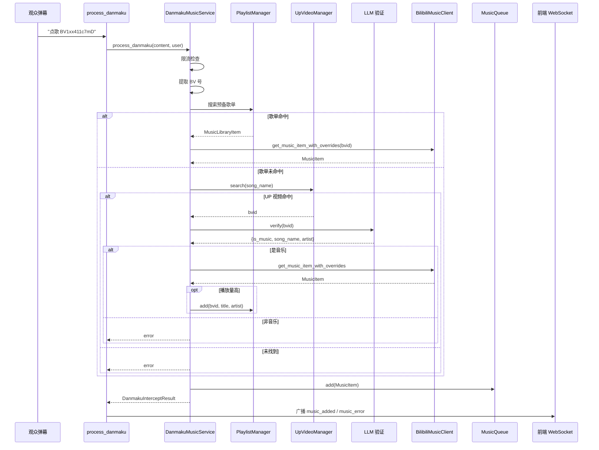

# 弹幕点歌流程

本文档详细描述观众通过弹幕点歌的完整流程，包括点歌识别、歌曲解析、LLM 验证、队列管理与自动播放。

---

## 一、流程图

### 1.1 点歌整体流程



### 1.2 自动播放循环



### 1.3 点歌时序图



---

## 二、流程节点详解

### 2.1 点歌识别

**涉及文件**：`backend/apps/live/music/service.py`

**节点功能**：识别弹幕是否为点歌请求，提取 BV 号或歌名。

**业务逻辑**：
1. `is_music_request(text)`：
   - 匹配前缀：`点歌`、`点歌 `、`来一首`、`来一首 `、`播放`、`播放 `
   - 或包含 BV 号（正则 `BV[a-zA-Z0-9]{10}`）
2. `extract_bv(text)`：提取 BV 号
3. `extract_song_name(text)`：去除前缀和 BV 号，剩余作为歌名

**涉及角色**：DanmakuMusicService

**示例**：
| 弹幕 | is_music_request | BV 号 | 歌名 |
|------|------------------|-------|------|
| `点歌 晴天` | True | 无 | 晴天 |
| `点歌 BV1xx411c7mD` | True | BV1xx411c7mD | 无 |
| `来一首 周杰伦 晴天` | True | 无 | 周杰伦 晴天 |
| `你好` | False | - | - |

### 2.2 限流检查

**涉及文件**：`backend/apps/live/music/service.py`

**节点功能**：防止刷屏点歌。

**业务逻辑**：
- **用户限流**：`queue.count_user_requests(user) >= 2` → 拒绝（每人最多 2 首在队列）
- **队列上限**：`queue.size >= 5` → 拒绝（队列最多 5 首）

**涉及角色**：MusicQueue

### 2.3 预备歌单匹配

**涉及文件**：`backend/apps/live/music/library.py`

**节点功能**：优先从预备歌单查找，命中则直接获取音频。

**业务逻辑**：
1. `PlaylistManager` 基于 SQLAlchemy，表 `playlist`（bvid, title, artist, enabled）
2. 初始化时若表为空，从 `config.default_playlist` 填充默认歌单
3. `_search_playlist(keyword)`：
   - 按 title / artist / bvid 双向 ilike 匹配
   - 仅返回 `enabled=True` 的项
4. 命中后调用 `BilibiliMusicClient.get_music_item_with_overrides(bvid, requestedBy, title, artist)` 获取完整 MusicItem（含音频直链）

**涉及角色**：PlaylistManager、BilibiliMusicClient、PlaylistItem（DB）

### 2.4 UP 主视频搜索

**涉及文件**：`backend/apps/live/music/up_videos.py`

**节点功能**：预备歌单未命中时，搜索信任 UP 主的视频库。

**业务逻辑**：
1. `UpVideoManager` 维护信任 UP 主的视频缓存（表 `up_videos`）
2. `_auto_refresh()`：后台定期增量刷新（默认 5 天增量，30 天全量）
3. 翻页拉取 B 站视频列表，使用 WBI 签名算法绕过反爬
4. `search(keyword, limit=10)`：按 title ilike 搜索，返回最佳匹配

**涉及角色**：UpVideoManager、UpVideo（DB）、B 站 API

**WBI 签名**：
- 从 `https://api.bilibili.com/x/web-interface/nav` 获取 img_key/sub_key
- 按 OE 数组重排得到 mixin_key（前 32 字符）
- 请求参数添加 `wts`（时间戳）和 `w_rid`（MD5 签名）

### 2.5 LLM 音乐验证

**涉及文件**：`backend/apps/live/music/llm_verify.py`

**节点功能**：用 LLM 判断视频是否为音乐，避免点错视频。

**业务逻辑**：
1. 时长预检：`MIN_DURATION=60s`、`MAX_DURATION=480s`，超出范围跳过 LLM 直接判断
2. 获取视频详情：标题、简介（截断 500 字）、时长
3. 获取热门评论：最多 3 页，按点赞排序，每条截断 50 字，最多 3 条
4. 调用 LLM（`config.llm_prompts["music_verify"]`）：
   - 输入：标题 + 简介 + 热门评论
   - 输出 JSON：`{"is_music": bool, "song_name": str, "artist": str, "reason": str}`
5. `is_music=True` 则继续，否则返回拒绝原因

**涉及角色**：LLMMusicVerifier、AIClient、bilibili-api

### 2.6 自动收录

**涉及文件**：`backend/apps/live/music/service.py`

**节点功能**：高播放量音乐视频自动收录到预备歌单。

**业务逻辑**：
- LLM 验证通过后，若视频播放量 >= `config.auto_collect_min_views`（默认 20000）
- 调用 `PlaylistManager.add(bvid, title, artist)` 收录
- 下次点歌可直接从预备歌单命中，无需再次 LLM 验证

### 2.7 音频获取与代理

**涉及文件**：`backend/apps/live/music/client.py`、`backend/apps/live/music/router.py`

**节点功能**：获取 B 站音频直链，通过代理转发到前端。

**业务逻辑**：
1. `BilibiliMusicClient.get_audio_url(bvid)`：
   - 调用 bilibili-api 获取视频 dash 信息
   - 优先选择 `dash.audio` 中 `id` 最大的（最高质量）
   - 回退到 `durl[0].url`
2. 前端播放时，音频 URL 经 `toProxyUrl()` 转为 `/music/proxy/audio?url=...`
3. `proxy_audio(url)`：
   - httpx 流式转发
   - 添加 `Referer: https://www.bilibili.com` 头绕过防盗链
   - `Content-Type: audio/mp4`

**涉及角色**：BilibiliMusicClient、MusicRouter

### 2.8 播放队列管理

**涉及文件**：`backend/apps/live/music/queue.py`

**节点功能**：管理播放队列、当前歌曲、历史记录、自动播放。

**业务逻辑**：
- `_queue`：deque，maxlen=200
- `_current`：当前播放歌曲
- `_history`：deque，maxlen=100
- `_volume`：音量（0.0-1.0）

**关键方法**：
- `add(item)`：入队
- `next()`：当前移入历史，取下一首标记 PLAYING
- `skip()`：等同 next
- `skip_and_disable_current()`：跳过并返回 bvid（用于禁用）
- `start_auto_play()` / `stop_auto_play()`：控制自动播放循环
- `_auto_play_loop()`：
  - 无当前则 next
  - 调用 `_play_callback(current)`
  - 睡眠 `duration + 2` 秒（无 duration 睡 180 秒）
  - 然后 next

**涉及角色**：MusicQueue

---

## 三、管理员音乐控制

管理员可通过弹幕指令控制音乐播放，详见 [管理员指令流程](./06-管理员指令流程.md)。

| 指令 | 功能 | 实现 |
|------|------|------|
| `/next` | 下一首 | `on_next_track` 回调，队列空则随机选歌 |
| `/pause 1/0` | 暂停/恢复 | `on_pause_change` 回调，控制 auto_play |
| `/rm` | 移除当前并禁用 | `on_remove_track` 回调，禁用 BV 号 |
| `/sound 0-10` | 设置音量 | `on_volume_change` 回调，set_volume |
| `/add_music BV号` | 管理员点歌 | 走 LLM 验证流程 |

**广播消息**：
```json
{"type": "music_control", "data": {"action": "volume", "volume": 0.5}}
{"type": "music_control", "data": {"action": "pause", "is_paused": true}}
{"type": "music_control", "data": {"action": "next"}}
{"type": "music_control", "data": {"action": "rm"}}
```

---

## 四、数据结构

### 4.1 MusicItem

```python
class MusicItem(BaseModel):
    id: str                    # UUID
    bvid: str                  # B 站视频 ID
    title: str
    upName: str                # UP 主名
    upFace: Optional[str]      # UP 主头像
    duration: int              # 秒
    audioUrl: str              # 音频直链
    coverUrl: str              # 封面
    status: MusicStatus        # PENDING/PLAYING/COMPLETED/FAILED
    requestedBy: str           # 点歌用户
    requestedAt: datetime
    playedAt: Optional[datetime]
```

### 4.2 MusicLibraryItem

```python
class MusicLibraryItem(BaseModel):
    id: int
    bvid: str
    title: str
    artist: str
    enabled: bool
```

### 4.3 LLMVerifyResult

```python
@dataclass
class LLMVerifyResult:
    is_music: bool
    song_name: str
    artist: str
    reason: str
```

---

## 五、前端音乐播放机制

**涉及文件**：`fronted/src/stores/music.ts`

**业务逻辑**：
1. `fetchQueue()`：GET `/music/queue`，更新 current 和 queue
2. `current` 变化时：
   - 音频 URL 经 `toProxyUrl()` 转为代理 URL
   - 设置 `audioElement.src`
   - `audioUnlocked` 时自动播放
3. 事件监听：
   - `timeupdate` → 更新 currentTime
   - `loadedmetadata` → 更新 duration
   - `ended` → `playNext()`
   - `play/pause` → 更新 isPlaying
4. `unlockAndPlay()`：浏览器自动播放策略限制，需用户交互后解锁

**音频代理 URL 转换**：
```typescript
function toProxyUrl(url: string): string {
    if (url.includes('bilivideo.com') || url.includes('biliplus')) {
        return `/music/proxy/audio?url=${encodeURIComponent(url)}`;
    }
    return url;
}
```

---

## 六、异常与边界情况

| 场景 | 处理方式 |
|------|----------|
| BV 号无效 | BilibiliMusicClient 返回 None，拒绝点歌 |
| 视频无音频流 | 回退到 durl[0].url |
| 音频直链过期 | 前端播放失败，通知错误 |
| LLM 验证服务不可用 | 跳过验证直接获取（时长在范围内时） |
| UP 主视频未缓存 | 搜索无结果，拒绝点歌 |
| 预备歌单为空 | 随机选歌无果，等待点歌 |
| 队列空且无歌单 | 自动播放循环等待，不报错 |

---

## 七、相关文档

- [弹幕接收与分发流程](./01-弹幕接收与分发流程.md)：点歌拦截的入口
- [管理员指令流程](./06-管理员指令流程.md)：音乐控制指令
- [接口设计规范 - REST API](../02-系统架构/04-接口设计规范.md)：音乐模块 API
