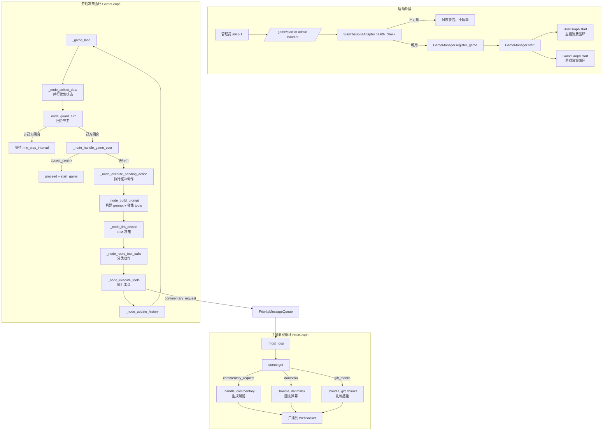
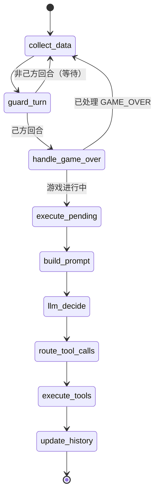
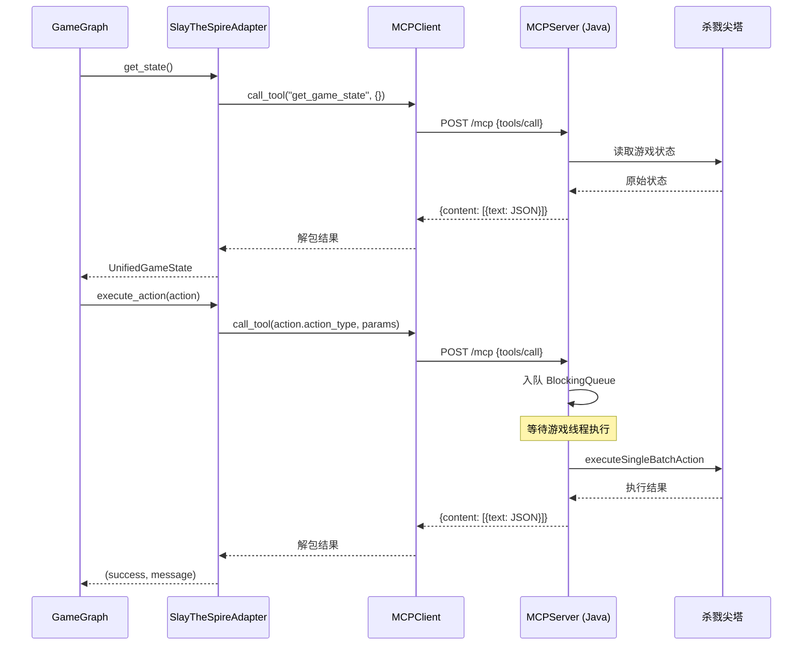
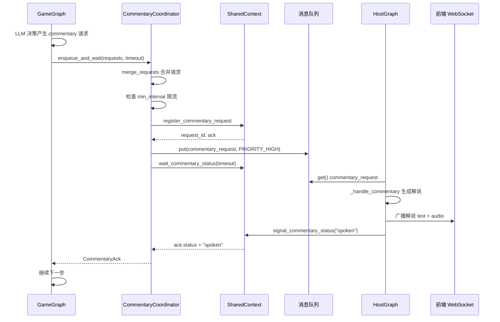
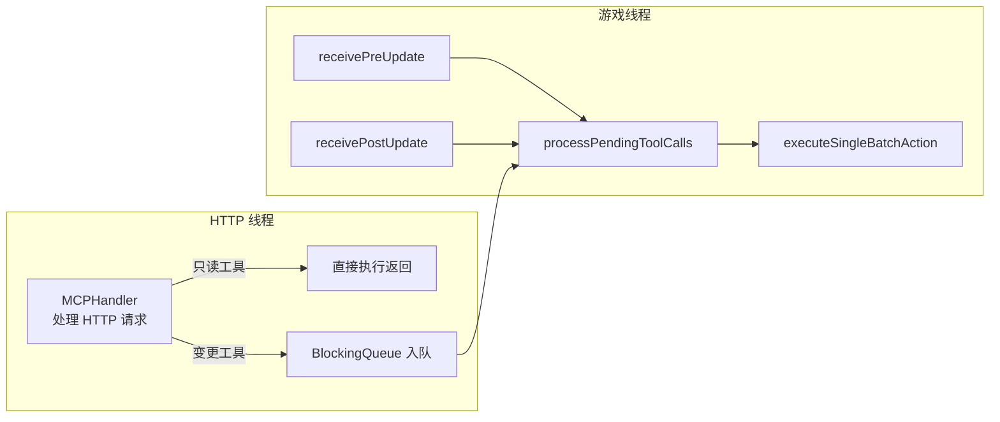

# 游戏 AI 自动化流程

本文档详细描述游戏 AI（杀戮尖塔）的自动化流程，包括 MCP 协议通信、状态机决策循环、解说协调机制。

---

## 一、流程图

### 1.1 游戏集成整体流程



### 1.2 单次决策状态机



### 1.3 MCP 通信时序



### 1.4 解说协调时序



---

## 二、流程节点详解

### 2.1 游戏启动

**涉及文件**：`backend/apps/ai/game_manager.py`、`backend/apps/ai/game_router.py`、`backend/main.py`

**节点功能**：管理员通过 `/mcp 1` 指令启动游戏 AI。

**业务逻辑**：
1. 管理员发送 `/mcp 1` → `AdminCommandHandler.handle()` → `on_mcp_change(True)` 回调
2. 检查 `game_manager.is_running`，已在运行则跳过
3. 创建 `SlayTheSpireAdapter`，调用 `health_check()`：
   - 通过 `MCPClient.health_check()` GET `{mcp_url}/health`
   - 或调用 `get_game_state` 验证
4. 不可用则日志警告，不启动
5. 可用则 `game_manager.register_game(adapter)` + `game_manager.start(on_reply)`：
   - 启动 `HostGraph.start()`：主播消费循环 + HostBrain 轮询
   - 启动所有 GameGraph：`game_graph.start()`

**涉及角色**：AdminCommandHandler、GameManager、SlayTheSpireAdapter、HostGraph、GameGraph

**配置要求**：
- `game.enabled = true`
- `game.mcp_url` 指向运行中的 MCPTheSpire 服务
- 游戏进程（杀戮尖塔）已启动并加载 MCPTheSpire mod

### 2.2 状态收集

**涉及文件**：`backend/apps/ai/game_graph.py`

**节点功能**：并行收集游戏状态、主播历史、游戏历史、记忆注入。

**业务逻辑**（`_node_collect_data`）：
1. 并行执行：
   - `adapter.get_state()` → `UnifiedGameState`
   - `shared_context.get_host_history_text()` → 主播历史
   - `shared_context.get_game_history_text()` → 游戏历史
   - `engine.inject_for_game(game_id)` → 记忆注入（单局 + 长期 + 图谱）
2. 结果存入 `GameLoopState`

**涉及角色**：SlayTheSpireAdapter、SharedContext、MemoryEngine

### 2.3 回合守卫

**涉及文件**：`backend/apps/ai/game_graph.py`

**节点功能**：判断是否轮到 AI 行动。

**业务逻辑**（`_node_guard_turn`）：
- `adapter.is_my_turn(state)` 基于：
  - `screen_type`（战斗中/选择中/地图等）
  - `ready_for_command`（游戏是否就绪接受指令）
  - `in_combat`（是否在战斗中）
  - `can_proceed`（是否可继续）
- 非己方回合 → 等待 `min_step_interval` 后重新收集

**涉及角色**：SlayTheSpireAdapter

### 2.4 Prompt 构建与工具收集

**涉及文件**：`backend/apps/ai/game_graph.py`

**节点功能**：构建游戏决策 prompt，收集可用工具。

**业务逻辑**（`_node_build_prompt`）：
1. `build_game_system_prompt(...)` 构建 system prompt，包含：
   - 双重角色说明（游戏玩家 + 直播主播）
   - 战斗原则（生存优先、费用效率、意图应对）
   - 三层记忆（core/important/recent）
   - 解说指导（`_commentary_guide`，根据距上次解说时间生成）
   - 记忆更新指导（`_memory_prompt`，根据 eagerness 1-5 生成）
   - 操作历史
   - 当前游戏状态
   - JSON 返回格式示例
2. 收集工具：
   - 内置工具：`request_host_commentary`、`request_memory_update`
   - 记忆工具：`memorize`、`recall`（来自 `memory/tools.py`）
   - MCP 工具：`adapter.get_tools_definition()`（17 个游戏工具）

**涉及角色**：GameGraph、MemoryEngine、SlayTheSpireAdapter

### 2.5 LLM 决策

**涉及文件**：`backend/apps/ai/game_graph.py`、`backend/apps/ai/client.py`

**节点功能**：调用游戏专用 LLM 生成决策。

**业务逻辑**（`_node_llm_decide`）：
1. 使用 `get_game_ai_client()`（独立于主播 LLM 的配置）
2. 调用 `chat(request)`（非流式，因需完整 tool_calls）
3. 处理响应：
   - 有 `tool_calls` → 直接使用
   - 无 `tool_calls` → 尝试从 content 解析 JSON 代码块（`_parse_tool_calls`）
   - 兼容 `actions` / `tool_calls` / list 三种格式（`_normalize_tool_calls`）

**涉及角色**：AIClient（game）、GameGraph

**关键配置**：
- `game.model`：游戏 LLM 模型
- `game.temperature`：0.4（较低，保证决策稳定）
- `game.max_tokens`：8000（需容纳复杂决策）
- `game.disable_thinking`：禁用思考过程

### 2.6 工具路由与执行

**涉及文件**：`backend/apps/ai/game_graph.py`

**节点功能**：将 LLM 决策分类并执行。

**业务逻辑**（`_node_route_tool_calls` + `_node_execute_tools`）：
1. 分类到四组：
   - `commentary_requests`：解说请求 → `CommentaryCoordinator.enqueue_and_wait()`
   - `memory_tool_calls`：记忆操作 → `handle_memory_tool_call()`
   - `readonly_tool_calls`：只读查询 → `adapter.query_tool()`
   - `game_actions`：游戏动作 → `adapter.execute_action()`
2. 执行策略：
   - 记忆 + 只读工具：并行执行
   - 游戏动作：串行执行，**第一个立即执行，其余入缓冲队列**（`_pending_actions`）
   - 解说请求：合并后入消息队列，等待主播播报

**涉及角色**：GameGraph、CommentaryCoordinator、MemoryEngine、SlayTheSpireAdapter

### 2.7 游戏动作执行

**涉及文件**：`backend/apps/ai/mcp/adapters/slay_the_spire.py`

**节点功能**：通过 MCP 协议操控游戏。

**业务逻辑**：
1. `adapter.execute_action(action)` 分发 14 种动作类型：
   - `start_game`：先 `abandon_run`（放弃当前局），再开始新局，初始化知识图谱
   - `execute_actions`：批量执行
   - `play_card`：出牌（支持 card_uuid/card_index/card_name/card_id）
   - `end_turn`：结束回合
   - `choose`：选择选项
   - `use_potion` / `discard_potion`：使用/丢弃药水
   - `proceed` / `confirm` / `skip` / `cancel`：UI 操作
   - `select_cards`：选择卡牌（drop/keep 模式）
   - `abandon_run` / `save_game`：放弃/保存
   - `get_*`：只读查询
2. 每个动作通过 `MCPClient.call_tool(tool_name, arguments)` 发送到 MCP 服务
3. `start_game` 时清空记忆（新局开始），其他动作记录事件并触发 `summarize_session_if_needed`

**涉及角色**：SlayTheSpireAdapter、MCPClient、MCPServer

### 2.8 解说协调

**涉及文件**：`backend/apps/ai/commentary.py`、`backend/apps/ai/shared_context.py`

**节点功能**：GameGraph 请求主播解说，等待播报完成。

**业务逻辑**：
1. `CommentaryCoordinator.enqueue_and_wait(requests, timeout)`：
   - `merge_requests(requests)`：合并 key_points（去重），选取非 neutral 的 mood
   - 检查距上次解说时间 < `min_interval`（默认 15 秒）则跳过
   - `shared_context.register_commentary_request()` 生成 request_id 和 ack
   - 入消息队列（`PRIORITY_HIGH`，`allow_skip=False`，`expire=hold_timeout+5`）
   - `shared_context.wait_commentary_status(timeout)` 等待主播播报完成
   - 超时则 `queue.cancel(cancel_key)` 取消
2. HostGraph 消费 `commentary_request`：
   - `_handle_commentary(msg)`：构建解说 prompt → `_stream_reply` → 广播
   - 完成后 `shared_context.signal_commentary_status("spoken")`

**涉及角色**：CommentaryCoordinator、SharedContext、PriorityMessageQueue、HostGraph

**解说请求格式**：
```python
{
    "key_points": ["打出重击造成 18 伤害", "击败史莱姆"],
    "mood": "excited"  # excited/confident/nervous/happy/sad/angry/neutral
}
```

### 2.9 记忆管理

**涉及文件**：`backend/apps/ai/memory/` 子系统

**节点功能**：游戏过程中积累和调用记忆。

**业务逻辑**：
1. **单局记忆**（SessionMemory）：
   - 三层文本块：core / important / recent
   - 待总结事件 FIFO（maxlen=40）
   - 每 12 个事件触发 `summarize_session_if_needed()` → LLM 压缩
   - 新游戏开始时 `start_session()` 清空
2. **长期记忆**（AtomStore）：
   - LLM 通过 `memorize` 工具主动记录
   - 类型：GAME_MECHANIC（180 天）、GAME_LORE（365 天）
   - FTS5 全文检索 + 时间衰减排序
3. **知识图谱**（GameKnowledgeGraph）：
   - 节点：card / relic / enemy / event / mechanic
   - 边：synergizes_with / counters / belongs_to / found_in
   - `ingest_game_state_to_graph()`：从游戏状态自动提取节点
4. **记忆注入**（MemoryInjector）：
   - `inject_for_game()`：单局全量 + 长期 top 10 + 图谱关系
   - 从 SessionMemory 提取【】关键词查询图谱

**涉及角色**：MemoryEngine、SessionMemory、AtomStore、GameKnowledgeGraph、MemoryInjector

---

## 三、MCPTheSpire Mod 架构

### 3.1 线程模型



### 3.2 工具列表（17 个）

| 工具 | 类型 | 说明 |
|------|------|------|
| `get_game_state` | 只读 | 完整游戏状态 |
| `get_screen_state` | 只读 | 轻量屏幕状态 |
| `get_available_commands` | 只读 | 可用命令列表 |
| `get_card_info` | 只读 | 卡牌详情 |
| `get_relic_info` | 只读 | 遗物详情 |
| `execute_actions` | 变更 | 批量执行动作 |
| `play_card` | 变更 | 出牌 |
| `end_turn` | 变更 | 结束回合 |
| `choose` | 变更 | 选择选项 |
| `use_potion` | 变更 | 使用药水 |
| `discard_potion` | 变更 | 丢弃药水 |
| `proceed` | 变更 | 继续 |
| `confirm` | 变更 | 确认 |
| `skip` | 变更 | 跳过 |
| `cancel` | 变更 | 取消 |
| `start_game` | 变更 | 开始新游戏 |
| `abandon_run` | 变更 | 放弃当前局 |
| `save_game` | 变更 | 保存游戏 |

### 3.3 补丁机制

MCPTheSpire 通过 SpirePatch 注入游戏逻辑，分三类：

1. **状态变更通知**：在关键事件（动作入队、回合开始/结束、屏幕切换）调用 `GameStateListener.registerStateChange()`
2. **异步效果守卫**：篝火效果/遗物装备期间 `blockStateUpdate()` / `resumeStateUpdate()` 防止过早响应
3. **交互注入**：通过静态标志位（doHover/visitMerchant/doKeypress）模拟鼠标 hover/click/按键

---

## 四、操作节奏控制

为模拟真人操作节奏，避免被检测为脚本：

| 配置项 | 默认值 | 说明 |
|--------|--------|------|
| `game.min_step_interval` | 3.0 秒 | 操作最小间隔 |
| `game.step_jitter` | 0.5 秒 | 操作间隔随机误差（±） |
| `game.poll_interval` | 1.0 秒 | 状态轮询间隔 |
| `game.commentary_interval` | 30.0 秒 | 解说建议间隔 |
| `game.min_commentary_interval` | 15.0 秒 | 解说最小间隔（硬限制） |

**节奏计算**：`sleep(min_step_interval + random.uniform(-step_jitter, step_jitter))`

---

## 五、异常与边界情况

| 场景 | 处理方式 |
|------|----------|
| MCP 服务不可用 | health_check 失败，不启动游戏 AI |
| MCP 调用超时 | MCPClient 指数退避重试（默认 3 次） |
| 游戏崩溃 | get_state 失败，GameGraph 停止 |
| LLM 决策失败 | 重试 2 次，仍失败则跳过本轮 |
| 解说请求超时 | 取消队列消息，ack.status = "timeout" |
| 游戏结束 | 自动 proceed + start_game 开始新局 |
| 缓冲动作积压 | 每轮先执行 1 个缓冲动作 |

---

## 六、相关文档

- [AI 主播对话流程](./02-AI主播对话流程.md)：解说请求的消费端
- [管理员指令流程](./06-管理员指令流程.md)：`/mcp` 指令
- [核心组件设计 - Graph 编排](../02-系统架构/03-核心组件设计.md)：GameGraph 状态机
- [核心组件设计 - 记忆系统](../02-系统架构/03-核心组件设计.md)：游戏记忆层次
- [接口设计规范 - MCP 协议](../02-系统架构/04-接口设计规范.md)：MCP JSON-RPC 规范
