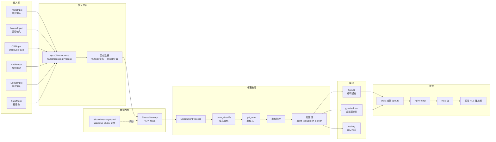
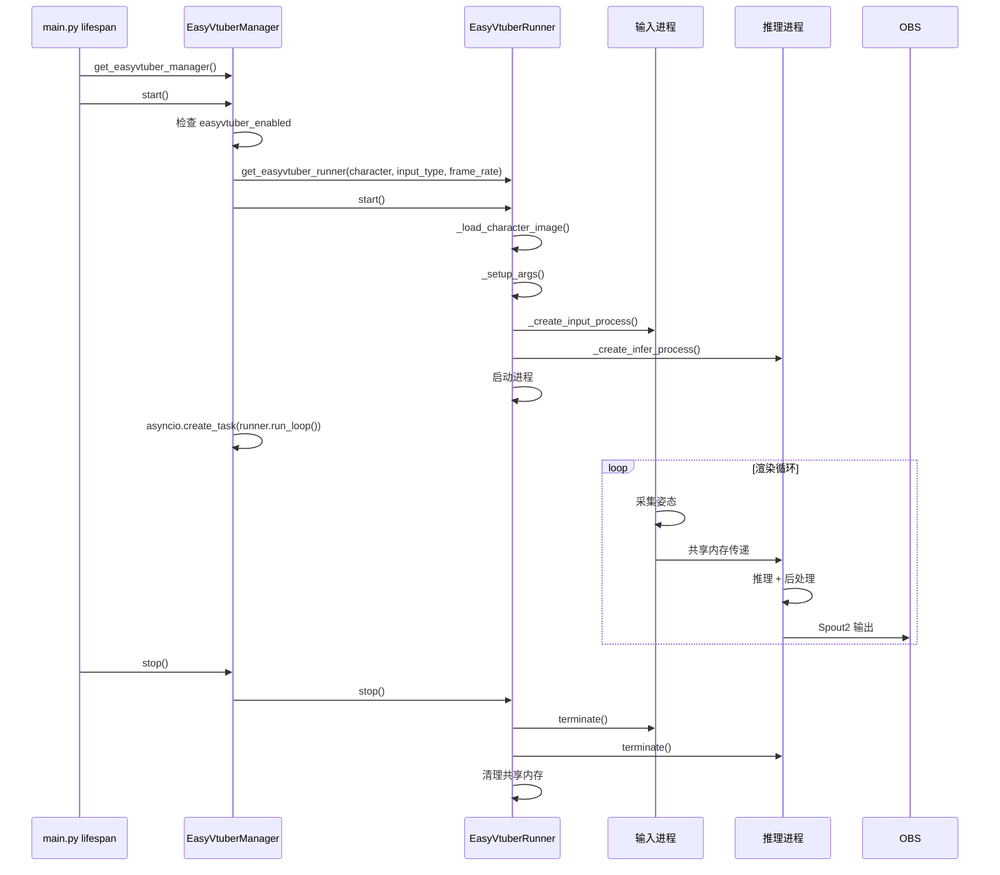
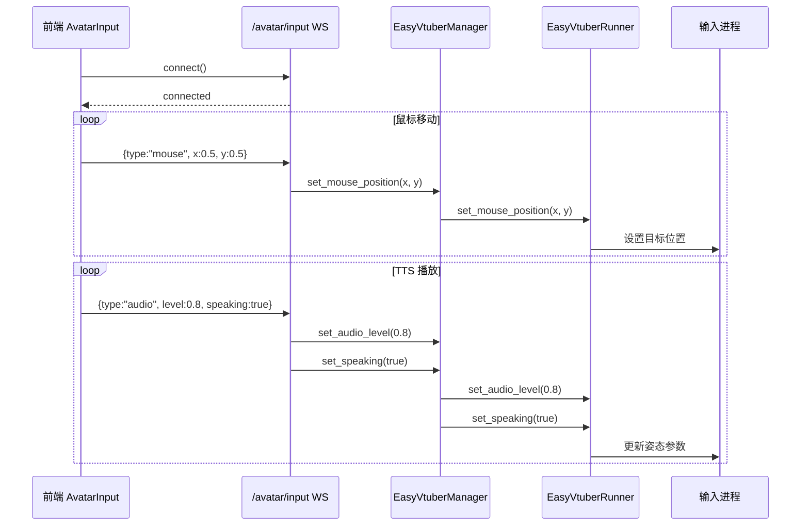

# 数字人渲染流程

本文档详细描述 EasyVtuber 数字人渲染管线的完整流程，包括输入采集、模型推理、画面输出与直播推流。

---

## 一、流程图

### 1.1 渲染管线整体流程



### 1.2 后端集成流程



### 1.3 前端输入控制流程



---

## 二、流程节点详解

### 2.1 输入采集

**涉及文件**：`backend/EasyVtuber/src/` 下各输入客户端

**节点功能**：采集姿态数据，驱动数字人动作。

**输入类型**（由 `config.easyvtuber_input_type` 配置）：

| 类型 | 文件 | 说明 |
|------|------|------|
| `hybrid` | `hybrid_input_client.py` | 混合输入：自动随机游走 + 鼠标控制 + 音频驱动（推荐） |
| `mouse` | `mouse_client.py` | 鼠标输入 + 可选音频 |
| `osf` | `open_see_face_client.py` | OpenSeeFace 面部捕捉（UDP） |
| `cam` | `face_mesh_client.py` | MediaPipe FaceMesh 摄像头捕捉 |
| `audio` | `audio_client.py` | 纯音频驱动 |
| `debug` | `debug_input_client.py` | 正弦波测试输入 |

**HybridInput 详细逻辑**（`NaturalRandomWalk` 类）：
- `auto_mode=True`（漫步模式）：随机生成鼠标移动目标，模拟自然头部运动
- `auto_mode=False`（鼠标追踪模式）：跟随实际鼠标位置
- `set_speaking(True)`：根据音频电平生成嘴部姿态
- `set_audio_level(level)`：调整嘴部张开程度
- 含呼吸动画（周期性微动）和眨眼动画（随机间隔）

**姿态数据结构**：
- 45 个 float：面部姿态参数（眼睛、眉毛、嘴部、头部旋转等）
- 4 个 float：位置参数（x/y/z 平移 + 缩放）

**涉及角色**：InputClientProcess、SharedMemoryGuard

### 2.2 共享内存同步

**涉及文件**：`backend/EasyVtuber/src/utils/shared_mem_guard.py`

**节点功能**：跨进程共享内存的互斥访问。

**业务逻辑**：
- 使用 Windows Named Mutex（kernel32 `CreateMutexW` / `WaitForSingleObject`）
- 输入进程写入姿态数据前获取 mutex
- 推理进程读取姿态数据前获取 mutex
- 避免读写竞争导致姿态数据不一致

**涉及角色**：SharedMemoryGuard

### 2.3 模型推理

**涉及文件**：`backend/EasyVtuber/src/model_infer_client.py`、`backend/EasyVtuber/ezvtuber-rt/`

**节点功能**：THA3/THA4 模型推理，生成数字人画面。

**业务逻辑**：
1. `get_core(use_tensorrt, model_version, ...)` 工厂函数：
   - 优先尝试 `CoreTRT`（TensorRT 加速，需 pycuda）
   - 失败回退 `CoreORT`（ONNX Runtime）
2. 推理流程：
   - `pose_simplify(model_input)`：姿态量化（level 0-4，降低参数精度提升性能）
   - `core.setImage(character_image)`：设置角色立绘
   - `core.inference(poses)`：模型推理
   - RIFE 帧插值（x2/x3/x4）：平滑动画
   - 超分辨率（waifu2x / Real-ESRGAN / Anime4K）
3. 后处理：
   - `alpha_split`：透明通道分离
   - `green_screen`：绿幕背景
   - debug overlay：调试信息叠加

**模型版本**（`config.easyvtuber_model_version`）：
| 版本 | 模型 | 说明 |
|------|------|------|
| `v3` | THA3 | Talking Head Anime 3，成熟稳定 |
| `v4` | THA4 | Talking Head Anime 4，质量更高 |
| `v4_student` | THA4 Student | 蒸馏模型，速度更快 |

**性能优化**：
- VRAM 缓存（`VRAMCacher`）：LRU 缓存推理结果到显存
- RAM 缓存（`Cacher`）：LRU + Brotli 压缩缓存到内存
- TensorRT 加速：模型转 TensorRT engine
- ONNX Runtime：CUDA EP，回退 CPU

**涉及角色**：ModelClientProcess、CoreORT/CoreTRT、Cacher、VRAMCacher

### 2.4 画面输出

**涉及文件**：`backend/EasyVtuber/src/main.py`

**节点功能**：将渲染画面输出到目标设备。

**输出方式**（由 args.output 决定）：
| 方式 | 说明 |
|------|------|
| `spout2` | Spout2 纹理共享，OBS 可直接捕获（推荐） |
| `virtual_cam` | pyvirtualcam 虚拟摄像头 |
| `debug` | 窗口预览 |

**Spout2 输出**：
- 使用 `PySpout.pyd` + `Spout.dll`
- 发送透明 PNG 帧（RGBA）到 Spout2 接收器
- OBS 安装 Spout2 插件后可捕获为源

**帧率控制**：
- `config.easyvtuber_frame_rate`：目标帧率（默认 30）
- `timer_wait.wait_until(target_time)`：高精度等待（NtSetTimerResolution 0.5ms + busy-wait）
- 动态周期计算：根据推理耗时调整，避免积压

**涉及角色**：ModelClientProcess、Spout2、pyvirtualcam

### 2.5 直播推流

**涉及文件**：`backend/services/nginx_service.py`、`nginx-rtmp-win32/`

**节点功能**：nginx-rtmp 接收推流，输出 HLS 直播流。

**业务逻辑**：
1. `NginxService.start()`：
   - 检查 `nginx.exe` 存在
   - 创建 HLS 输出目录
   - `subprocess.Popen([nginx.exe, "-c", nginx.conf], cwd=NGINX_DIR)`
2. nginx-rtmp 配置（`nginx-rtmp.conf`）：
   - RTMP 监听 1935 端口接收推流
   - HTTP 监听 8088 端口提供 HLS
   - 推流地址：`rtmp://localhost:1935/live/stream`
   - HLS 地址：`http://localhost:8088/hls/stream.m3u8`
3. OBS 推流配置：
   - 服务：自定义
   - 服务器：`rtmp://localhost:1935/live`
   - 串流密钥：`stream`
4. 前端通过 `useHlsPlayer` 播放 HLS 流

**涉及角色**：NginxService、nginx-rtmp、OBS

**关键端口**：
| 端口 | 用途 |
|------|------|
| 1935 | RTMP 推流接收 |
| 8088 | HLS HTTP 服务 |
| 8765 | EasyVtuber WebSocket（可选） |

### 2.6 前端输入控制

**涉及文件**：`backend/apps/easyvtuber/router.py`、`fronted/src/composables/useAvatarInput.ts`

**节点功能**：前端通过 WebSocket 实时控制数字人输入。

**业务逻辑**：
1. 前端 `useAvatarInput` 连接 `ws://host/avatar/input`
2. 鼠标移动监听：
   - `window.mousemove` 事件
   - 归一化坐标（0-1）
   - 发送 `{type:"mouse", x, y}`
3. 音频电平驱动（来自 LLM store 的 AudioPlayer）：
   - `AnalyserNode` 计算电平
   - 发送 `{type:"audio", level, speaking}`
4. 后端 `EasyVtuberManager` 接收并转发给 Runner：
   - `set_mouse_position(x, y)` → 输入进程
   - `set_audio_level(level)` → 输入进程
   - `set_speaking(speaking)` → 输入进程

**涉及角色**：useAvatarInput、EasyVtuberManager、EasyVtuberRunner

---

## 三、角色与立绘管理

### 3.1 角色立绘

**存储位置**：`backend/EasyVtuber/data/images/`

**角色列表**（`config.easyvtuber_character`）：
- `lambda_00`（默认）
- 其他 `.png` 文件可通过 `/config/easyvtuber/characters` 查询

**立绘要求**：
- PNG 格式，透明背景
- 角色正面朝向
- 分辨率建议 512×512 或 1024×1024

### 3.2 模型文件

**存储位置**：`backend/EasyVtuber/data/models/`

**目录结构**：
```
backend/EasyVtuber/data/models/
├── rife/          # RIFE 帧插值模型
├── sr/            # 超分辨率模型
├── tha3/          # THA3 模型
└── tha4/          # THA4 模型
```

**下载**：从 [Google Drive](https://drive.google.com/file/d/1pWKIpjWeqfpa3Rub185FVvxDr5H09pOi/view) 下载。

---

## 四、配置项详解

| 配置项 | 默认值 | 说明 |
|--------|--------|------|
| `easyvtuber.enabled` | true | 是否启用数字人 |
| `easyvtuber.character` | lambda_00 | 角色名称 |
| `easyvtuber.input.type` | hybrid | 输入类型 |
| `easyvtuber.input.osf_address` | 127.0.0.1:11573 | OSF 服务地址 |
| `easyvtuber.input.mouse_range` | 0,0,1920,1080 | 鼠标活动范围 |
| `easyvtuber.model.version` | v3 | 模型版本 |
| `easyvtuber.model.precision` | half | 精度（full/half） |
| `easyvtuber.model.separable` | false | 可分离卷积 |
| `easyvtuber.model.use_tensorrt` | true | TensorRT 加速 |
| `easyvtuber.model.use_eyebrow` | true | 眉毛追踪 |
| `easyvtuber.performance.frame_rate` | 30 | 输出帧率 |
| `easyvtuber.performance.interpolation` | x2 | 插值倍率 |
| `easyvtuber.performance.super_resolution` | x2 | 超分辨率 |
| `easyvtuber.performance.ram_cache` | 2gb | 内存缓存 |
| `easyvtuber.performance.vram_cache` | 2gb | 显存缓存 |
| `easyvtuber.output.websocket.enabled` | true | WebSocket 输出 |
| `easyvtuber.output.websocket.port` | 8765 | WebSocket 端口 |

---

## 五、环境依赖

### 5.1 GPU 环境

- CUDA 12.1+（`C:\Program Files\NVIDIA GPU Computing Toolkit\CUDA\v12.1\bin`）
- cuDNN（`backend/.venv/nvidia/cudnn/bin`）
- PyTorch with CUDA 12.4（`torch` from `pytorch-cu124` index）

### 5.2 系统库

- `PySpout.pyd` + `Spout.dll`：Spout2 纹理共享（项目根目录）
- `onnxruntime-gpu`：ONNX Runtime GPU 推理

### 5.3 Python 依赖

- `torch`、`onnx`、`onnxruntime-gpu`
- `opencv-python`、`Pillow`、`numpy`、`scipy`
- `pyvirtualcam`、`mediapipe==0.10.11`
- `pynput`、`sounddevice`
- `pyanime4k==3.1.0`、`OneEuroFilter`

---

## 六、异常与边界情况

| 场景 | 处理方式 |
|------|----------|
| GPU 不可用 | 回退 CPU 推理（性能大幅下降） |
| 模型文件缺失 | 启动失败，提示下载 |
| TensorRT 不可用 | 回退 ONNX Runtime |
| 角色立绘缺失 | 启动失败 |
| Spout2 输出失败 | 回退 pyvirtualcam |
| 帧率不达标 | 自动降低插值倍率 |
| 共享内存冲突 | SharedMemoryGuard 互斥保护 |
| OBS 未捕获 | 画面无输出，检查 OBS Spout2 源 |

---

## 七、相关文档

- [AI 主播对话流程](./02-AI主播对话流程.md)：TTS 口型联动
- [系统架构总览](../02-系统架构/00-系统架构总览.md)：部署拓扑
- [技术栈选型说明](../02-系统架构/01-技术栈选型说明.md)：渲染技术选型
- [接口设计规范 - WebSocket](../02-系统架构/04-接口设计规范.md)：/avatar/input 规范
