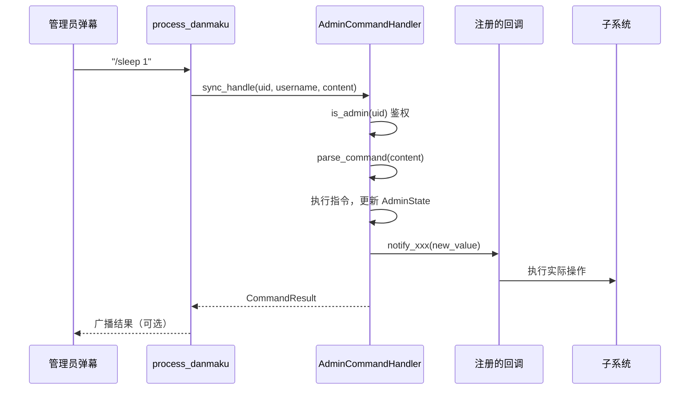
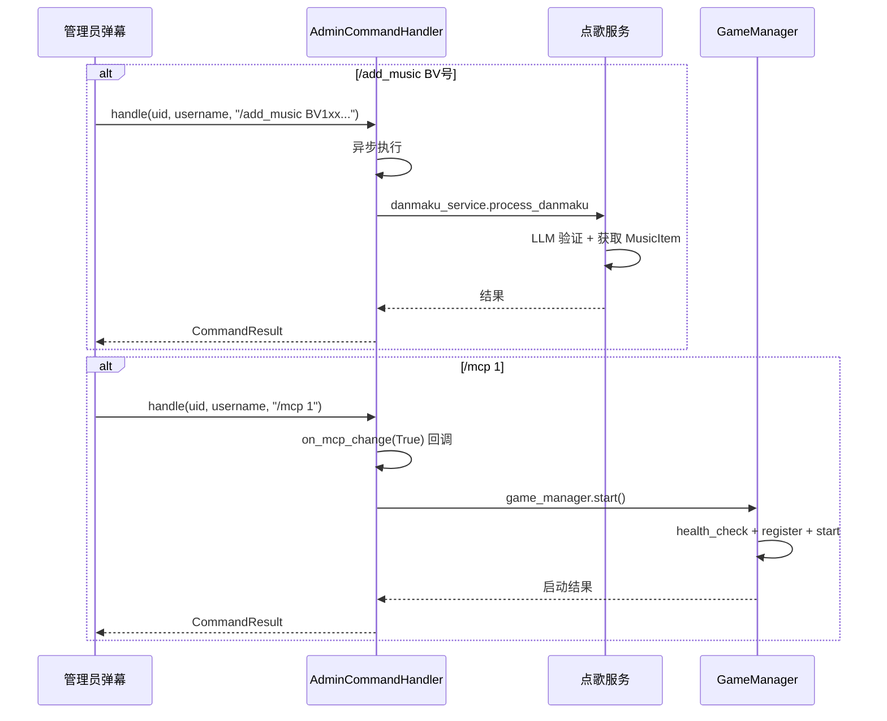

# 管理员指令流程

本文档详细描述管理员通过弹幕指令控制系统行为的完整流程，包括指令识别、鉴权、执行与回调。

---

## 一、流程图

### 1.1 指令处理整体流程

```mermaid
flowchart TD
    Danmaku[管理员弹幕<br/>/xxx 参数] --> Handler[AdminCommandHandler]
    Handler --> AuthCheck{鉴权}
    AuthCheck -->|非管理员| Ignore[忽略]
    AuthCheck -->|管理员| Parse[parse_command<br/>解析指令和参数]
    Parse --> Dispatch{指令分发}
    
    Dispatch -->|sleep| Sleep[/sleep 1/0<br/>暂停/恢复 AI]
    Dispatch -->|face| Face[/face 1/0<br/>鼠标追踪/漫步]
    Dispatch -->|voice| Voice[/voice 1/0<br/>接管/AI模式]
    Dispatch -->|hide| Hide[/hide 1/0<br/>隐藏管理员弹幕]
    Dispatch -->|sound| Sound[/sound 0-10<br/>音量]
    Dispatch -->|next| Next[/next<br/>下一首]
    Dispatch -->|pause| Pause[/pause 1/0<br/>暂停/恢复]
    Dispatch -->|rm| Rm[/rm<br/>移除当前]
    Dispatch -->|add_music| AddMusic[/add_music BV号<br/>点歌]
    Dispatch -->|mcp| Mcp[/mcp 1/0<br/>游戏AI开关]
    Dispatch -->|testroom| TestRoom[/testroom 1/0<br/>测试房间]
    Dispatch -->|help| Help[/help<br/>帮助]
    Dispatch -->|clear| Clear[/clear<br/>清除记忆]
    
    Sleep --> Callback[触发回调]
    Face --> Callback
    Voice --> Callback
    Hide --> Callback
    Sound --> Callback
    Next --> Callback
    Pause --> Callback
    Rm --> Callback
    AddMusic --> AsyncProcess[异步处理<br/>LLM 验证]
    Mcp --> AsyncProcess
    TestRoom --> StateUpdate[更新状态]
    Help --> ReturnHelp[返回帮助文本]
    Clear --> ClearMemory[清除用户记忆]
    
    Callback --> Notify[notify 回调]
    Notify --> Subsystem[子系统执行]
    AsyncProcess --> Result[CommandResult]
    StateUpdate --> Result
    ReturnHelp --> Result
    ClearMemory --> Result
```

### 1.2 指令执行时序



### 1.3 异步指令流程（add_music / mcp）



---

## 二、指令清单

### 2.1 完整指令表

| 指令 | 参数 | 功能 | 同步/异步 | 影响状态 |
|------|------|------|-----------|----------|
| `/sleep 1` | 1=暂停, 0=恢复 | 暂停/恢复 AI 主播回复 | 同步 | `is_sleeping` |
| `/face 1` | 1=鼠标追踪, 0=漫步 | 切换数字人面部模式 | 同步 | `face_mode` |
| `/voice 1` | 1=接管, 0=AI模式 | 管理员接管/AI 主播模式 | 同步 | `is_voice_mode` |
| `/hide 1` | 1=隐藏, 0=显示 | 隐藏/显示管理员弹幕 | 同步 | `is_hide_admin` |
| `/sound 5` | 0-10 | 设置音量（映射到 0.0-1.0） | 同步 | `volume` |
| `/next` | 无 | 下一首 | 异步 | - |
| `/pause 1` | 1=暂停, 0=恢复 | 暂停/恢复音乐播放 | 异步 | `is_paused` |
| `/rm` | 无 | 移除当前歌曲并禁用 | 异步 | - |
| `/add_music BV号` | BV 号 | 管理员点歌（走 LLM 验证） | 异步 | - |
| `/mcp 1` | 1=启动, 0=停止 | 启动/停止游戏 AI | 异步 | `is_mcp_running` |
| `/testroom 1` | 1=启用, 0=禁用 | 启用/禁用测试房间 | 同步 | `is_test_room_enabled` |
| `/help` | 无 | 显示帮助 | 同步 | - |
| `/clear` | 无 | 清除 AI 对当前用户的记忆 | 同步 | - |

### 2.2 指令格式

**正则匹配**：`^/(\w+)\s*(\S*)$`

- `/` 开头
- 指令名：`\w+`（字母数字下划线）
- 可选参数：`\S*`（非空白字符）

**示例**：
- `/sleep 1` → command="sleep", arg="1"
- `/next` → command="next", arg=""
- `/add_music BV1xx411c7mD` → command="add_music", arg="BV1xx411c7mD"

---

## 三、流程节点详解

### 3.1 鉴权

**涉及文件**：`backend/apps/ai/admin_commands.py`

**节点功能**：验证发送者是否为管理员。

**业务逻辑**：
- `is_admin(uid)`：`uid == config.admin_uid`（默认 378810242）
- `is_admin_by_username(username)`：`username == config.admin_username`（默认 "RongR0Ng"）
- 两者满足其一即可

**配置**：
```yaml
admin:
  uid: 378810242
  username: "RongR0Ng"
```

**涉及角色**：AdminCommandHandler、Config

### 3.2 指令解析与执行

**涉及文件**：`backend/apps/ai/admin_commands.py`

**节点功能**：解析指令并执行，更新 AdminState。

**业务逻辑**：
1. `sync_handle(uid, username, content)`：同步处理（除 add_music/mcp）
   - 鉴权
   - `parse_command(content)` → (command, arg)
   - 按 command 分发执行
   - 更新 `AdminState`
   - 触发对应回调
   - 返回 `CommandResult`
2. `async handle(uid, username, content)`：异步处理（支持 add_music/mcp）
   - add_music：调用 `danmaku_service.process_danmaku`
   - mcp：触发 `on_mcp_change` 回调

**涉及角色**：AdminCommandHandler、AdminState

### 3.3 状态管理

**涉及文件**：`backend/apps/ai/admin_commands.py`

**AdminState 数据结构**：
```python
@dataclass
class AdminState:
    is_sleeping: bool = False          # AI 暂停
    face_mode: FaceMode = WANDERING    # 面部模式
    is_voice_mode: bool = False        # 管理员接管
    is_hide_admin: bool = False        # 隐藏管理员弹幕
    volume: float = 1.0                # 音量
    is_paused: bool = False            # 音乐暂停
    is_mcp_running: bool = False       # 游戏 AI 运行中
    is_test_room_enabled: bool = False # 测试房间启用
```

**FaceMode 枚举**：
- `WANDERING`：漫步模式（auto_mode=True）
- `MOUSE_TRACKING`：鼠标追踪模式（auto_mode=False）

**状态查询**：
- `GET /ai/admin/state`：返回 AdminState 字典
- `GET /test/admin/state`：同上（测试路由）

### 3.4 回调机制

**涉及文件**：`backend/apps/ai/admin_commands.py`、`backend/main.py`

**节点功能**：指令执行后通知子系统执行实际操作。

**回调注册**（在 `main.py` lifespan 中）：

| 回调 | 触发指令 | 实际操作 |
|------|----------|----------|
| `register_face_mode_callback` | `/face` | `easyvtuber_manager.set_face_mode(mode)` |
| `register_state_change_callback` | `/sleep` | 游戏 `game_manager.mute()/unmute()` |
| `register_volume_change_callback` | `/sound` | `queue.set_volume(volume)` + 广播 music_control |
| `register_pause_change_callback` | `/pause` | `queue.stop_auto_play()/start_auto_play()` + 广播 |
| `register_next_track_callback` | `/next` | `on_next_track()` 切换下一首 |
| `register_remove_track_callback` | `/rm` | `on_remove_track()` 移除并禁用 |
| `register_mcp_change_callback` | `/mcp` | `on_mcp_change()` 启停游戏 AI |

**回调执行示例**（音量变化）：
```python
def on_volume_change(volume: float):
    queue.set_volume(volume)
    asyncio.create_task(broadcast_music_control("volume", {"volume": volume}))

admin_handler.register_volume_change_callback(on_volume_change)
```

**涉及角色**：AdminCommandHandler、EasyVtuberManager、MusicQueue、GameManager、ConnectionManager

### 3.5 弹幕过滤

**涉及文件**：`backend/apps/ai/admin_commands.py`、`backend/apps/live/danmaku_handler.py`

**节点功能**：根据管理员状态过滤弹幕。

**业务逻辑**：
1. `should_filter_admin_danmaku(uid, username)`：
   - `is_hide_admin=True` 且是管理员 → 返回 True（过滤）
   - 用于隐藏管理员指令弹幕，避免干扰观众
2. `should_process_danmaku(uid, username)`：
   - `is_sleeping=True` → 返回 False（AI 暂停，不处理弹幕）
   - `is_voice_mode=True` 且非管理员 → 返回 False（管理员接管，AI 不回复）
   - 否则返回 True

**涉及角色**：AdminCommandHandler、process_danmaku、AIHostBrain

### 3.6 测试房间控制

**涉及文件**：`backend/apps/ai/admin_commands.py`、`backend/apps/test_router.py`

**节点功能**：启用/禁用测试房间，允许前端模拟弹幕。

**业务逻辑**：
- `/testroom 1`：`is_test_room_enabled=True`
- `/testroom 0`：`is_test_room_enabled=False`
- 启用后：
  - `POST /test/danmaku` 可发送测试弹幕
  - 测试房间 WS 消息会转发给 `llmStore.handleExternalChunk`，触发完整 AI 回复
- 禁用后：测试弹幕接口返回错误

**涉及角色**：AdminCommandHandler、TestRouter

### 3.7 记忆清除

**涉及文件**：`backend/apps/ai/host_brain.py`

**节点功能**：`/clear` 指令清除 AI 对当前用户的记忆。

**业务逻辑**：
- 在 `push_danmaku` 中检测 `/clear` 指令
- 调用 `clear_user_profile(uid)` 清除用户画像
- 清除该用户的 SessionHistory
- 返回成功消息

**注意**：`/clear` 不经过 AdminCommandHandler，任何用户都可对自己使用。

---

## 四、前端管理

### 4.1 管理员状态同步

**涉及文件**：`fronted/src/composables/useAdminCommands.ts`

**业务逻辑**：
- `startAdminStateSync()`：每 3 秒轮询 `GET /test/admin/state` 刷新状态
- 模块级单例 `_adminState`，跨组件共享
- `shouldHideDanmaku(uid, username)`：根据 `is_hide_admin` 过滤管理员弹幕

### 4.2 前端指令发送

**涉及文件**：`fronted/src/components/DanmakuTestPanel.vue`、`fronted/src/components/SettingsPanel.vue`

**业务逻辑**：
- `POST /test/admin/command` 发送指令
- 使用 `config.admin_uid` 和 `config.admin_username` 作为身份
- 响应 `CommandResult` 更新本地状态并通知

**快捷操作**：
- MainView 组件：MCP 开关按钮 → `toggleMCP()`
- SettingsPanel：完整的管理员控制面板

---

## 五、CommandResult 结构

```python
@dataclass
class CommandResult:
    success: bool           # 是否成功
    message: str            # 结果消息
    command: str            # 指令名
    new_state: dict         # 新状态（AdminState 字典）
```

**示例响应**：
```json
{
  "success": true,
  "message": "AI 已暂停",
  "command": "sleep",
  "new_state": {
    "is_sleeping": true,
    "face_mode": "WANDERING",
    "is_voice_mode": false,
    "is_hide_admin": false,
    "volume": 1.0,
    "is_paused": false,
    "is_mcp_running": false,
    "is_test_room_enabled": false
  }
}
```

---

## 六、指令与其他流程的关系

| 指令 | 影响的流程 | 相关文档 |
|------|------------|----------|
| `/sleep` | AI 主播对话（暂停/恢复） | [AI 主播对话流程](./02-AI主播对话流程.md) |
| `/face` | 数字人渲染（面部模式） | [数字人渲染流程](./05-数字人渲染流程.md) |
| `/voice` | AI 主播对话（接管控制） | [AI 主播对话流程](./02-AI主播对话流程.md) |
| `/hide` | 弹幕接收与分发（过滤） | [弹幕接收与分发流程](./01-弹幕接收与分发流程.md) |
| `/sound` `/next` `/pause` `/rm` | 弹幕点歌（音乐控制） | [弹幕点歌流程](./03-弹幕点歌流程.md) |
| `/add_music` | 弹幕点歌（管理员点歌） | [弹幕点歌流程](./03-弹幕点歌流程.md) |
| `/mcp` | 游戏 AI 自动化（启停） | [游戏 AI 自动化流程](./04-游戏AI自动化流程.md) |
| `/testroom` | 弹幕接收与分发（测试房间） | [弹幕接收与分发流程](./01-弹幕接收与分发流程.md) |
| `/clear` | AI 主播对话（清除记忆） | [AI 主播对话流程](./02-AI主播对话流程.md) |

---

## 七、异常与边界情况

| 场景 | 处理方式 |
|------|----------|
| 非管理员发送指令 | 忽略，不执行 |
| 指令格式错误 | 返回 `success=False`，提示正确格式 |
| 参数无效（如 `/sound 11`） | 返回错误，提示有效范围 |
| `/mcp 1` 但 MCP 服务不可用 | 日志警告，不启动游戏 AI |
| `/add_music` 无效 BV 号 | LLM 验证失败，返回错误 |
| `/next` 但队列为空 | 从预备歌单随机选歌，无歌单则等待 |
| 回调执行失败 | 记录日志，不影响指令状态更新 |

---

## 八、相关文档

- [业务流程总览](./00-业务流程总览.md)：各业务场景概览
- [接口设计规范 - REST API](../02-系统架构/04-接口设计规范.md)：管理员指令 API
- [核心组件设计 - AdminCommandHandler](../02-系统架构/03-核心组件设计.md)：组件设计细节
