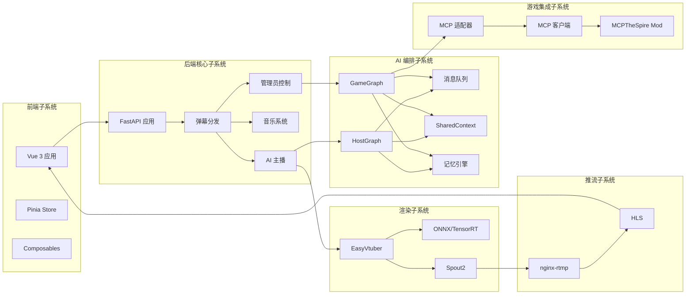
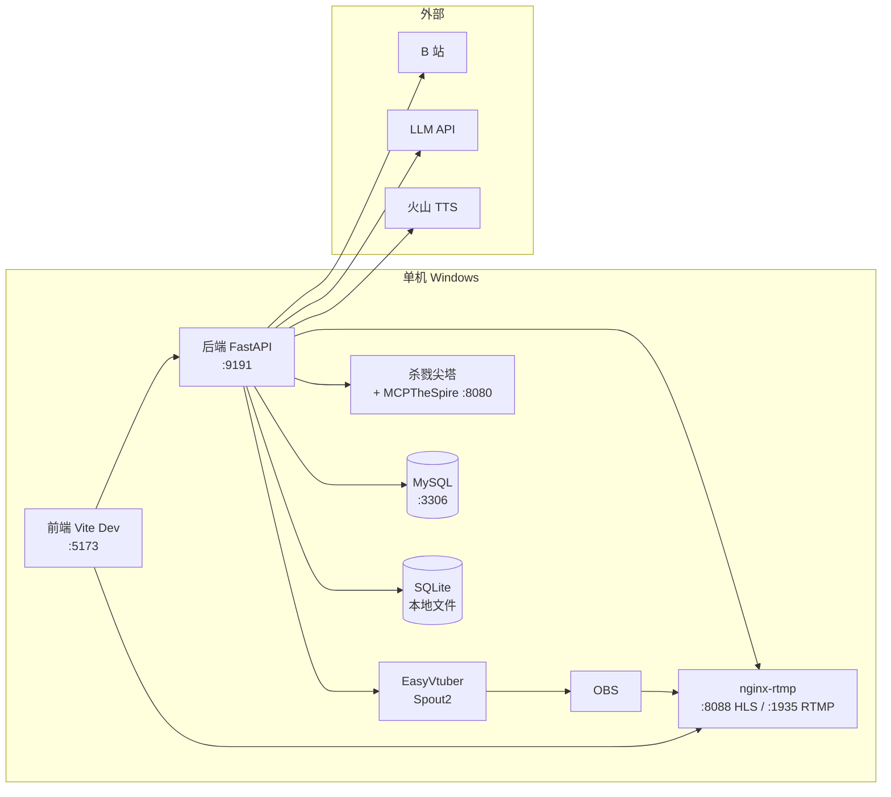
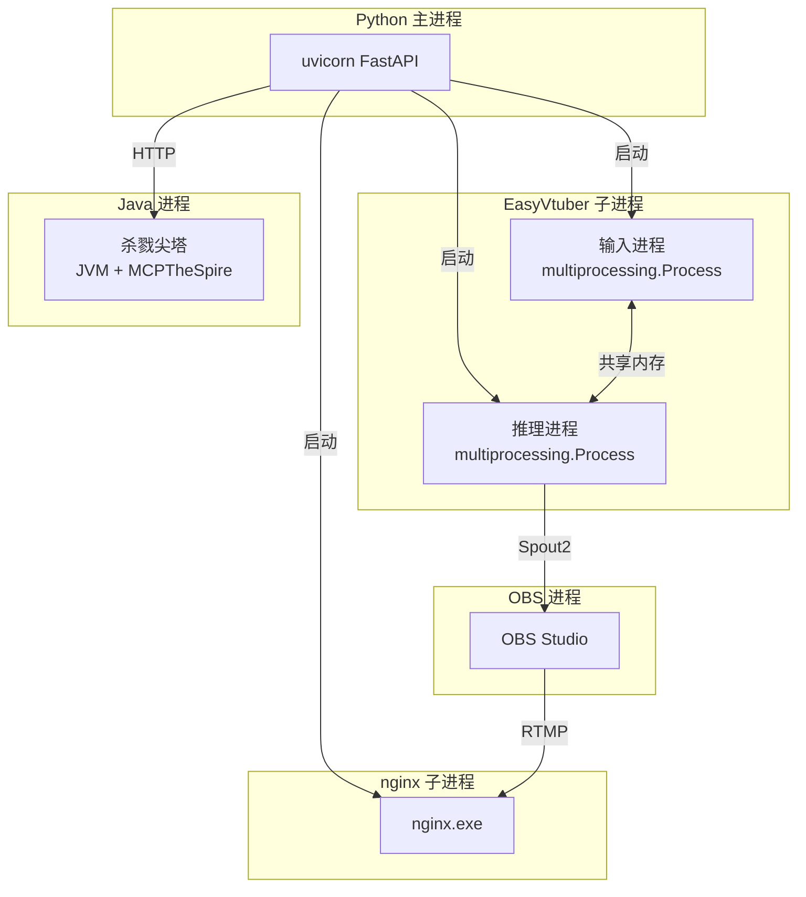

# 系统架构总览

本文档呈现 FeinaLive 系统的整体架构、子系统关系、部署拓扑，帮助开发者建立全局视角。

---

## 一、整体架构图

### 1.1 系统分层架构

```mermaid
flowchart TB
    subgraph 表现层
        Frontend[Vue 3 前端<br/>直播间控制台]
        OBS[OBS 推流软件]
        Viewers[B 站观众]
    end

    subgraph 接入层
        BilibiliWS[B 站直播 WebSocket<br/>blivedm]
        FrontendWS[前端 WebSocket<br/>ConnectionManager]
        RESTAPI[REST API<br/>FastAPI Router]
        SSE[SSE 流<br/>/ai/reply]
    end

    subgraph 应用层
        DanmakuHandler[弹幕分发中枢<br/>process_danmaku]
        AdminHandler[管理员指令<br/>AdminCommandHandler]
        MusicService[点歌服务<br/>DanmakuMusicService]
        HostBrain[主播大脑<br/>AIHostBrain]
        HostGraph[主播消费循环<br/>HostGraph]
        GameGraph[游戏决策循环<br/>GameGraph]
        GameManager[游戏管理器<br/>GameManager]
        EasyVtuberMgr[数字人管理器<br/>EasyVtuberManager]
        NginxService[推流服务<br/>NginxService]
    end

    subgraph 编排层
        MsgQueue[优先级消息队列<br/>PriorityMessageQueue]
        DynamicPriority[动态优先级<br/>DynamicPriorityManager]
        RateLimiter[频率限制<br/>RateLimiter]
        SharedContext[共享上下文<br/>SharedContext]
        CommentaryCoord[解说协调<br/>CommentaryCoordinator]
    end

    subgraph 智能层
        AIClient[LLM 客户端<br/>AIClient]
        TTSClient[TTS 客户端<br/>VolcanoTTSClient]
        EmbeddingClient[Embedding 客户端]
        MemoryEngine[记忆引擎<br/>MemoryEngine]
        PromptManager[提示词管理<br/>PromptManager]
    end

    subgraph 记忆层
        SessionMemory[单局记忆<br/>SessionMemory]
        AtomStore[长期记忆<br/>AtomStore SQLite+FTS5]
        KnowledgeGraph[知识图谱<br/>GameKnowledgeGraph]
        UserProfile[用户画像<br/>UserProfile MySQL]
        AtomLifecycle[生命周期管理<br/>AtomLifecycleManager]
    end

    subgraph 渲染层
        EasyVtuber[EasyVtuber 引擎<br/>THA3/THA4 + ONNX/TensorRT]
        InputProcess[输入进程<br/>Hybrid/Mouse/OSF]
        InferProcess[推理进程<br/>ModelClientProcess]
        SpoutOutput[Spout2 输出]
    end

    subgraph 游戏层
        MCPClient[MCP 客户端<br/>JSON-RPC 2.0]
        SlayAdapter[杀戮尖塔适配器<br/>SlayTheSpireAdapter]
        MCPServer[MCPTheSpire Mod<br/>Java HTTP 服务]
        StsGame[杀戮尖塔游戏进程]
    end

    subgraph 数据层
        MySQL[(MySQL<br/>用户画像/歌单/UP视频)]
        SQLite[(SQLite<br/>记忆原子/知识图谱)]
        Config[config.yaml<br/>配置文件]
    end

    subgraph 外部服务
        BilibiliAPI[B 站 API<br/>视频/评论/WBI]
        LLMProvider[LLM 服务<br/>OpenAI 兼容]
        VolcanoTTS[火山引擎 TTS]
        EmbeddingAPI[Embedding 服务]
    end

    Viewers -->|弹幕/礼物| BilibiliWS
    BilibiliWS --> DanmakuHandler
    Frontend --> FrontendWS
    Frontend --> RESTAPI
    Frontend --> SSE
    FrontendWS --> DanmakuHandler
    RESTAPI --> AdminHandler
    RESTAPI --> MusicService
    RESTAPI --> EasyVtuberMgr
    RESTAPI --> NginxService

    DanmakuHandler --> AdminHandler
    DanmakuHandler --> MusicService
    DanmakuHandler --> HostBrain
    DanmakuHandler --> FrontendWS

    AdminHandler --> EasyVtuberMgr
    AdminHandler --> MusicService
    AdminHandler --> GameManager

    HostBrain --> MsgQueue
    MsgQueue --> HostGraph
    HostGraph --> AIClient
    HostGraph --> TTSClient
    HostGraph --> MemoryEngine
    HostGraph --> SharedContext
    HostGraph --> EasyVtuberMgr
    HostGraph --> FrontendWS

    GameManager --> HostGraph
    GameManager --> GameGraph
    GameGraph --> MCPClient
    GameGraph --> AIClient
    GameGraph --> MemoryEngine
    GameGraph --> SharedContext
    GameGraph --> CommentaryCoord
    CommentaryCoord --> MsgQueue

    MsgQueue --> DynamicPriority
    MsgQueue --> RateLimiter

    MemoryEngine --> SessionMemory
    MemoryEngine --> AtomStore
    MemoryEngine --> KnowledgeGraph
    MemoryEngine --> UserProfile
    MemoryEngine --> AtomLifecycle
    AtomLifecycle --> AtomStore

    AIClient --> LLMProvider
    TTSClient --> VolcanoTTS
    EmbeddingClient --> EmbeddingAPI
    MusicService --> BilibiliAPI

    EasyVtuberMgr --> EasyVtuber
    EasyVtuber --> InputProcess
    EasyVtuber --> InferProcess
    InferProcess --> SpoutOutput
    SpoutOutput --> OBS
    OBS --> NginxService
    NginxService --> Frontend

    MCPClient --> MCPServer
    MCPServer --> StsGame
    SlayAdapter --> MCPClient
    GameGraph --> SlayAdapter

    UserProfile --> MySQL
    MusicService --> MySQL
    AtomStore --> SQLite
    KnowledgeGraph --> SQLite
    Config --> EasyVtuberMgr
    Config --> AIClient
    Config --> TTSClient
```

### 1.2 子系统关系图

---

## 二、子系统职责

### 2.1 前端子系统

**职责**：直播间控制台，展示弹幕、视频、音乐，提供配置与管理界面。

**核心组件**：
- Vue 3 应用（固定 1920×1080 设计稿，transform 缩放适配）
- Pinia Store（danmaku/llm/music/stream/mission）
- Composables（useBilibiliDanmaku/useAvatarInput/useHlsPlayer/useAdminCommands）
- WebSocket 客户端（弹幕流、数字人输入、测试房间）

**详细设计**：见 [模块划分 - 前端模块](./02-模块划分.md#前端模块)

### 2.2 后端核心子系统

**职责**：中心枢纽，连接所有外部服务与内部模块。

**核心模块**：
- FastAPI 应用入口（`main.py`，lifespan 管理生命周期）
- 弹幕分发中枢（`process_danmaku`）
- AI 主播大脑（`AIHostBrain`）
- 音乐系统（`DanmakuMusicService` + `MusicQueue`）
- 管理员控制（`AdminCommandHandler`）
- 配置管理（`Config` 单例 + `config_router`）

**详细设计**：见 [模块划分 - 后端模块](./02-模块划分.md#后端模块)

### 2.3 AI 编排子系统

**职责**：基于消息队列的 Graph 编排，协调主播与游戏 AI。

**核心组件**：
- 优先级消息队列（`PriorityMessageQueue`）
- 动态优先级管理（`DynamicPriorityManager`）
- 主播消费循环（`HostGraph`）
- 游戏决策循环（`GameGraph`）
- 共享上下文（`SharedContext`）
- 解说协调（`CommentaryCoordinator`）
- 记忆引擎（`MemoryEngine`）

**详细设计**：见 [核心组件设计](./03-核心组件设计.md)

### 2.4 渲染子系统

**职责**：实时渲染数字人画面，输出到推流。

**核心组件**：
- EasyVtuber 引擎（多进程架构）
- 输入进程（姿态采集）
- 推理进程（THA3/THA4 模型推理）
- 输出（Spout2 纹理共享）

**详细设计**：见 [数字人渲染流程](../01-业务流程/05-数字人渲染流程.md)

### 2.5 游戏集成子系统

**职责**：通过 MCP 协议操控游戏，AI 自主决策。

**核心组件**：
- MCP 适配器（`SlayTheSpireAdapter`）
- MCP 客户端（`MCPClient`，JSON-RPC 2.0）
- MCPTheSpire Mod（Java，游戏内 HTTP 服务）

**详细设计**：见 [游戏 AI 自动化流程](../01-业务流程/04-游戏AI自动化流程.md)

### 2.6 推流子系统

**职责**：nginx-rtmp 接收 OBS 推流，输出 HLS 直播流。

**核心组件**：
- nginx-rtmp-win32（Windows 版 nginx with RTMP 模块）
- HLS 输出（`.m3u8` + `.ts` 分片）
- 前端 HLS 播放器（hls.js）

**详细设计**：见 [数字人渲染流程 - 直播推流](../01-业务流程/05-数字人渲染流程.md#25-直播推流)

---

## 三、部署拓扑

### 3.1 单机部署（当前方案）

### 3.2 端口分配

| 端口 | 服务 | 说明 |
|------|------|------|
| 9191 | 后端 FastAPI | 主服务（main.py 默认） |
| 5173 | 前端 Vite Dev | 开发服务器 |
| 8088 | nginx HLS | HTTP HLS 流 |
| 1935 | nginx RTMP | RTMP 推流接收 |
| 8080 | MCPTheSpire | 游戏 MCP 服务 |
| 8765 | EasyVtuber WS | 数字人 WebSocket（可选） |
| 3306 | MySQL | 数据库 |

### 3.3 进程模型

---

## 四、关键设计决策

### 4.1 单例模式贯穿全局

几乎所有管理器都通过 `get_xxx()` 工厂函数实现懒加载单例：
- `get_host_brain(room_id)`、`get_message_queue()`、`get_memory_engine()`
- `get_music_queue()`、`get_playlist_manager()`、`get_easyvtuber_manager()`
- `get_admin_handler()`、`get_game_manager()`、`get_shared_context()`

**理由**：单进程内共享状态，避免重复初始化，简化依赖管理。

### 4.2 双 Graph 架构

- **HostGraph**：消费消息队列，生成主播话术
- **GameGraph**：状态机决策，操控游戏
- **SharedContext**：两者共享历史与记忆
- **CommentaryCoordinator**：协调解说请求

**理由**：解耦主播对话与游戏决策，独立演进，通过消息队列协同。

### 4.3 多进程渲染

EasyVtuber 使用 `multiprocessing.Process` 将输入采集与模型推理分离：
- 输入进程：采集姿态，写入共享内存
- 推理进程：读取共享内存，模型推理，输出画面
- `SharedMemoryGuard`：Windows Mutex 同步

**理由**：GIL 限制下，多进程充分利用多核，推理不阻塞输入采集。

### 4.4 消息队列解耦

弹幕/礼物/解说请求统一入 `PriorityMessageQueue`，HostGraph 统一消费：
- 动态优先级：饥饿升级、洪流降级
- 频率限制：避免刷屏
- 用户冷却：公平性

**理由**：统一调度，避免各消息源直接竞争 LLM/TTS 资源。

### 4.5 记忆分层

- **短期**：SessionHistory（会话级，50 条）
- **中期**：UserProfile（用户画像 + 近期对话）
- **长期**：AtomStore（SQLite + FTS5，时间衰减）
- **图谱**：GameKnowledgeGraph（游戏知识关系）

**理由**：不同时间尺度的记忆用不同存储，平衡性能与持久性。

---

## 五、技术栈速览

| 层次 | 技术 | 版本 |
|------|------|------|
| 后端框架 | FastAPI + Uvicorn | 0.115+ |
| LLM 接入 | LiteLLM | 1.70.x |
| 数据库 ORM | SQLAlchemy 2.0 async | 2.0+ |
| 关系数据库 | MySQL（aiomysql） | - |
| 嵌入式数据库 | SQLite（aiosqlite） | - |
| B 站 SDK | blivedm + bilibili-api-python | - |
| 前端框架 | Vue 3 + TypeScript | 3.4+ |
| 状态管理 | Pinia | 2.1+ |
| 构建工具 | Vite | 5.2+ |
| 样式 | Tailwind CSS | 3.4+ |
| HLS 播放 | hls.js | 1.6+ |
| 渲染引擎 | EasyVtuber (THA3/THA4) | - |
| 推理加速 | ONNX Runtime GPU / TensorRT | 1.21+ |
| 推流 | nginx-rtmp-win32 | - |
| 游戏 Mod | MCPTheSpire (Java) | - |

> 详细选型理由见 [技术栈选型说明](./01-技术栈选型说明.md)。

---

## 六、相关文档

- [技术栈选型说明](./01-技术栈选型说明.md)：各技术选型的详细理由
- [模块划分](./02-模块划分.md)：各模块的详细职责与文件结构
- [核心组件设计](./03-核心组件设计.md)：核心组件的内部设计
- [接口设计规范](./04-接口设计规范.md)：REST/WebSocket/MCP 接口规范
- [数据流转机制](./05-数据流转机制.md)：各数据流的流转路径
