# 模块划分

本文档详细描述 FeinaLive 各模块的职责、文件结构与依赖关系，帮助开发者快速定位代码位置。

---

## 一、后端模块

### 1.1 目录总览

```
backend/
├── main.py                    # FastAPI 应用入口
├── pyproject.toml             # 依赖配置
├── config.example.yaml        # 配置模板
├── config.yaml                # 实际配置（gitignore）
├── apps/                      # 应用模块
│   ├── __init__.py
│   ├── config.py              # 全局配置单例
│   ├── config_router.py       # 配置管理 API
│   ├── db.py                  # 数据库连接与表定义
│   ├── exceptions.py          # 通用异常类
│   ├── test_router.py         # 测试路由
│   ├── ai/                    # AI 模块
│   ├── easyvtuber/            # 数字人集成模块
│   ├── live/                  # 直播模块
│   └── image/                 # 图像模块（预留）
├── core/                      # 核心组件
│   ├── __init__.py
│   └── websocket.py           # WebSocket 连接管理
├── services/                  # 服务层
│   ├── __init__.py
│   └── nginx_service.py       # nginx-rtmp 服务管理
├── tests/                     # 测试
├── EasyVtuber/                # 数字人渲染引擎
└── prompts/                   # 提示词文件
```

### 1.2 AI 模块（`apps/ai/`）

```
apps/ai/
├── __init__.py
├── router.py                  # AI 主播对话路由（/ai）
├── game_router.py             # 游戏集成路由（/game）
├── client.py                  # LLM 统一客户端（LiteLLM）
├── embedding.py               # Embedding 客户端
├── tts.py                     # 火山引擎 TTS 客户端
├── host_brain.py              # AI 主播大脑（弹幕缓冲+流式回复）
├── host_graph.py              # 主播消费循环（HostGraph）
├── game_graph.py              # 游戏决策循环（GameGraph）
├── game_manager.py            # 游戏管理器（统一启停）
├── admin_commands.py          # 管理员指令处理器
├── commentary.py              # 解说协调器
├── history.py                 # 会话历史管理
├── prompt.py                  # 提示词管理
├── shared_context.py          # 共享上下文（Graph 间共享状态）
├── game_graph.py              # 游戏 Graph 决策主循环
├── memory/                    # 记忆子系统
│   ├── __init__.py
│   ├── atom.py                # 记忆原子模型
│   ├── atom_store.py          # 长期记忆存储（SQLite+FTS5）
│   ├── engine.py              # 统一记忆引擎
│   ├── extractor.py           # 记忆提取器（LLM）
│   ├── injector.py            # 记忆注入器（按角色）
│   ├── lifecycle.py           # 生命周期管理（过期/遗忘/强化）
│   ├── session_memory.py      # 单局游戏记忆
│   ├── graph_store.py         # 游戏知识图谱
│   ├── tools.py               # Agent 记忆工具（memorize/recall）
│   ├── user_profile.py        # 用户画像管理
│   ├── summarizer.py          # 用户记忆摘要
│   └── game_memory.py         # 游戏记忆总结服务
├── messaging/                 # 消息调度子系统
│   ├── __init__.py
│   ├── queue.py               # 优先级消息队列
│   ├── dynamic_priority.py    # 动态优先级管理
│   └── rate_limiter.py        # 频率限制器
├── mcp/                       # MCP 游戏集成
│   ├── __init__.py
│   ├── base_adapter.py        # 游戏适配器抽象基类
│   ├── client.py              # MCP JSON-RPC 客户端
│   └── adapters/
│       ├── __init__.py
│       └── slay_the_spire.py  # 杀戮尖塔适配器
├── tools/                     # 工具类型定义
│   ├── __init__.py
│   └── types.py               # AgentAction / ToolResult
└── plugins/                   # 插件目录（预留）
    └── __init__.py
```

**模块职责**：

| 子模块 | 职责 | 关键类 |
|--------|------|--------|
| 路由层 | HTTP/WebSocket 接口 | `router.py`, `game_router.py` |
| 大脑层 | 弹幕缓冲、流式回复 | `AIHostBrain`, `HostGraph`, `GameGraph` |
| 客户端层 | LLM/TTS/Embedding 接入 | `AIClient`, `VolcanoTTSClient`, `EmbeddingClient` |
| 记忆层 | 短期/长期/图谱记忆 | `MemoryEngine`, `AtomStore`, `GameKnowledgeGraph` |
| 消息层 | 优先级队列与调度 | `PriorityMessageQueue`, `DynamicPriorityManager` |
| MCP 层 | 游戏通信与适配 | `MCPClient`, `SlayTheSpireAdapter` |
| 共享层 | 跨 Graph 状态 | `SharedContext`, `CommentaryCoordinator` |

### 1.3 直播模块（`apps/live/`）

```
apps/live/
├── __init__.py
├── danmaku_handler.py         # 弹幕统一处理器
├── bilibili/                  # B 站直播
│   ├── __init__.py
│   ├── models.py              # 弹幕数据模型
│   ├── handlers.py            # 弹幕事件处理器
│   ├── client.py              # B 站直播客户端（blivedm）
│   └── router.py              # 弹幕 WebSocket 路由
└── music/                     # 音乐系统
    ├── __init__.py
    ├── models.py              # 音乐数据模型
    ├── client.py              # B 站音乐客户端
    ├── library.py             # 预备歌单管理
    ├── llm_verify.py          # LLM 音乐验证
    ├── queue.py               # 播放队列管理
    ├── service.py             # 弹幕点歌服务
    ├── up_videos.py           # UP 主视频管理
    └── router.py              # 音乐 API 路由
```

**模块职责**：

| 子模块 | 职责 | 关键类 |
|--------|------|--------|
| danmaku_handler | 弹幕分发中枢 | `process_danmaku()` |
| bilibili | B 站弹幕接入 | `BilibiliClient`, `CustomHandler` |
| music | 点歌与播放 | `DanmakuMusicService`, `MusicQueue`, `PlaylistManager` |

### 1.4 数字人集成模块（`apps/easyvtuber/`）

```
apps/easyvtuber/
├── __init__.py                # EasyVtuberManager 单例
└── router.py                  # 数字人输入控制路由（/avatar）
```

**模块职责**：
- `EasyVtuberManager`：管理 EasyVtuber 引擎生命周期
- `router.py`：提供 WebSocket 输入控制接口

### 1.5 核心组件（`core/`）

```
core/
├── __init__.py
└── websocket.py               # ConnectionManager（按 room_id 管理 WS 连接）
```

**模块职责**：
- `ConnectionManager`：WebSocket 连接管理，按 room_id 隔离
- 线程安全（每个 room 一把 asyncio.Lock）

### 1.6 服务层（`services/`）

```
services/
├── __init__.py
└── nginx_service.py           # NginxService（nginx-rtmp 进程管理）
```

### 1.7 数据库（`apps/db.py`）

**表定义**：

| 表名 | 用途 | 关键字段 |
|------|------|----------|
| `user_profiles` | 用户画像 | user_id(PK), username, danmaku_count, impression, long_term_memory, recent_messages(JSON) |
| `up_videos` | UP 主视频缓存 | id(PK), bvid(unique), title, up_uid, duration |
| `playlist` | 预备歌单 | id(PK), bvid(unique), title, artist, enabled |

### 1.8 EasyVtuber 渲染引擎（`EasyVtuber/`）

```
EasyVtuber/
├── runner.py                  # 后端集成入口（EasyVtuberRunner）
├── models.py                  # PyTorch 模型定义
├── run_gpu.py                 # GPU 启动脚本
├── test_gpu.py                # GPU 测试脚本
├── env_init.py                # 环境初始化
├── data/
│   ├── images/                # 角色立绘
│   └── models/                # 模型文件（rife/sr/tha3/tha4）
├── src/                       # 渲染引擎源码
│   ├── main.py                # 原始主入口
│   ├── args.py                # 命令行参数
│   ├── audio_client.py        # 音频驱动输入
│   ├── debug_input_client.py  # 调试输入
│   ├── ezvtb_rt_interface.py  # 模型工厂
│   ├── face_mesh_client.py    # FaceMesh 输入
│   ├── hybrid_input_client.py # 混合输入
│   ├── model_infer_client.py  # 推理进程
│   ├── mouse_client.py        # 鼠标输入
│   ├── open_see_face_client.py# OSF 输入
│   └── utils/                 # 工具函数
│       ├── facial_points.py   # 面部关键点
│       ├── filter.py          # OneEuroFilter
│       ├── fps.py             # FPS 计数器
│       ├── pose.py            # 姿态计算
│       ├── pose_simplify.py   # 姿态量化
│       ├── preprocess.py      # 图像预处理
│       ├── shared_mem_guard.py# 共享内存互斥
│       ├── timer_wait.py      # 高精度等待
│       └── utils.py           # 通用工具
└── ezvtuber-rt/               # 实时渲染引擎
    └── ezvtb_rt/
        ├── __init__.py        # 模型路径初始化
        ├── cache.py           # RAM 缓存（LRU+Brotli）
        ├── core_ort.py        # CoreORT 主管线
        ├── init_utils.py      # 模型合并工具
        ├── ort_utils.py       # ORT session 创建
        ├── vram_cache.py      # VRAM 缓存
        ├── tha3.py / tha3_ort.py       # THA3 TensorRT/ORT
        ├── tha4.py / tha4_ort.py       # THA4 TensorRT/ORT
        └── tha4_student.py / tha4_student_ort.py  # THA4 Student
```

---

## 二、前端模块

### 2.1 目录总览

```
fronted/
├── index.html                 # HTML 入口
├── package.json               # 依赖配置
├── vite.config.ts             # Vite 构建配置
├── tailwind.config.js         # Tailwind 配置
├── postcss.config.js          # PostCSS 配置
├── tsconfig.json              # TypeScript 配置
└── src/
    ├── main.ts                # 应用入口
    ├── App.vue                # 根组件
    ├── assets/styles/main.css # 全局样式
    ├── components/            # 组件
    ├── composables/           # 组合式函数
    ├── stores/                # Pinia Store
    ├── types/                 # 类型定义
    ├── utils/                 # 工具函数
    ├── mock/                  # Mock 数据
    └── pic/                   # 图片资源
```

### 2.2 组件（`components/`）

```
components/
├── danmaku/                   # 弹幕组件
│   ├── DanmakuItem.vue        # 单条弹幕
│   └── DanmakuPanel.vue       # 弹幕列表面板
├── infobar/                   # 信息栏组件
│   ├── ClockDisplay.vue       # 时钟
│   ├── InfoBar.vue            # 信息栏容器
│   ├── MarqueeText.vue        # 跑马灯公告
│   └── NoticeBadge.vue        # 通知徽章
├── layout/                    # 布局装饰
│   ├── TopDecoration.vue      # 顶部装饰
│   └── BottomDecoration.vue   # 底部装饰
├── mainview/                  # 主视图
│   └── MainView.vue           # 主视频区域
├── music/                     # 音乐组件
│   └── MusicPlayer.vue        # 音乐播放器
├── panels/                    # 面板组件
│   ├── MissionPanel.vue       # 委托密函面板
│   └── PlaceholderPanel.vue   # 占位面板（音乐+LLM文本）
├── DanmakuTestPanel.vue       # 弹幕测试面板
├── NotificationToast.vue      # 全局通知
├── PlayUnlockModal.vue        # 播放解锁弹窗
├── SessdataWarningModal.vue   # SESSDATA 警告弹窗
└── SettingsPanel.vue          # 设置面板
```

**组件职责**：

| 组件 | 职责 | 关键交互 |
|------|------|----------|
| App.vue | 根布局、全局初始化 | fetchConfig、checkSessdata、connectToRoom |
| DanmakuPanel | 弹幕列表展示 | danmaku store |
| MainView | 主视频区域 | HLS 播放、MCP 开关 |
| MusicPlayer | 音乐播放器 | music store |
| PlaceholderPanel | 音乐信息 + LLM 文本 | music + llm store |
| SettingsPanel | 集中配置管理 | GET/PUT /config、管理员指令 |
| DanmakuTestPanel | 弹幕测试 | POST /test/danmaku |

### 2.3 组合式函数（`composables/`）

| 文件 | 职责 | WebSocket |
|------|------|-----------|
| `useBilibiliDanmaku.ts` | B 站弹幕连接与消息分发 | `/bilibili/ws/{roomId}` |
| `useAvatarInput.ts` | 数字人输入控制 | `/avatar/input` |
| `useHlsPlayer.ts` | HLS 直播流播放 | 无（HTTP 轮询 /stream/status） |
| `useAdminCommands.ts` | 管理员指令与状态 | 无（REST 轮询 /test/admin/state） |

### 2.4 Pinia Store（`stores/`）

| Store | 职责 | 关键 API |
|-------|------|----------|
| `danmaku.ts` | 弹幕列表、连接管理 | useBilibiliDanmaku |
| `llm.ts` | LLM 生成、音频播放、文本动画 | POST /ai/reply（SSE） |
| `music.ts` | 音乐队列、播放控制 | /music/* |
| `stream.ts` | 时钟、公告、直播状态 | GET /config |
| `mission.ts` | 游戏任务数据 | 外部 GraphQL API |

### 2.5 类型定义（`types/`）

| 文件 | 内容 |
|------|------|
| `config.ts` | FullConfig 及所有子配置接口（与后端 Pydantic 对齐） |
| `danmaku.ts` | DanmakuMessage、DanmakuType |
| `music.ts` | MusicItem、MusicStatus、QueueResponse |
| `stream.ts` | StreamStatus |

---

## 三、MCP 模块

### 3.1 目录总览

```
mcp/
├── pom.xml                    # Maven 配置
├── README.md                  # 说明文档
└── src/main/
    ├── java/mcpthespire/
    │   ├── MCPTheSpire.java        # Mod 主类
    │   ├── CommandExecutor.java    # 命令执行器
    │   ├── EndOfTurnAction.java    # 回合结束动作
    │   ├── GameStateConverter.java # 游戏状态转换器
    │   ├── GameStateListener.java  # 状态监听器
    │   ├── InvalidCommandException.java # 异常类
    │   ├── ChoiceScreenUtils.java  # 选择屏幕工具
    │   ├── mcp/
    │   │   ├── MCPProtocol.java    # JSON-RPC 协议常量
    │   │   ├── MCPServer.java      # HTTP 服务
    │   │   └── MCPToolHandler.java # 工具定义与执行
    │   └── patches/                # SpirePatch 补丁（27 个文件）
    └── resources/
        ├── ModTheSpire.json        # Mod 元信息
        └── badge.png               # Mod 图标
```

### 3.2 补丁分类

| 类别 | 文件 | 数量 | 职责 |
|------|------|------|------|
| 状态变更通知 | CardCrawlGamePatch, GameActionManager*, EnableEndTurnPatch 等 | 10+ | 在关键事件调用 registerStateChange |
| 异步效果守卫 | Campfire*Patch, AbstractRelicUpdatePatch | 7 | block/resume 状态更新配对 |
| 交互注入 | CardRewardScreenPatch, DungeonMapPatch, InputActionPatch 等 | 10+ | 模拟 hover/click/keypress |

---

## 四、模块间依赖关系

```mermaid
flowchart TD
    Main[main.py] --> Config[config.py]
    Main --> BilibiliRouter[bilibili/router.py]
    Main --> MusicRouter[music/router.py]
    Main --> ConfigRouter[config_router.py]
    Main --> AIRouter[ai/router.py]
    Main --> GameRouter[game_router.py]
    Main --> EasyVtuberRouter[easyvtuber/router.py]
    Main --> TestRouter[test_router.py]
    Main --> NginxService[nginx_service.py]
    
    BilibiliRouter --> BilibiliClient[bilibili/client.py]
    BilibiliRouter --> DanmakuHandler[danmaku_handler.py]
    BilibiliRouter --> WSManager[websocket.py]
    BilibiliRouter --> MsgQueue[messaging/queue.py]
    BilibiliRouter --> PriorityMgr[messaging/dynamic_priority.py]
    
    DanmakuHandler --> AdminHandler[admin_commands.py]
    DanmakuHandler --> MusicService[music/service.py]
    DanmakuHandler --> HostBrain[host_brain.py]
    DanmakuHandler --> WSManager
    
    MusicService --> MusicClient[music/client.py]
    MusicService --> PlaylistLib[music/library.py]
    MusicService --> LLMVerify[music/llm_verify.py]
    MusicService --> UpVideos[music/up_videos.py]
    MusicService --> MusicQueue[music/queue.py]
    MusicService --> DB[db.py]
    
    MusicRouter --> MusicQueue
    MusicRouter --> MusicClient
    
    HostBrain --> AIClient[ai/client.py]
    HostBrain --> TTS[ai/tts.py]
    HostBrain --> History[history.py]
    HostBrain --> UserProfile[user_profile.py]
    HostBrain --> PromptMgr[prompt.py]
    HostBrain --> MsgQueue
    HostBrain --> AdminHandler
    HostBrain --> EasyVtuberMgr[easyvtuber/__init__.py]
    
    HostGraph --> AIClient
    HostGraph --> TTS
    HostGraph --> MsgQueue
    HostGraph --> SharedContext[shared_context.py]
    HostGraph --> MemoryEngine[memory/engine.py]
    HostGraph --> WSManager
    
    GameGraph --> GameAIClient[ai/client.py game]
    GameGraph --> MCPAdapter[mcp/adapters/slay_the_spire.py]
    GameGraph --> SharedContext
    GameGraph --> MemoryEngine
    GameGraph --> CommentaryCoord[commentary.py]
    
    MCPAdapter --> MCPClient[mcp/client.py]
    
    MemoryEngine --> SessionMem[memory/session_memory.py]
    MemoryEngine --> AtomStore[memory/atom_store.py]
    MemoryEngine --> GraphStore[memory/graph_store.py]
    MemoryEngine --> UserProfile
    MemoryEngine --> AtomLifecycle[memory/lifecycle.py]
    MemoryEngine --> Extractor[memory/extractor.py]
    MemoryEngine --> Injector[memory/injector.py]
    
    EasyVtuberMgr --> Runner[EasyVtuber/runner.py]
    
    style Main fill:#e1f5fe
    style DanmakuHandler fill:#fff3e0
    style HostBrain fill:#e8f5e9
    style GameGraph fill:#fce4ec
    style MemoryEngine fill:#f3e5f5
```



---

## 五、相关文档

- [系统架构总览](./00-系统架构总览.md)：整体架构
- [核心组件设计](./03-核心组件设计.md)：各模块内部设计
- [接口设计规范](./04-接口设计规范.md)：各模块 API 规范
