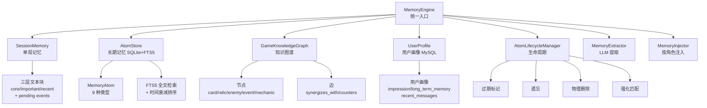
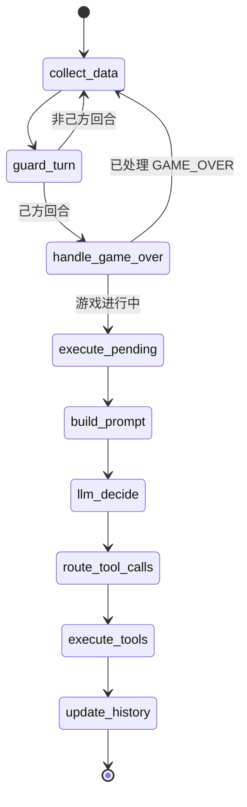

# 核心组件设计

本文档详细描述 FeinaLive 核心组件的内部设计，包括记忆系统、消息队列、Graph 编排、共享上下文、解说协调等。

---

## 一、记忆系统（Memory Engine）

### 1.1 设计目标

- **多时间尺度**：短期（会话级）、中期（用户画像）、长期（知识库）、图谱（关系网络）
- **时间感知**：记忆随时间衰减，可被强化
- **按角色注入**：游戏 AI 与主播 AI 获取不同记忆上下文
- **自动提取**：从对话/动作中用 LLM 提取记忆

### 1.2 架构



### 1.3 记忆原子（MemoryAtom）

**文件**：`backend/apps/ai/memory/atom.py`

**类型与 TTL**：

| AtomType | 说明 | base_ttl(天) | decay_type |
|----------|------|--------------|------------|
| GAME_MECHANIC | 游戏机制 | 180 | EXPONENTIAL |
| GAME_LORE | 游戏背景 | 365 | EXPONENTIAL |
| VIEWER_PREFERENCE | 观众偏好 | 60 | EXPONENTIAL |
| VIEWER_FACT | 观众事实 | 90 | LINEAR |
| VIEWER_RELATION | 观众关系 | 90 | LINEAR |
| HOST_PERSONALITY | 主播人设 | 365 | EXPONENTIAL |
| EPISODIC | 情节记忆 | 7 | EXPONENTIAL |
| FACTUAL | 事实 | 180 | EXPONENTIAL |
| UNKNOWN | 未知 | 30 | EXPONENTIAL |

**衰减算法**：
```python
def compute_decay_score(decay_type, ttl_days, days_since):
    if decay_type == LINEAR:
        return max(0, 1 - days_since / ttl_days)
    elif decay_type == STEP:
        return 1.0 if days_since < ttl_days else 0.05
    elif decay_type == EXPONENTIAL:
        half_life = ttl_days / 2
        return math.exp(-math.log(2) * days_since / half_life)
```

**TTL 计算**：
```python
ttl = base_ttl * (0.5 + importance) * (1 + min(0.5, reinforcement_count * 0.1))
```

### 1.4 AtomStore 存储设计

**文件**：`backend/apps/ai/memory/atom_store.py`

**表结构**：
```sql
CREATE TABLE memory_atoms (
    atom_id INTEGER PRIMARY KEY,
    parent_memory_id TEXT,
    atom_type TEXT,
    content TEXT,
    entities TEXT,           -- JSON
    importance REAL,
    confidence REAL,
    created_at TEXT,
    last_accessed_at TEXT,
    last_reinforced_at TEXT,
    event_time TEXT,
    ttl_days REAL,
    expires_at TEXT,
    status TEXT,             -- ACTIVE/EXPIRED/FORGOTTEN
    reinforcement_count INTEGER,
    decay_type TEXT,
    game_id TEXT,
    user_id TEXT,
    session_id TEXT,
    metadata TEXT            -- JSON
);

CREATE VIRTUAL TABLE memory_atoms_fts USING fts5(
    content,
    content='memory_atoms',
    content_rowid='atom_id',
    tokenize='unicode61'
);
```

**检索算法**：
1. FTS5 MATCH 检索（token 加引号处理长词）
2. 无结果时 LIKE 回退
3. BM25 分数归一化（0-1）
4. `final_score = bm25_score * temporal_score`
5. 按 final_score 降序排序

### 1.5 SessionMemory 单局记忆

**文件**：`backend/apps/ai/memory/session_memory.py`

**三层结构**：
- `core`：核心记忆（关键信息，手动更新）
- `important`：重要记忆（次关键，手动更新）
- `recent`：最近记忆（最新事件，append）
- `pending_events`：待总结事件 FIFO（maxlen=40）

**总结触发**：
- `should_summarize()`：pending 数 ≥ 12
- `summarize_session_memory()`：LLM 压缩 pending 为三层 JSON
- `apply_summary(summary)`：清空 pending，记录 summarized_until_id

**Prompt 文本**：
```
【核心记忆】
{core}

【重要记忆】
{important}

【最近记忆】
{recent}

【待总结近期事件】
{pending 最后 8 条}
```

### 1.6 GameKnowledgeGraph 知识图谱

**文件**：`backend/apps/ai/memory/graph_store.py`

**节点类型**：card / relic / enemy / event / mechanic
**边类型**：synergizes_with / counters / belongs_to / found_in

**表结构**：
```sql
CREATE TABLE graph_nodes (
    node_id INTEGER PRIMARY KEY,
    game_id TEXT,
    node_type TEXT,
    canonical_name TEXT,
    display_name TEXT,
    properties TEXT,         -- JSON
    UNIQUE(game_id, canonical_name)
);

CREATE TABLE graph_edges (
    edge_id INTEGER PRIMARY KEY,
    source_id INTEGER,
    target_id INTEGER,
    relation TEXT,
    confidence REAL,
    evidence TEXT,
    UNIQUE(source_id, target_id, relation)
);

CREATE VIRTUAL TABLE graph_nodes_fts USING fts5(
    display_name, properties,
    content='graph_nodes',
    content_rowid='node_id'
);
```

**自动入库**：`SlayTheSpireAdapter.ingest_game_state_to_graph(state)` 从游戏状态提取手牌/遗物/敌人节点。

### 1.7 MemoryInjector 按角色注入

**文件**：`backend/apps/ai/memory/injector.py`

**游戏 AI 注入**（`inject_for_game`）：
1. SessionMemory 全量
2. 长期游戏知识 top 10（GAME_MECHANIC + GAME_LORE）
3. 知识图谱协同/克制关系（从 important/core 提取【】关键词查询）

**主播 AI 注入**（`inject_for_host`）：
1. 主播人设（HOST_PERSONALITY）top 10
2. 观众记忆（VIEWER_FACT/PREFERENCE/RELATION）top 5
3. 最近互动（EPISODIC）top 5

### 1.8 生命周期管理

**文件**：`backend/apps/ai/memory/lifecycle.py`

**定期维护**（每 24 小时）：
1. `expire_stale_atoms()`：超过 expires_at 的标记为 EXPIRED
2. `forget_expired_atoms()`：EXPIRED 超过 7 天标记为 FORGOTTEN
3. `cleanup_forgotten()`：FORGOTTEN 超过 30 天物理删除

**强化匹配**（新记忆入库时）：
- Jaccard 相似度匹配（CJK 文本用字符 bigram 回退）
- 相似度 ≥ 0.6 → `reinforce(atom_id, new_confidence)`
- 强化：`reinforcement_count += 1`，重算 TTL，`confidence = 0.7*old + 0.3*new`

---

## 二、消息队列（Priority Message Queue）

### 2.1 设计目标

- **统一调度**：弹幕/礼物/解说请求统一入队
- **动态优先级**：饥饿升级、洪流降级
- **频率限制**：避免刷屏
- **公平性**：用户冷却

### 2.2 优先级体系

**文件**：`backend/apps/ai/messaging/dynamic_priority.py`

| 优先级 | 数值 | 说明 | 丢弃策略 |
|--------|------|------|----------|
| PRIORITY_HIGHEST | 1 | 最高（如舰长礼物） | 永不丢弃 |
| PRIORITY_HIGH | 2 | 高（如解说请求） | 永不丢弃 |
| PRIORITY_NORMAL | 3 | 普通（常规弹幕） | 队列满且 allow_skip 时丢弃 |
| PRIORITY_LOW | 4 | 低（洪流期弹幕） | 队列满时优先丢弃 |
| PRIORITY_DISPOSABLE | 5 | 可丢弃（严重洪流） | 立即丢弃 |

### 2.3 动态优先级算法

**弹幕优先级**：
```python
def get_danmaku_priority():
    if 饥饿(>30s 未消费): return PRIORITY_HIGH
    if 严重洪流(>=flood+3): return PRIORITY_DISPOSABLE
    if 洪流(>=flood in 20s): return PRIORITY_LOW
    return PRIORITY_NORMAL
```

**礼物优先级**（按价值 + 动态调整）：
```python
def get_gift_priority(total_coin):
    if total_coin >= 10000: return PRIORITY_HIGHEST  # 舰长
    base = HIGH(5000+) / NORMAL(1000+) / LOW(100+)
    if 饥饿 and base >= NORMAL: base -= 1  # 升一级
    if 洪流 and base >= NORMAL: base += 1  # 降一级
    return base
```

### 2.4 队列丢弃策略

**文件**：`backend/apps/ai/messaging/queue.py`

```python
async def put(msg):
    if muted: return False
    if cancel_key in cancelled: return False
    if not rate_limiter.allow(msg.source, msg.action): return False
    if user_cooldown_active(msg.user_id): return False
    
    apply_priority_override(msg)
    
    if queue_full:
        if msg.priority in NEVER_DROP:  # HIGHEST, HIGH
            evict_lowest_priority()  # 挤掉最低优先级
        elif msg.allow_skip:
            return False  # 直接丢弃
        else:
            evict_lowest_priority()
    
    if msg.merge_key:
        merge_with_existing(msg)
    else:
        queue.put(msg)
```

### 2.5 频率限制

**文件**：`backend/apps/ai/messaging/rate_limiter.py`

| source:action | min_interval | 说明 |
|---------------|--------------|------|
| game:commentary_request | 4.0s | 解说请求 |
| danmaku:danmaku | 3.0s | 弹幕 |
| gift:gift_thanks | 10.0s | 礼物感谢 |

**算法**：min_interval 检查 + 突发窗口内 burst 检查

---

## 三、Graph 编排

### 3.1 HostGraph 主播消费循环

**文件**：`backend/apps/ai/host_graph.py`

**职责**：消费消息队列，生成主播话术并 TTS 播报。

**循环逻辑**：
```python
async def _host_loop():
    while running:
        queue.apply_priority_override()
        msg = await queue.get(timeout=5.0)
        
        if msg.msg_type == "commentary_request":
            await _handle_commentary(msg)
        elif msg.msg_type == "danmaku":
            await _handle_danmaku(msg)
        elif msg.msg_type == "gift_thanks":
            await _handle_gift_thanks(msg)
```

**消息处理**：

| 消息类型 | Prompt 模板 | 字数限制 | 后续操作 |
|----------|-------------|----------|----------|
| commentary_request | COMMENTARY_SYSTEM_PROMPT | 20-50 字 | signal_commentary_status("spoken") |
| danmaku | DANMAKU_REPLY_PROMPT | 20-50 字 | extract_and_store + add_conversation |
| gift_thanks | GIFT_THANKS_PROMPT | 15-30 字 | - |

**流式回复管线**（`_stream_reply`）：
1. 构建 system + user prompt
2. `get_ai_client().chat_stream(request)` 流式生成
3. `SentenceBuffer` 切句
4. 每句并行 `get_tts_client().synthesize(sentence)`
5. 广播 `{type:"start"}` → `{type:"text"}` → `{type:"audio"}` → `{type:"end"}`
6. `easyvtuber_manager.set_speaking(True/False)` 控制口型

### 3.2 GameGraph 游戏决策循环

**文件**：`backend/apps/ai/game_graph.py`

**职责**：状态机驱动游戏决策，与主播协同解说。

**状态机节点**：



**节点详解**：

| 节点 | 功能 | 关键操作 |
|------|------|----------|
| collect_data | 并行收集 | adapter.get_state + host_history + game_history + memory.inject_for_game |
| guard_turn | 回合守卫 | adapter.is_my_turn(state) |
| handle_game_over | 游戏结束 | GAME_OVER 时 proceed + start_game |
| execute_pending | 执行缓冲动作 | 执行 _pending_actions 中的第一个 |
| build_prompt | 构建 prompt | build_game_system_prompt + 收集 tools |
| llm_decide | LLM 决策 | get_game_ai_client().chat() |
| route_tool_calls | 分类动作 | commentary / memory / readonly / game_actions |
| execute_tools | 执行工具 | 记忆+只读并行，游戏动作串行 |
| update_history | 更新历史 | shared_context.add_game_entry |

**工具分类**：

| 类别 | 处理方式 | 示例 |
|------|----------|------|
| commentary_requests | CommentaryCoordinator.enqueue_and_wait | request_host_commentary |
| memory_tool_calls | handle_memory_tool_call | memorize, recall |
| readonly_tool_calls | adapter.query_tool 并行 | get_card_info, get_relic_info |
| game_actions | adapter.execute_action 串行 | play_card, end_turn, choose |

**动作缓冲**：第一个游戏动作立即执行，其余入 `_pending_actions`，下一轮先执行缓冲动作。

### 3.3 GameManager 统一管理

**文件**：`backend/apps/ai/game_manager.py`

**职责**：管理 GameGraph 与 HostGraph 的注册、启停、静音。

**接口**：
- `register_game(adapter)`：按 game_id 注册 GameGraph
- `start(on_reply)`：启动 HostGraph + 所有 GameGraph
- `stop()`：停止所有
- `mute()` / `unmute()`：委托给消息队列
- `get_game_status()`：返回运行状态字典

---

## 四、共享上下文（SharedContext）

**文件**：`backend/apps/ai/shared_context.py`

### 4.1 设计目标

- 游戏与主播之间共享历史与记忆
- 解说请求的 ACK 协调
- 线程安全（asyncio.Lock）

### 4.2 数据结构

```python
@dataclass
class HostHistoryEntry:
    danmaku: str
    reply: str
    user: str
    timestamp: str

@dataclass
class GameHistoryEntry:
    action: str
    params: dict
    result: str
    timestamp: str

@dataclass
class LongTermMemory:
    core: str
    important: str
    recent: str
    key_events: list
    last_updated: str

@dataclass
class CommentaryAck:
    request_id: str
    status: str  # pending/spoken/llm_failed/failed/dropped/timeout/cancelled
    game_step_id: int
    spoken_text: str
    error: str
    created_at: str
    updated_at: str
    event: asyncio.Event  # 用于 wait
```

### 4.3 核心方法

**历史管理**：
- `add_host_entry(danmaku, reply, user)`：添加主播历史
- `add_game_entry(action, params, result)`：添加游戏历史
- `get_host_history_text()` / `get_game_history_text()`：格式化为 prompt 文本
- `trim_histories(keep_seconds)`：清理超时历史

**记忆管理**：
- `get_memory()` / `update_memory(memory_type, content)`
- `rewrite_memory(memory_type, content)`：完全重写
- `search_replace_memory(memory_type, mode, search, replace, end)`：
  - `exact`：精确替换
  - `fuzzy`：模糊替换（忽略大小写/空白）
  - `range`：范围替换（需 end）

**解说协调**：
- `register_commentary_request(key_points, mood)` → request_id, ack
- `signal_commentary_status(request_id, status, spoken_text)`：主播播报完成
- `wait_commentary_status(request_id, timeout)`：GameGraph 等待
- `get_last_commentary_time()`：用于限流

---

## 五、解说协调（CommentaryCoordinator）

**文件**：`backend/apps/ai/commentary.py`

### 5.1 设计目标

- 合并多个解说请求（避免重复解说）
- 限流（min_interval）
- 等待主播播报完成（ACK 机制）

### 5.2 流程

```python
async def enqueue_and_wait(requests, timeout):
    # 1. 合并请求
    merged = merge_requests(requests)  # key_points 去重，mood 选非 neutral
    
    # 2. 限流检查
    if time_since_last < min_interval:
        return None  # 跳过
    
    # 3. 注册请求
    request_id, ack = shared_context.register_commentary_request(
        merged.key_points, merged.mood
    )
    
    # 4. 入消息队列
    queue.put(Message(
        msg_type="commentary_request",
        priority=PRIORITY_HIGH,
        allow_skip=False,
        expire_at=hold_timeout + 5,
        cancel_key=request_id
    ))
    
    # 5. 等待播报完成
    result = await shared_context.wait_commentary_status(request_id, timeout)
    
    # 6. 超时则取消
    if result is None:
        queue.cancel(request_id)
    
    return result
```

### 5.3 请求合并

```python
def merge_requests(requests):
    # key_points 去重合并
    all_keys = []
    for r in requests:
        for k in r["key_points"]:
            if k not in all_keys:
                all_keys.append(k)
    
    # mood 选非 neutral
    mood = "neutral"
    for r in requests:
        if r.get("mood") != "neutral":
            mood = r["mood"]
            break
    
    return CommentaryRequest(key_points=all_keys, mood=mood, data=...)
```

---

## 六、会话历史（SessionHistory）

**文件**：`backend/apps/ai/history.py`

### 6.1 设计

- 按 room_id 隔离
- 最大条数 `config.ai_max_history_per_session`（默认 16）
- 基于 `_answered_ids` 集合判断弹幕是否已答复

### 6.2 数据结构

```python
@dataclass
class MessageEntry:
    role: str        # user / assistant
    content: str
    sender: str      # 用户名
    timestamp: str
```

### 6.3 关键方法

- `add_user_message(content, sender, msg_id)`：标记 msg_id 为已答
- `add_assistant_message(content)`
- `is_answered(msg_id)`：判断弹幕是否已答
- `mark_answered_batch(msg_ids)`：批量标记
- `get_recent(n)`：获取最近 n 条（用于 prompt 构建）

---

## 七、用户画像（UserProfile）

**文件**：`backend/apps/ai/memory/user_profile.py`

### 7.1 数据结构

```python
@dataclass
class UserProfile:
    user_id: str
    username: str
    danmaku_count: int
    interaction_count: int
    key_topics: list[str]      # 自动提取的话题
    impression: str            # LLM 生成的印象
    long_term_memory: str      # LLM 生成的长期记忆
    recent_messages: list      # 最近对话（max 16）
    last_danmaku: str
    last_interaction: str
    last_summary_count: int
    created_at: str
```

### 7.2 话题提取

`_extract_topics(text)` 正则匹配：
- 唱歌、游戏、动漫、主播、聊天、技术、音乐、电影、读书、运动

### 7.3 记忆上下文

`get_memory_context()` 拼接：
```
长期记忆：{long_term_memory}
印象：{impression}
关注话题：{key_topics}
最近对话：
{recent_messages 最后 6 条}
```

### 7.4 摘要触发

- `should_summarize()`：`interaction_count - last_summary_count >= 10`
- `trigger_summary_if_needed(profile)`：后台异步触发，`_summary_tasks` dict 防重复
- LLM 生成【用户印象】（20 字内）+【长期记忆】
- 清空 recent_messages，mark_summarized()

---

## 八、提示词管理（PromptManager）

**文件**：`backend/apps/ai/prompt.py`

### 8.1 加载机制

- 优先级：`config.llm_prompts[name]` > 文件 `prompts/{name}.txt` > `DEFAULT_HOST_PROMPT`
- 类变量 `_cache` 缓存，`reload(name)` 清缓存

### 8.2 默认主播人设

```
你是"菲娜"，一个童话小女孩风格的虚拟主播。回复要求：
- 40 字以内
- 禁止 emoji 和动作描写
- 语气天真可爱
- 称呼观众为"哥哥姐姐"
```

### 8.3 Prompt 构建

```python
def build_chat_prompt(user_text, history_entries, system_prompt):
    messages = [{"role": "system", "content": system_prompt}]
    for entry in history_entries[-10:]:  # 最近 10 条
        messages.append({"role": entry.role, "content": entry.content})
    messages.append({"role": "user", "content": user_text})
    return messages
```

---

## 九、LLM 客户端（AIClient）

**文件**：`backend/apps/ai/client.py`

### 9.1 多客户端设计

| 客户端 | 配置来源 | 用途 |
|--------|----------|------|
| `get_ai_client()` | `config.llm_*` | 通用任务（记忆总结、音乐验证） |
| `get_game_ai_client()` | `config.game_*` | 游戏决策 |
| 主播对话 | 复用 `get_ai_client()` + `config.host_*` 覆盖 | 主播回复 |

### 9.2 关键特性

- **LiteLLM 统一接入**：支持 OpenAI/DeepSeek/豆包等
- **流式生成**：`chat_stream(request)` 异步生成器
- **JSON 模式**：`json_format=True` → `response_format={"type": "json_object"}`
- **thinking 禁用**：`disable_thinking=True` → `thinking={"type": "disabled"}`
- **function calling**：支持 `tools` 和 `tool_choice`

### 9.3 响应解析

```python
def _parse_response(data):
    message = data.choices[0].message
    content = message.content or message.reasoning_content  # 回退
    tool_calls = message.tool_calls
    return ChatResponse(content=content, tool_calls=tool_calls, ...)
```

---

## 十、TTS 客户端（VolcanoTTSClient）

**文件**：`backend/apps/ai/tts.py`

### 10.1 句级切分

```python
SENTENCE_END_PATTERN = re.compile(r'[。！？.!?~\n]+')

def split_sentences(text):
    parts = SENTENCE_END_PATTERN.split(text)
    return [p for p in parts if p.strip()]
```

### 10.2 并行合成

```python
async def synthesize_stream_by_sentence(text):
    sentences = split_sentences(text)
    tasks = [self.synthesize(s) for s in sentences]
    results = await asyncio.gather(*tasks)
    for i, result in enumerate(results):
        yield TTSSentenceResult(
            audio_data=result.audio_data,
            text=sentences[i],
            sentence_index=i,
            voice=self.speaker_id
        )
```

### 10.3 API 调用

- 端点：`https://openspeech.bytedance.com/api/v1/tts`
- cluster：`volcano_icl`（声音复刻）
- 返回：base64 编码的 WAV/MP3

---

## 十一、相关文档

- [系统架构总览](./00-系统架构总览.md)：整体架构
- [AI 主播对话流程](../01-业务流程/02-AI主播对话流程.md)：记忆与队列的实际使用
- [游戏 AI 自动化流程](../01-业务流程/04-游戏AI自动化流程.md)：GameGraph 与解说协调
- [接口设计规范](./04-接口设计规范.md)：各组件的接口
