# 数据流转机制

本文档详细描述 FeinaLive 系统中各数据流的流转路径、数据格式与处理机制，帮助开发者理解数据如何在各模块间传递。

---

## 一、数据流总览

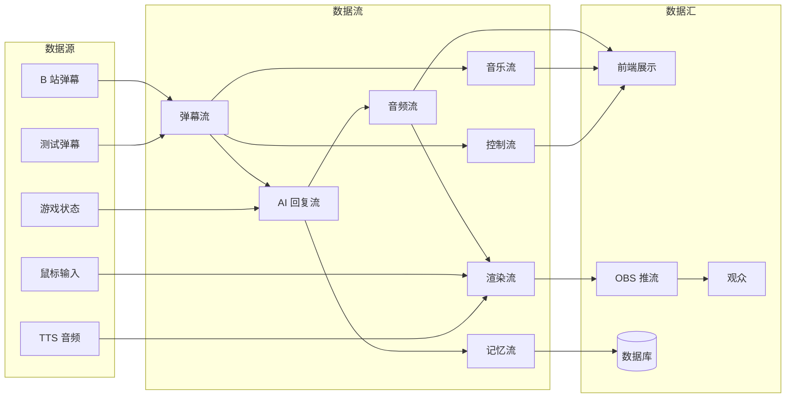

---

## 二、弹幕数据流

### 2.1 流转路径

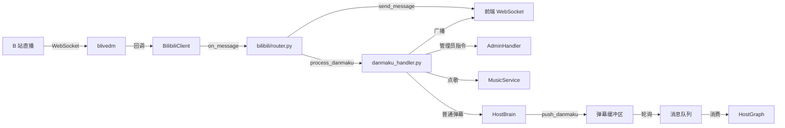

### 2.2 数据格式变化

**B 站原始数据**（blivedm 回调）：
```python
# blivedm.models.DanmakuMessage
{
    "info": [
        [0,1,1,16777215,1,...],  # mode, content, type, color, ...
        [uid, user, ...],         # 用户信息
        [...],                    # 管理员信息
        [...],                    # 勋章信息
        [...],                    # 用户等级
        [...],                    # 勋章详情
        ...
    ]
}
```

**DanmakuData**（client.py 构造）：
```python
DanmakuData(
    uid=12345,
    user="用户名",
    content="弹幕内容",
    timestamp="2026-04-09T10:30:00",
    color="#FFFFFF",
    medal_level=5,
    medal_name="粉丝牌",
    privilege_type=0
)
```

**前端消息**（router.py 广播）：
```json
{
  "type": "danmaku",
  "data": {
    "id": "22608112_1234567890",
    "uid": 12345,
    "user": "用户名",
    "uname": "用户名",
    "content": "弹幕内容",
    "msg": "弹幕内容",
    "timestamp": "2026-04-09T10:30:00"
  }
}
```

**DanmakuInput**（推入 HostBrain）：
```python
DanmakuInput(
    msg_id="22608112_1234567890",
    user="用户名",
    content="弹幕内容",
    uid=12345,
    timestamp="2026-04-09T10:30:00"
)
```

**Message**（入消息队列）：
```python
Message(
    id="uuid-xxx",
    priority=PRIORITY_NORMAL,
    source="danmaku",
    msg_type="danmaku",
    content="弹幕内容",
    data={"user": "用户名", "uid": 12345, "msg_id": "..."},
    user_id="12345",
    expire_at=now + 60s,
    allow_skip=True
)
```

### 2.3 前端处理

**useBilibiliDanmaku.ts**：
```typescript
ws.onmessage = (event) => {
    const msg = JSON.parse(event.data);
    switch (msg.type) {
        case 'danmaku':
            danmakuList.value.push({
                id: msg.data.id,
                user: msg.data.user,
                content: msg.data.content,
                timestamp: parseTimestamp(msg.data.timestamp),
                type: DanmakuType.NORMAL,
                uid: msg.data.uid
            });
            // 截断到 50 条
            if (danmakuList.value.length > 50) danmakuList.value.shift();
            break;
        case 'gift':
            // 礼物处理
            break;
        case 'start'/'text'/'audio'/'end':
            llmStore.handleExternalChunk(msg);
            break;
        case 'music_added'/'music_error':
            // 通知
            break;
        case 'music_control':
            // 音乐控制
            break;
    }
};
```

**danmaku.ts store**：
- 监听 `wsDanmakuList` 变化
- `shouldHideDanmaku` 过滤管理员弹幕
- `addDanmaku` 去重 + 截断到 9 条
- `sortedList` 按时间戳降序

---

## 三、AI 回复数据流

### 3.1 流转路径

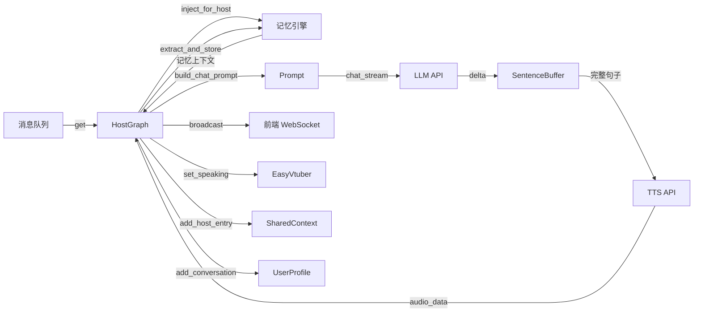

### 3.2 数据格式变化

**LLM 请求**：
```python
ChatRequest(
    messages=[
        {"role": "system", "content": "你是菲娜..."},
        {"role": "user", "content": "记忆上下文 + 弹幕内容"},
        {"role": "user", "content": "历史弹幕1"},
        {"role": "assistant", "content": "历史回复1"},
        ...
    ],
    model="deepseek-v4-flash",
    temperature=0.7,
    top_p=0.9,
    max_tokens=200,
    stream=True
)
```

**LLM 流式响应**（delta）：
```python
# 每个 chunk
{"choices": [{"delta": {"content": "哥"}}]}
{"choices": [{"delta": {"content": "哥"}}]}
{"choices": [{"delta": {"content": "你好"}}]}
{"choices": [{"delta": {"content": "呀。"}}]}
```

**SentenceBuffer 切句**：
```python
# 输入累积："哥哥你好呀。"
# 输出完整句子：["哥哥你好呀。"]
```

**TTS 请求**：
```python
POST https://openspeech.bytedance.com/api/v1/tts
{
    "app": {"appid": "...", "token": "...", "cluster": "volcano_icl"},
    "user": {"uid": "..."},
    "audio": {
        "voice_type": "speaker_id",
        "encoding": "wav",
        "speed_ratio": 1.0
    },
    "request": {
        "reqid": "uuid",
        "text": "哥哥你好呀。",
        "operation": "query"
    }
}
```

**TTS 响应**：
```json
{
  "data": "<base64 编码的 WAV 音频>",
  "code": 3000,
  "message": "success"
}
```

**StreamReplyChunk**（广播）：
```python
StreamReplyChunk(type="text", text="哥哥你好呀。", char_offset=0, is_final=False)
StreamReplyChunk(type="audio", audio_data=b"<WAV bytes>", sentence_index=0, is_final=False)
StreamReplyChunk(type="end", is_final=True)
```

**前端 WebSocket 消息**：
```json
{"type": "start", "data": {}}
{"type": "text", "data": {"text": "哥哥你好呀。"}}
{"type": "audio", "data": {"audio": "<base64>", "index": 0, "text": "哥哥你好呀。", "charOffset": 0, "charLength": 6}}
{"type": "end", "data": {}}
```

### 3.3 前端音频播放流

```mermaid
flowchart LR
    WS[WebSocket] -->|audio chunk| LLMStore[llm.ts]
    LLMStore -->|queueAudio| Player[AudioPlayer]
    Player -->|按 index 排序| Queue[音频队列]
    Queue -->|playNext| Decode[decodeAudioData]
    Decode -->|AudioBuffer| Source[AudioBufferSourceNode]
    Source -->|播放| Destination[AudioDestinationNode]
    Source -->|AnalyserNode| Level[音频电平]
    Level -->|sendAudioData| AvatarWS[/avatar/input WS]
    Source -->|startTextAnimation| TextAnim[文本动画]
```

**AudioPlayer 关键逻辑**：
1. `queueAudio(base64, index, text, charOffset, charLength)`：入队并按 index 排序
2. `playNext()`：解码 base64 → `decodeAudioData` → 播放
3. `startAudioLevelMonitoring()`：AnalyserNode 计算电平 → `sendAudioData(level, speaking)`
4. `startTextAnimation(charOffset, textLength, charDuration, audioStartTime)`：requestAnimationFrame 同步文本显示

---

## 四、渲染数据流

### 4.1 流转路径

```mermaid
flowchart LR
    subgraph 输入
        Mouse[鼠标位置<br/>0-1 归一化]
        Audio[音频电平<br/>0-1]
        Speaking[说话状态<br/>bool]
    end
    
    subgraph 前端
        AvatarInput[useAvatarInput]
        AvatarWS[/avatar/input WS]
    end
    
    subgraph 后端
        Router[easyvtuber/router.py]
        Mgr[EasyVtuberManager]
        Runner[EasyVtuberRunner]
    end
    
    subgraph EasyVtuber 进程
        InputProc[输入进程<br/>HybridInput]
        SharedMem[(共享内存<br/>45+4 floats)]
        InferProc[推理进程<br/>ModelClient]
        Output[Spout2 输出]
    end
    
    subgraph 推流
        OBS[OBS]
        Nginx[nginx-rtmp]
        HLS[HLS 流]
    end
    
    Mouse --> AvatarInput
    Audio --> AvatarInput
    Speaking --> AvatarInput
    AvatarInput -->|WebSocket| AvatarWS
    AvatarWS --> Router
    Router --> Mgr
    Mgr -->|set_mouse_position| Runner
    Mgr -->|set_audio_level| Runner
    Mgr -->|set_speaking| Runner
    Runner --> InputProc
    InputProc -->|写入| SharedMem
    SharedMem -->|读取| InferProc
    InferProc -->|RGBA 帧| Output
    Output -->|纹理共享| OBS
    OBS -->|RTMP| Nginx
    Nginx -->|HLS| HLS
```

### 4.2 姿态数据结构

**共享内存布局**：
```
[0-44]:  45 个 float 面部姿态参数
  [0-14]:  眼睛相关（左眼开合、右眼开合、瞳孔等）
  [15-25]: 眉毛相关
  [26-35]: 嘴部相关（开合、微笑、皱眉等）
  [36-44]: 头部旋转（pitch/yaw/roll 等）
[45-48]: 4 个 float 位置参数
  [45]: x 平移
  [46]: y 平移
  [47]: z 平移（缩放）
  [48]: 保留
```

**同步机制**：
- `SharedMemoryGuard` 使用 Windows Named Mutex
- 输入进程写入前 `WaitForSingleObject(mutex)`
- 推理进程读取前同样获取 mutex
- 避免读写竞争

### 4.3 渲染管线数据流

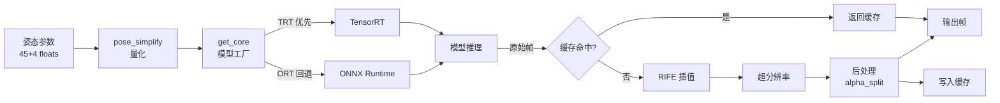

### 4.4 HLS 流数据流

**nginx-rtmp 配置**：
```nginx
rtmp {
    server {
        listen 1935;
        application live {
            live on;
            hls on;
            hls_path hls;
            hls_fragment 2s;
            hls_playlist_length 10s;
        }
    }
}

http {
    server {
        listen 8088;
        location /hls {
            types {
                application/vnd.apple.mpegurl m3u8;
                video/mp2t ts;
            }
            root html;
            add_header Cache-Control no-cache;
        }
    }
}
```

**前端 HLS 播放**：
```typescript
const hls = new Hls({
    lowLatencyMode: false,
    liveSyncDurationCount: 3,
    maxBufferLength: 30
});
hls.loadSource('/hls/stream.m3u8');
hls.attachMedia(videoElement);
```

---

## 五、音乐数据流

### 5.1 点歌数据流

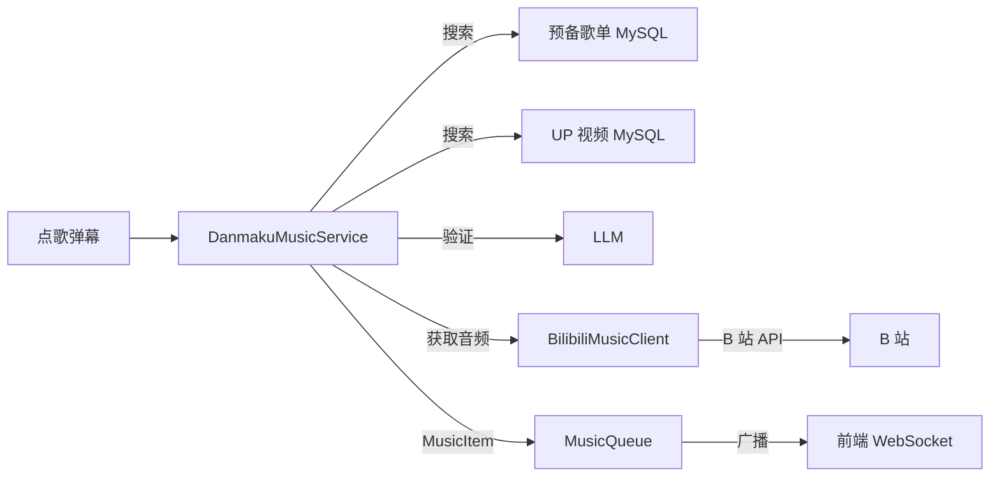

### 5.2 音频播放数据流

```mermaid
flowchart LR
    Queue[MusicQueue] -->|current| Store[music.ts store]
    Store -->|toProxyUrl| ProxyURL[/music/proxy/audio?url=...]
    ProxyURL -->|httpx 流式| Router[music/router.py]
    Router -->|Referer 头| BiliCDN[B 站 CDN]
    BiliCDN -->|音频流| Router
    Router -->|audio/mp4| AudioElement[HTMLAudioElement]
    AudioElement -->|播放| Speaker[扬声器]
    AudioElement -->|ended| Store2[playNext]
```

**音频 URL 转换**：
```typescript
function toProxyUrl(url: string): string {
    if (url.includes('bilivideo.com') || url.includes('biliplus')) {
        return `/music/proxy/audio?url=${encodeURIComponent(url)}`;
    }
    return url;
}
```

### 5.3 自动播放循环数据流

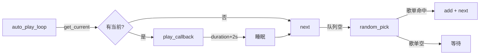

---

## 六、游戏数据流

### 6.1 MCP 通信数据流

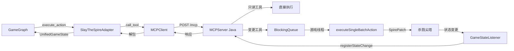

### 6.2 游戏状态数据流

**原始游戏状态**（MCP 返回）：
```json
{
  "ready_for_command": true,
  "in_game": true,
  "game_state": {
    "screen_type": "COMBAT",
    "player": {"hp": 50, "max_hp": 75, "gold": 100, "energy": 3, ...},
    "combat": {"hand": [...], "monsters": [...], "turn": 1, ...},
    ...
  }
}
```

**UnifiedGameState**（适配器转换）：
```python
UnifiedGameState(
    game_id="slay_the_spire",
    game_type="roguelike_card",
    player={"hp": 50, "max_hp": 75, "gold": 100, "energy": 3},
    enemies=[{"name": "史莱姆", "hp": 20, "intent": "攻击", ...}],
    available_actions=[...],
    turn_info={"is_my_turn": True, "turn": 1},
    screen_type="COMBAT",
    game_specific={"hand": [...], "choices": [...]},
    raw_state={...}
)
```

**Prompt 文本**（format_state_for_prompt）：
```
【画面】战斗中
【楼层】第 1 层
【HP】50/75
【费用】3/3
【敌人】
- 史莱姆: HP 20/20, 意图: 攻击 6 伤害
【手牌】
[0] 重击 (1 费, 攻击 6)
[1] 防御 (1 费, 格挡 5)
【选项】
无
```

### 6.3 解说协调数据流

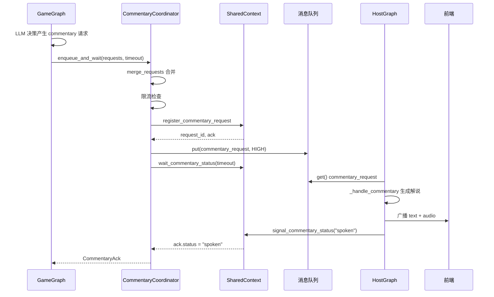

---

## 七、记忆数据流

### 7.1 记忆写入流

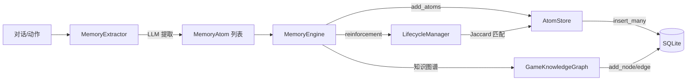

### 7.2 记忆读取流

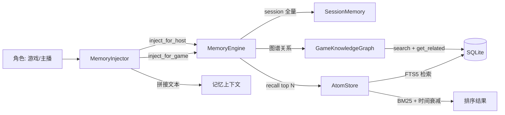

### 7.3 记忆生命周期

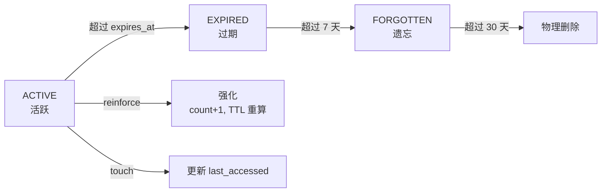

---

## 八、控制数据流

### 8.1 管理员指令数据流

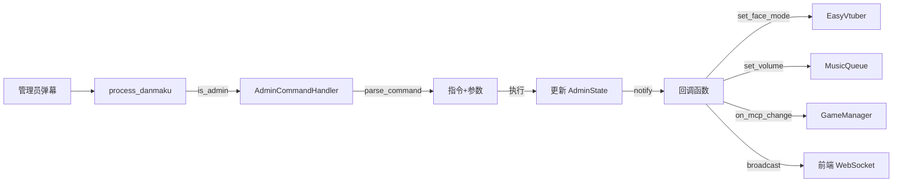

### 8.2 配置数据流

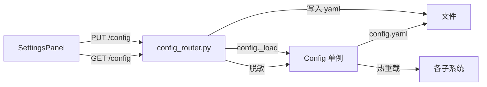

---

## 九、数据存储汇总

### 9.1 持久化存储

| 存储 | 用途 | 表/文件 | 访问方式 |
|------|------|---------|----------|
| MySQL | 用户画像 | user_profiles | SQLAlchemy async |
| MySQL | 预备歌单 | playlist | SQLAlchemy async |
| MySQL | UP 主视频 | up_videos | SQLAlchemy async |
| SQLite | 记忆原子 | memory_atoms + memory_atoms_fts | aiosqlite |
| SQLite | 知识图谱 | graph_nodes + graph_edges + graph_nodes_fts | aiosqlite |
| YAML | 配置 | config.yaml | PyYAML |
| 文件 | 提示词 | prompts/*.txt | 文件读取 |

### 9.2 内存存储

| 存储 | 用途 | 实现位置 | 生命周期 |
|------|------|----------|----------|
| SessionHistory | 会话历史 | history.py | 按 room_id，进程内 |
| SessionMemory | 单局记忆 | session_memory.py | 按 game_id，进程内 |
| SharedContext | 共享状态 | shared_context.py | 进程内 |
| PriorityMessageQueue | 消息队列 | messaging/queue.py | 进程内 |
| AdminState | 管理员状态 | admin_commands.py | 进程内 |
| MusicQueue | 播放队列 | music/queue.py | 进程内 |
| ConnectionManager | WS 连接 | core/websocket.py | 进程内 |

### 9.3 共享内存

| 存储 | 用途 | 实现位置 | 同步机制 |
|------|------|----------|----------|
| EasyVtuber 共享内存 | 姿态数据传递 | EasyVtuber/src/ | SharedMemoryGuard (Windows Mutex) |

---

## 十、数据流性能考量

### 10.1 实时性要求

| 数据流 | 延迟要求 | 优化措施 |
|--------|----------|----------|
| 弹幕展示 | < 1 秒 | WebSocket 直推 |
| AI 回复 | < 3 秒首字 | LLM 流式 + TTS 句级并行 |
| 数字人口型 | < 100ms | 前端 AnalyserNode 实时计算 |
| 渲染帧率 | 30 FPS | 多进程 + 缓存 + TensorRT |
| HLS 直播 | 5-10 秒 | nginx-rtmp 分片 |

### 10.2 背压机制

| 场景 | 背压策略 |
|------|----------|
| 弹幕缓冲区满（20 条） | 丢弃最旧 |
| 消息队列满（20 条） | 按优先级丢弃 |
| EasyVtuber 推理积压 | `finish_event` 背压，跳帧 |
| LLM 请求超时 | 重试 2 次后跳过 |
| TTS 合成失败 | 跳过该句音频 |

### 10.3 并发模型

| 组件 | 并发模型 | 说明 |
|------|----------|------|
| FastAPI | asyncio 单进程 | 异步 IO，避免阻塞 |
| EasyVtuber | multiprocessing | 输入/推理分离进程 |
| MCPTheSpire | 多线程 | HTTP 线程 + 游戏线程 |
| 前端 | 事件驱动 | WebSocket + requestAnimationFrame |

---

## 十一、相关文档

- [系统架构总览](./00-系统架构总览.md)：整体架构
- [接口设计规范](./04-接口设计规范.md)：数据格式规范
- [核心组件设计](./03-核心组件设计.md)：组件内部数据流
- [业务流程总览](../01-业务流程/00-业务流程总览.md)：业务场景数据流
