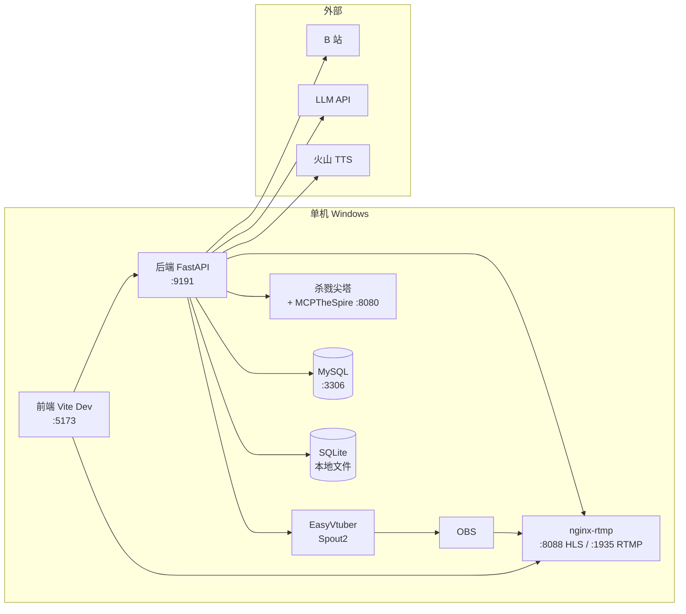

# FeinaLive 总体架构

> **汇报板块一：系统总览**
> 面向对象：技术管理者
> 目标：建立对系统全局架构、设计目标、核心模块划分的共识

---

## 一、系统定位

FeinaLive 是一个 7×24 小时无人值守的虚拟主播直播系统，对标 Neuro-Sama 架构。核心能力：

- **AI 主播**：实时响应 B 站弹幕，LLM 生成风格化回复 + TTS 语音播报
- **数字人渲染**：EasyVtuber 驱动虚拟形象，口型与语音同步
- **弹幕点歌**：观众通过弹幕点歌，LLM 验证后自动播放
- **游戏 AI 自动化**：通过 MCP 协议操控《杀戮尖塔》，AI 自主决策并解说
- **直播推流**：nginx-rtmp 提供 HLS 直播流

---

## 二、系统分层架构

```mermaid
flowchart TB
    subgraph 表现层
        Frontend[Vue 3 前端<br/>直播间控制台]
        OBS[OBS 推流软件]
        Viewers[B 站观众]
    end

    subgraph 接入层
        BilibiliWS[B 站直播 WebSocket<br/>blivedm]
        FrontendWS[前端 WebSocket<br/>ConnectionManager]
        RESTAPI[REST API<br/>FastAPI Router]
        SSE[SSE 流<br/>/ai/reply]
    end

    subgraph 应用层
        DanmakuHandler[弹幕分发中枢<br/>process_danmaku]
        AdminHandler[管理员指令<br/>AdminCommandHandler]
        MusicService[点歌服务<br/>DanmakuMusicService]
        HostBrain[主播大脑<br/>AIHostBrain]
        HostGraph[主播消费循环<br/>HostGraph]
        GameGraph[游戏决策循环<br/>GameGraph]
        GameManager[游戏管理器<br/>GameManager]
        EasyVtuberMgr[数字人管理器<br/>EasyVtuberManager]
        NginxService[推流服务<br/>NginxService]
    end

    subgraph 编排层
        MsgQueue[优先级消息队列<br/>PriorityMessageQueue]
        DynamicPriority[动态优先级<br/>DynamicPriorityManager]
        RateLimiter[频率限制<br/>RateLimiter]
        SharedContext[共享上下文<br/>SharedContext]
        CommentaryCoord[解说协调<br/>CommentaryCoordinator]
    end

    subgraph 智能层
        AIClient[LLM 客户端<br/>AIClient]
        TTSClient[TTS 客户端<br/>VolcanoTTSClient]
        EmbeddingClient[Embedding 客户端]
        MemoryEngine[记忆引擎<br/>MemoryEngine]
        PromptManager[提示词管理<br/>PromptManager]
    end

    subgraph 记忆层
        SessionMemory[单局记忆<br/>SessionMemory]
        AtomStore[长期记忆<br/>AtomStore SQLite+FTS5]
        KnowledgeGraph[知识图谱<br/>GameKnowledgeGraph]
        UserProfile[用户画像<br/>UserProfile MySQL]
        AtomLifecycle[生命周期管理<br/>AtomLifecycleManager]
    end

    subgraph 渲染层
        EasyVtuber[EasyVtuber 引擎<br/>THA3/THA4 + ONNX/TensorRT]
        InputProcess[输入进程<br/>Hybrid/Mouse/OSF]
        InferProcess[推理进程<br/>ModelClientProcess]
        SpoutOutput[Spout2 输出]
    end

    subgraph 游戏层
        MCPClient[MCP 客户端<br/>JSON-RPC 2.0]
        SlayAdapter[杀戮尖塔适配器<br/>SlayTheSpireAdapter]
        MCPServer[MCPTheSpire Mod<br/>Java HTTP 服务]
        StsGame[杀戮尖塔游戏进程]
    end

    subgraph 数据层
        MySQL[(MySQL<br/>用户画像/歌单/UP视频)]
        SQLite[(SQLite<br/>记忆原子/知识图谱)]
        Config[config.yaml<br/>配置文件]
    end

    subgraph 外部服务
        BilibiliAPI[B 站 API<br/>视频/评论/WBI]
        LLMProvider[LLM 服务<br/>OpenAI 兼容]
        VolcanoTTS[火山引擎 TTS]
        EmbeddingAPI[Embedding 服务]
    end

    Viewers -->|弹幕/礼物| BilibiliWS
    BilibiliWS --> DanmakuHandler
    Frontend --> FrontendWS
    Frontend --> RESTAPI
    Frontend --> SSE
    FrontendWS --> DanmakuHandler
    RESTAPI --> AdminHandler
    RESTAPI --> MusicService
    RESTAPI --> EasyVtuberMgr
    RESTAPI --> NginxService

    DanmakuHandler --> AdminHandler
    DanmakuHandler --> MusicService
    DanmakuHandler --> HostBrain
    DanmakuHandler --> FrontendWS

    AdminHandler --> EasyVtuberMgr
    AdminHandler --> MusicService
    AdminHandler --> GameManager

    HostBrain --> MsgQueue
    MsgQueue --> HostGraph
    HostGraph --> AIClient
    HostGraph --> TTSClient
    HostGraph --> MemoryEngine
    HostGraph --> SharedContext
    HostGraph --> EasyVtuberMgr
    HostGraph --> FrontendWS

    GameManager --> HostGraph
    GameManager --> GameGraph
    GameGraph --> MCPClient
    GameGraph --> AIClient
    GameGraph --> MemoryEngine
    GameGraph --> SharedContext
    GameGraph --> CommentaryCoord
    CommentaryCoord --> MsgQueue

    MsgQueue --> DynamicPriority
    MsgQueue --> RateLimiter

    MemoryEngine --> SessionMemory
    MemoryEngine --> AtomStore
    MemoryEngine --> KnowledgeGraph
    MemoryEngine --> UserProfile
    MemoryEngine --> AtomLifecycle
    AtomLifecycle --> AtomStore

    AIClient --> LLMProvider
    TTSClient --> VolcanoTTS
    EmbeddingClient --> EmbeddingAPI
    MusicService --> BilibiliAPI

    EasyVtuberMgr --> EasyVtuber
    EasyVtuber --> InputProcess
    EasyVtuber --> InferProcess
    InferProcess --> SpoutOutput
    SpoutOutput --> OBS
    OBS --> NginxService
    NginxService --> Frontend

    MCPClient --> MCPServer
    MCPServer --> StsGame
    SlayAdapter --> MCPClient
    GameGraph --> SlayAdapter

    UserProfile --> MySQL
    MusicService --> MySQL
    AtomStore --> SQLite
    KnowledgeGraph --> SQLite
    Config --> EasyVtuberMgr
    Config --> AIClient
    Config --> TTSClient
```

---

## 三、核心子系统划分

| 子系统 | 职责 | 关键组件 |
|--------|------|----------|
| **弹幕交互系统** | B 站弹幕接入、分发、管理员指令 | BilibiliClient、process_danmaku、AdminCommandHandler |
| **AI 主播引擎** | LLM 对话、TTS、记忆管理与 Graph 编排 | HostGraph、MemoryEngine、PriorityMessageQueue |
| **弹幕点歌系统** | 点歌识别、LLM 验证、播放队列 | DanmakuMusicService、MusicQueue |
| **游戏 AI 系统** | MCP 协议、杀戮尖塔自动化、解说协调 | GameGraph、MCPClient、SlayTheSpireAdapter |
| **数字人渲染系统** | EasyVtuber 管线、口型联动 | EasyVtuberManager、输入/推理进程 |
| **前端控制台** | Vue 3 直播间界面、WebSocket 通信 | Pinia Store、Composables |
| **推流系统** | nginx-rtmp、HLS 直播 | NginxService |

---

## 四、部署拓扑

**部署说明**：当前为单机 Windows 部署方案。所有服务运行在同一台机器上，后端 FastAPI 作为中心枢纽桥接所有子系统。外部依赖为 B 站 API、LLM API 和火山引擎 TTS。

---

## 五、关键设计决策

| 设计决策 | 说明 |
|----------|------|
| **单例模式** | 所有管理器通过 `get_xxx()` 工厂函数实现懒加载单例，单进程内共享状态 |
| **双 Graph 架构** | HostGraph（主播对话）与 GameGraph（游戏决策）独立运行，通过消息队列 + SharedContext 协同 |
| **多进程渲染** | EasyVtuber 将输入采集与模型推理分离到不同进程，避免 GIL 瓶颈 |
| **消息队列解耦** | 所有消息类型（弹幕/礼物/解说）统一入优先级队列，统一调度 |
| **记忆分层** | 短期（会话级）、中期（用户画像）、长期（AtomStore + FTS5）、图谱（知识关系） |

---

## 六、技术栈速览

| 层次 | 技术 |
|------|------|
| 后端框架 | FastAPI + Uvicorn |
| LLM 接入 | LiteLLM（OpenAI 兼容） |
| 数据库 | MySQL（SQLAlchemy async）+ SQLite（aiosqlite） |
| B 站 SDK | blivedm + bilibili-api-python |
| 前端框架 | Vue 3 + TypeScript + Pinia + Tailwind CSS |
| 渲染引擎 | EasyVtuber（THA3/THA4，ONNX Runtime GPU / TensorRT） |
| 推流 | nginx-rtmp-win32 + HLS |
| 游戏 Mod | MCPTheSpire（Java，MCP 协议） |

---

## 【讲解稿】

### 开场（约 2 分钟）

各位好，今天由我来汇报 FeinaLive 虚拟主播直播系统的总体架构。整个汇报我会从总览开始，然后逐个展开七个核心子系统的设计。

先简单介绍一下这个项目的背景。FeinaLive 是一个 7×24 小时无人值守的虚拟主播直播系统。什么叫无人值守？就是 AI 自己去 B 站开播，跟观众聊天互动，播放音乐，打游戏并解说——全程不需要人工介入。运营人员只需要在后台做监控和配置，日常的直播内容完全由系统自动生成。

这个项目对标的是 Neuro-Sama。Neuro-Sama 是一个在 Twitch 上直播的 AI 主播，她会跟观众对话，玩 osu! 音游，甚至会因为观众的互动影响她的情绪和游戏表现。我们想做类似的事情，但是面向国内生态：直播平台是 B 站，游戏选的是杀戮尖塔，TTS 用的是火山引擎。技术路线也完全不同——我们的后端基于 Python FastAPI，渲染引擎是自集成的 EasyVtuber，游戏操控通过自研的 MCP 协议完成。

### 五大核心能力（约 2 分钟）

整套系统的核心能力可以归纳为五块。

第一，AI 主播对话。观众在 B 站直播间发弹幕，系统通过 LLM 生成符合人设的回复——我们的主播叫"菲娜"，是一个童话小女孩风格的角色——然后通过 TTS 合成语音播报出来。播报的同时驱动虚拟形象的口型，让观众感觉是一个真人在说话。

第二，数字人渲染。我们用 EasyVtuber 引擎，基于 THA3 和 THA4 模型，把一张静态的角色立绘变成会呼吸、会眨眼、会说话、会随着鼠标移动视线的动态形象。这个过程涉及多进程管线、GPU 推理、帧插值、超分辨率等一系列技术。

第三，弹幕点歌。观众发"点歌 晴天"，系统自动去 B 站搜索这首歌，用 LLM 验证它到底是不是音乐——防止点到游戏视频或者 Vlog——验证通过后自动加入播放队列。

第四，游戏 AI 自动化。这是我们技术挑战最大的部分。AI 能够自己打开杀戮尖塔，自己决策出什么牌、选什么路线、买什么遗物，并且在关键节点主动解说——比如"看我打出这张重击！"。整个过程通过我们自研的 MCP 协议，桥接 Python 后端和 Java 游戏 Mod。

第五，直播推流。数字人的渲染画面通过 Spout2 纹理共享输出到 OBS，OBS 推流到 nginx-rtmp，nginx 切成 HLS 分片，前端通过 hls.js 实时观看。

### 系统分层架构——带着大家逐层解读（约 5 分钟）

好，现在来看这张整体架构图。这张图包含了系统所有的组件和它们之间的数据流。我带着大家从上往下、从左到右走一遍。

**表现层**——最上面是观众和运营人员看到的部分。观众在 B 站直播间看到的是推流后的视频画面，上面叠加了弹幕、音乐信息等 UI 元素。运营人员面前有一个 Vue 3 的直播间控制台，这个控制台是固定 1920×1080 设计稿，通过 transform 缩放适配不同屏幕。运营可以在上面看弹幕滚动、看音乐播放队列、调音量、开关游戏 AI、修改主播配置——相当于直播间的"驾驶舱"。

**接入层**——所有外部通信的入口。这里有三条 WebSocket 通道：B 站弹幕接入用的 blivedm 库，前端状态同步用的 ConnectionManager，数字人鼠标/音频输入控制用的 avatar input。还有 REST API 做配置管理和 CRUD 操作，以及一条 SSE 流专门给 AI 主播的实时回复用。

这里有个设计细节：为什么不全部用 WebSocket？因为 SSE 是单向的，服务端推送流式数据非常方便——主播回复是一个持续的文本流，用 SSE 天然合适。而弹幕需要双向通信，所以用 WebSocket。

**应用层**——这是业务逻辑最密集的一层，也是整个系统的核心。

弹幕分发中枢 `process_danmaku` 是所有弹幕流量的入口。你可以把它理解成一个三岔路口：管理员指令走左边、点歌请求走中间、普通弹幕走右边。这个分发逻辑非常关键，因为它决定了每条消息的处理路径。

AI 主播大脑 `AIHostBrain` 负责弹幕的缓冲和调度。弹幕不是立刻处理的——先缓冲起来，每 10 秒轮询一次，把需要回复的弹幕合并后推入消息队列。

HostGraph 和 GameGraph 是两个核心的异步循环。HostGraph 消费消息队列，生成主播回复并 TTS 播报。GameGraph 负责游戏决策，通过 MCP 协议操控杀戮尖塔。这两个 Graph 各自独立运行，这是我们的核心设计之一。

管理员指令处理器、点歌服务、数字人管理器、推流服务——这些是相对独立的功能模块，各自管理自己的领域。

**编排层**——这是系统的调度中枢，也是架构中最巧妙的部分。

优先级消息队列是 AI 交互的统一调度器。弹幕回复、礼物感谢、游戏解说请求，所有"需要 AI 处理的消息"都走这个队列。它有 5 级优先级，支持饥饿升级和洪流降级。动态优先级管理器根据系统负载实时调整消息优先级。频率限制器防止刷屏。

SharedContext 是主播和游戏之间的共享状态层。GameGraph 需要知道主播刚才说了什么，HostGraph 需要知道游戏里发生了什么，这些信息通过 SharedContext 共享。它还支持解说请求的 ACK 协调——GameGraph 发出解说请求后，可以异步等待 HostGraph 播报完成。

CommentaryCoordinator 负责解说请求的合并和限流。GameGraph 一次决策可能产生多个解说意图，协调器会合并去重，控制频率，避免连续解说干扰正常对话。

**智能层与记忆层**——AI 能力的核心。

LLM 客户端基于 LiteLLM，统一接入 OpenAI、DeepSeek、豆包等多种模型。TTS 客户端对接火山引擎声音复刻。Embedding 客户端用于记忆检索。

记忆系统我们分了四层：会话级短期记忆存在进程内存、用户画像放 MySQL、长期记忆原子存 SQLite 加 FTS5 全文检索、游戏知识图谱存关系网络。这个分层设计的核心思想是：不同时间尺度和不同用途的信息，用不同的存储介质和管理策略。

**渲染层与游戏层**——这两层是系统的"输出端"。

EasyVtuber 渲染引擎采用双进程架构：输入进程采集姿态数据（鼠标、音频、摄像头），写入共享内存；推理进程读取共享内存，跑 THA3/THA4 模型推理，输出数字人画面。中间通过 Windows Named Mutex 做同步。

游戏层通过 MCP 协议与杀戮尖塔通信。MCP 是基于 JSON-RPC 2.0 的协议，Python 端有 MCPClient 和适配器，Java 端有嵌入式的 HTTP 服务。游戏端暴露了 17 个工具，包括出牌、结束回合、选择选项、开始新游戏等。

**数据层**——最底层是存储。MySQL 放用户画像和歌单，SQLite 放记忆原子和知识图谱。配置基于 YAML 文件，支持热重载。

### 七个子系统的划分逻辑（约 1 分钟）

基于这个分层架构，我们把系统拆成了七个核心子系统。划分的逻辑是"高内聚、低耦合"——每个子系统有清晰的职责边界和独立的演化路径。

弹幕交互系统负责所有"输入"相关的事情：接弹幕、分发音讯、管理员控制。AI 主播引擎负责"思考"：对话生成、语音合成、记忆管理。弹幕点歌和游戏 AI 是两个独立的能力模块，可以单独启用或禁用。数字人渲染负责"视觉呈现"，前端控制台是"操作界面"，推流系统负责"画面传输"。

### 四个最关键的设计决策（约 3 分钟）

在进入子系统之前，我想先展开四个对整个架构影响最大的设计决策。理解了这些，后面的子系统讲解会更流畅。

**决策一：双 Graph 架构。** 为什么要把主播对话和游戏决策拆成两个独立的循环？核心原因是它们的工作节奏完全不同。

主播对话的节奏是"即时响应"——观众发了弹幕，希望尽快得到回复。延迟超过几秒，观众就走了。所以 HostGraph 需要保持高响应性，从队列拿到消息后立即处理。

游戏决策的节奏是"定时轮询"——杀戮尖塔是一个回合制卡牌游戏，AI 不需要每时每刻做决策。它需要先收集状态，判断是不是自己的回合，如果是再做决策。一个回合可能持续几十秒甚至几分钟。

如果把两者放在同一个循环里，会出现什么问题？游戏决策的轮询等待会阻塞主播对话的即时响应。反过来，主播对话的高频调用也会干扰游戏决策的节奏。所以必须分开。

它们通过消息队列和 SharedContext 协同。GameGraph 需要解说时，发消息到队列，HostGraph 消费后播报，结果写回 SharedContext。这种异步协作模式让两个系统既独立又协同。

**决策二：多进程渲染。** Python 的 GIL 大家应该都知道——一个进程里同一时刻只有一个线程能执行 Python 字节码。对于 EasyVtuber 来说，这意味着模型推理会阻塞输入采集，导致数字人"僵住"。

解决方案是把输入采集和模型推理放到两个独立的进程。输入进程负责采集鼠标位置、音频电平等姿态数据，写入共享内存。推理进程从共享内存读取姿态数据，跑模型推理，输出画面。中间用 Windows Named Mutex 做互斥同步。

这样做的代价是进程间通信的复杂度增加了——需要用共享内存和互斥锁——但换来的是两个进程可以各自利用一个 CPU 核心，互不阻塞。

**决策三：消息队列统一调度。** 如果没有统一队列，弹幕回复、礼物感谢、解说请求会直接竞争 LLM 和 TTS 资源。竞争的结果是不可预测的——可能礼物感谢插队到弹幕回复前面，也可能解说请求一直在等。

统一队列让我们可以精确控制调度行为。5 级优先级让高价值消息优先处理。饥饿升级机制保证低优先级消息不会永远得不到服务。洪流降级在弹幕爆发时保护系统不过载。用户冷却机制保证单个观众不会刷屏。

**决策四：记忆分层。** 人的记忆也是分层的——短期记忆、长期记忆、专业知识。我们的系统也一样。

短期记忆只保留最近 16 条对话，存在进程内存里，即时访问零延迟。中期记忆存在 MySQL 里，记录每个观众的用户画像，持久化、可查询。长期记忆存在 SQLite 里，用 FTS5 全文搜索引擎检索，有 TTL 和强化机制。游戏知识图谱存关系网络——哪些卡牌协同、哪些遗物克制哪些敌人。

每一层有不同的 TTL、存储介质、访问模式和容量策略。这样做的目的是平衡性能、持久性和检索能力。

### 部署方式（约 1 分钟）

最后说一下部署。当前是单机 Windows 方案，所有进程跑在同一台机器上。

具体来说，后端 FastAPI 监听 9191 端口，前端 Vite 开发服务器在 5173 端口。nginx-rtmp 监听 1935 收推流，8088 提供 HLS。EasyVtuber 的 Spout2 输出被 OBS 捕获，OBS 推流到 nginx。杀戮尖塔进程通过 MCPTheSpire Mod 暴露 HTTP 服务在 8080 端口。

外部依赖只有三个：B 站 API、LLM 服务、火山引擎 TTS。其他一切都是自包含的。

这个部署方案的好处是简单——一台机器搞定所有。缺点是没有高可用，但考虑到无人值守直播的运维场景，单机方案在当前阶段是合理的选择。

好，总体概览就到这里。接下来我逐个子系统展开。
