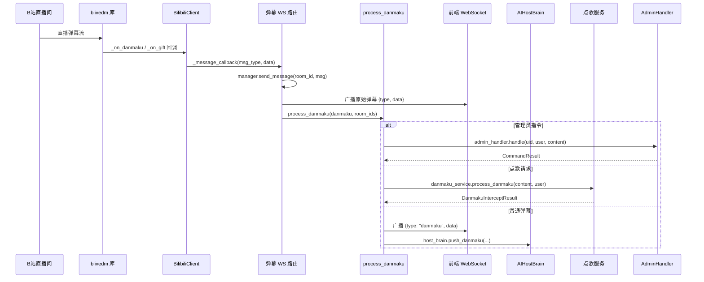

# 弹幕交互系统

> **汇报板块二：弹幕交互系统**
> 涵盖：B 站弹幕接入、弹幕分发中枢、管理员指令系统
> 核心文件：`backend/apps/live/bilibili/`、`backend/apps/live/danmaku_handler.py`、`backend/apps/ai/admin_commands.py`

---

## 一、系统概述

弹幕交互系统是整个 FeinaLive 的**入口模块**。所有观众交互（弹幕、礼物）都通过本系统进入，经分发中枢路由到不同的处理子系统。

**核心能力**：
- B 站直播间实时弹幕接入（含 SESSDATA 鉴权）
- 弹幕分发路由（管理员指令 / 点歌 / 普通弹幕 / 礼物）
- 管理员通过弹幕指令控制系统行为
- 测试房间机制（无 B 站连接时模拟弹幕）

---

## 二、架构图



---

## 三、模块运作机制

### 3.1 弹幕接入（BilibiliClient）

- 前端通过 `/bilibili/ws/{room_id}` 连接后端 WebSocket
- 后端为该 room_id 创建 `BilibiliClient`，内部使用 `blivedm` 库建立到 B 站直播间的 WebSocket
- 若有 SESSDATA 凭证，可获取完整用户名和 UID；无凭证则用户名被遮蔽
- 弹幕/礼物通过回调进入系统：`_on_danmaku` / `_on_gift`

### 3.2 弹幕分发中枢（process_danmaku）

这是整个系统**最核心的分发节点**，按优先级顺序处理每条弹幕：

1. **管理员指令拦截**：匹配 `/xxx` 格式，直接分发到 `AdminCommandHandler`
2. **管理员弹幕过滤**：若设置了隐藏模式，管理员弹幕不广播
3. **点歌拦截**：匹配"点歌/来一首/BV号"，分发到 `DanmakuMusicService`
4. **普通弹幕**：广播到前端 + 推入 AI 主播缓冲区

### 3.3 管理员指令系统（AdminCommandHandler）

管理员通过弹幕指令控制系统行为，支持 13 种指令：

| 指令 | 功能 | 影响范围 |
|------|------|----------|
| `/sleep 1/0` | 暂停/恢复 AI 回复 | AI 主播 |
| `/face 1/0` | 鼠标追踪/漫步模式 | 数字人 |
| `/voice 1/0` | 管理员接管/AI 模式 | AI 主播 |
| `/hide 1/0` | 隐藏/显示管理员弹幕 | 前端显示 |
| `/sound 0-10` | 音量控制 | 音乐系统 |
| `/next` / `/pause` / `/rm` | 音乐控制 | 音乐系统 |
| `/mcp 1/0` | 游戏 AI 启停 | 游戏系统 |
| `/testroom 1/0` | 测试房间开关 | 测试系统 |
| `/clear` | 清除用户记忆 | 记忆系统 |

**鉴权机制**：基于 UID（默认 `378810242`）或用户名（默认 `RongR0Ng`）识别管理员。

**回调机制**：指令执行后通过注册的回调函数通知各子系统，实现解耦。

### 3.4 礼物处理

- 礼物消息按价值计算优先级（舰长最高，普通礼物最低）
- 构造消息入 `PriorityMessageQueue`，由 AI 主播生成感谢话术

### 3.5 测试房间

- 通过 `/testroom 1` 启用，前端可通过 `POST /test/danmaku` 发送模拟弹幕
- 模拟弹幕走完整的 `process_danmaku` 流程，便于无 B 站连接时调试

---

## 四、关键数据流

```
B站直播间 → blivedm → BilibiliClient → 弹幕WS路由 → process_danmaku
                                                          │
                                            ┌─────────────┼─────────────┐
                                            ▼             ▼             ▼
                                      AdminHandler   MusicService   AIHostBrain
                                            │             │             │
                                            ▼             ▼             ▼
                                      各子系统指令    点歌播放队列    消息队列→HostGraph
```

---

## 【讲解稿】

### 开场（约 1 分钟）

好，我们开始第一个子系统——弹幕交互系统。

这个系统的定位非常明确：它是整个 FeinaLive 的入口。观众在 B 站直播间发弹幕、送礼物，所有来自观众的信息都通过这个系统进入，然后被路由到正确的处理模块。

它只有三个职责，但是每个都至关重要：第一，建立并维护到 B 站直播间的连接；第二，把弹幕分发给对应的处理模块；第三，让管理员能通过弹幕控制整个系统。

### 弹幕接入的完整链路（约 3 分钟）

我们来看弹幕从 B 站到后端再到前端的完整链路。

**第一步：前端发起连接。** 直播间的 Vue 前端通过 WebSocket 连接到后端的 `/bilibili/ws/{room_id}`。room_id 是 B 站的直播间 ID，不同的房间用不同的连接隔离。

**第二步：后端创建客户端。** 后端检查这个 room_id 是否已经有 `BilibiliClient` 实例。没有就创建。`BilibiliClient` 内部使用 `blivedm` 这个第三方库，建立一个到 B 站直播间的 WebSocket 连接。

**第三步：配置回调。** blivedm 支持注册事件回调。我们注册了四个回调：`_on_danmaku` 处理弹幕消息、`_on_gift` 处理礼物消息、`_on_heartbeat` 心跳保持连接，还有两个空实现占位的。

**第四步：消息路由。** 回调收到数据后，`BilibiliClient` 构造标准化的数据对象——`DanmakuData` 或 `GiftData`——然后通过 `on_message` 回调通知上层。上层做两件事：通过 WebSocket 广播到前端，和触发 `process_danmaku` 进入分发逻辑。

**关于 SESSDATA 的关键细节：** SESSDATA 是 B 站的登录 Cookie。如果配置了它，创建 blivedm 客户端时会带 CookieJar，B 站就会返回完整的用户名和 UID。如果不配，B 站会返回"UID:xxx"这种遮蔽后的格式。这对管理员鉴权特别重要——因为管理员是通过 UID 识别的，如果 UID 被遮蔽就无法正确鉴权。所以我们在前端做了一个 `SessdataWarningModal`，当检测到 SESSDATA 失效时自动弹出提示。

**连接管理：** 前端和后端的 WebSocket 连接由 `ConnectionManager` 统一管理，按 room_id 隔离。每个房间有一个 `asyncio.Lock` 保证线程安全。如果所有前端都断开了——比如运营关闭了浏览器——`ConnectionManager` 会自动关闭这个 room_id 对应的 B 站连接，避免资源泄漏。

### 分发中枢 process_danmaku——整个系统的交通枢纽（约 3 分钟）

接下来是弹幕交互系统最重要的部分——`process_danmaku`。你可以把它理解成整个后端流量的交通枢纽。

这里有一个重要的设计原则：**弹幕一经入站，就不再由原始来源控制，而是由 process_danmaku 决定去向。** 不管是真实的 B 站弹幕，还是测试房间的模拟弹幕，走的是同一个函数。

process_danmaku 按优先级顺序做三关判断：

**第一关：管理员指令拦截（最高优先级）。** 如果弹幕以 `/` 开头，并且发送者被鉴定为管理员，直接拦截。拦截后调用 `AdminCommandHandler.handle()` 做异步处理。注意这里是异步的——create_task 创建后台任务，不阻塞当前函数。处理结果通过 WebSocket 广播回前端。

**第二关：管理员弹幕过滤。** 如果发送者是管理员但弹幕不是指令，检查是否开启了隐藏模式（`is_hide_admin`）。如果开了，这条弹幕既不广播也不处理——相当于管理员在隐身操作。这个功能很实用，运营可以边操作边观察效果，不会在弹幕区留下痕迹。

**第三关：点歌拦截。** 如果弹幕匹配"点歌"、"来一首"、"播放"或者包含 BV 号，交给 `DanmakuMusicService.process_danmaku()`。点歌请求走独立的路径，不进入 AI 主播的回复流程。这样做的原因是点歌是一个有特定预期行为的功能——观众希望看到"已添加到播放列表"的反馈，而不是 AI 的闲聊回复。

**第四关：普通弹幕处理。** 做两件事：第一，构造标准格式的弹幕消息，广播到所有前端 WebSocket 连接；第二，推入 AI 主播的缓冲区 `AIHostBrain.push_danmaku()`。

**礼物的特殊处理：** 礼物不走 process_danmaku。礼物消息在路由层直接处理——按礼物价值计算优先级，然后构造 `Message` 直接入消息队列。为什么？因为礼物消息的字段和弹幕完全不同，而且它的处理路径只有一条（生成感谢语），不需要经过分发的判断逻辑。

### 分发决策的边界情况（约 1 分钟）

有几个边界情况值得提一下。

第一，管理员同时发指令和点歌的情况。比如 `/add_music BVxxx`——这既是管理员指令（以 `/` 开头），也是点歌请求（包含 BV 号）。我们的优先级规则是第一关优先，所以它被当作管理员指令处理，然后 AdminCommandHandler 内部再调用点歌服务的接口。

第二，管理员发普通弹幕但开了隐藏模式。这条弹幕既不展示也不处理，但管理员自己需要知道弹幕已经被隐藏了。前端通过轮询 `/test/admin/state` 获取 `is_hide_admin` 状态，然后在前端层面过滤——也就是说，管理员的弹幕在后端不会被广播，但管理员自己在控制台上也看不到自己的弹幕，避免了混淆。

第三，SESSDATA 失效后的管理员鉴权。如果没有有效的 SESSDATA，B 站返回的 UID 是 0。而我们通过用户名也可以鉴权——`is_admin_by_username` 检查用户名是否匹配。所以即使 SESSDATA 失效，只要管理员用户名没变，仍然能通过用户名鉴权。但用户名也可能变化，所以这只是一个回退方案。

### 管理员指令系统（约 2 分钟）

管理员指令系统支持 13 种指令，覆盖了系统全部子功能的控制。按功能方向来分，主要有几大类：

**AI 主播控制类**——可以暂停或恢复 AI 回复（比如运营需要自己说话的场合），可以切换管理员接管模式（只有管理员能触发 AI 回复），以及清除某个用户的记忆。

**数字人控制类**——切换鼠标追踪和漫步模式。鼠标追踪下数字人的视线跟随鼠标移动，适合有人值守；漫步模式下自动随机移动，适合无人值守。

**音乐控制类**——控制音量、切歌、暂停播放、移除当前歌曲并禁用。

**游戏控制类**——启动或停止游戏 AI。启动时会先做健康检查，看杀戮尖塔的 MCP 服务是否可达。

**系统控制类**——开关测试房间、隐藏管理员弹幕等。

**回调机制——解耦的关键：** 大家可能会疑惑，这些指令怎么跟具体的子系统交互？答案是回调机制。

AdminCommandHandler 内部只维护一个状态对象，记录了 is_sleeping、face_mode、volume 等所有状态。当指令执行时，它只做三件事：更新状态、触发回调、返回结果。回调函数是在系统启动时注册进来的，每个子系统自己注册、自己处理。

比如说音量控制指令执行后，会触发一个"音量变化"的回调，这个回调调用 MusicQueue 的设置音量方法，同时广播给前端。AdminCommandHandler 完全不需要知道 MusicQueue 的存在，也不需要知道数字人管理器怎么切换 face_mode——这样就做到了完全的解耦。

### 测试房间——开发调试利器（约 1 分钟）

最后说一下测试房间。

这是一个非常实用的功能。通过 `/testroom 1` 启用后，前端可以通过 `POST /test/danmaku` 发送模拟弹幕。模拟弹幕走完整的 `process_danmaku` 流程——只是不会广播到 B 站。

测试房间有两个使用场景：

第一，开发调试。开发者可以在前端模拟各种弹幕场景——普通对话、点歌、管理员指令——验证整个链路是否正常。不需要真正连接 B 站。

第二，自动化测试。测试弹幕接口返回完整的 `DanmakuProcessResult`，包含是否被拦截、是否被接受等信息。可以用它来写集成测试用例。

测试房间启用时会创建一个"测试房间"的 WebSocket 连接，这个连接也会接收 AI 主播的回复广播。这样在前端测试面板上就能看到完整的对话过程。

好，弹幕交互系统就讲到这里。接下来是 AI 主播系统。
