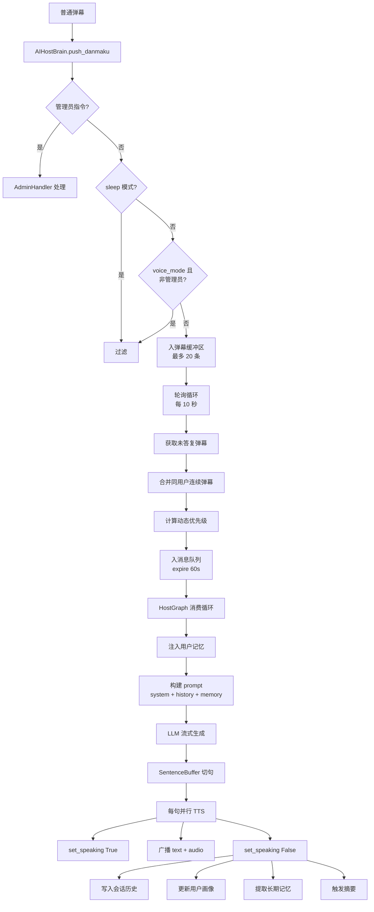

# AI 主播系统

> **汇报板块三：AI 主播引擎**
> 涵盖：LLM 对话、TTS 语音合成、记忆系统、Graph 编排、消息队列
> 核心文件：`backend/apps/ai/` 下各模块

---

## 一、系统概述

AI 主播系统是 FeinaLive 的**智能核心**。它负责接收弹幕消息，生成符合人设的回复文本，合成语音，提取记忆，是整个系统中最复杂的模块。

**核心能力**：
- LLM 流式生成风格化对话（"菲娜"人设，40 字以内）
- TTS 句级并行合成（火山引擎声音复刻）
- 多层级记忆管理（短期/长期/图谱）
- 优先级消息队列调度
- 双 Graph 编排（主播 + 游戏）

---

## 二、架构图



---

## 三、模块运作机制

### 3.1 弹幕缓冲与轮询（AIHostBrain）

- 弹幕进入缓冲区（deque，maxlen=20）
- 每 10 秒轮询一次，筛选未答复弹幕
- 合并同一用户的连续弹幕（最多 3 条用 ` | ` 连接）
- 计算动态优先级后入消息队列（expire=60s）

**过滤逻辑**：
- `sleep` 模式下全部拒绝
- `voice_mode` 下非管理员弹幕拒绝

### 3.2 优先级消息队列（PriorityMessageQueue）

这是 AI 主播和游戏 AI 的**统一调度中心**：

| 优先级 | 数值 | 适用场景 | 丢弃策略 |
|--------|------|----------|----------|
| HIGHEST | 1 | 舰长礼物 | 永不丢弃 |
| HIGH | 2 | 解说请求 | 永不丢弃 |
| NORMAL | 3 | 普通弹幕 | 队列满且 allow_skip 时丢弃 |
| LOW | 4 | 洪流期弹幕 | 优先丢弃 |
| DISPOSABLE | 5 | 严重洪流 | 立即丢弃 |

**动态优先级算法**：
- 饥饿升级：超过 30 秒未消费，所有弹幕升一级
- 洪流降级：20 秒内弹幕数超过阈值，降级处理
- 用户冷却：同一用户 3 秒内只处理一条

### 3.3 HostGraph 消费循环

HostGraph 是一个**异步消费循环**，从消息队列获取消息并处理：

| 消息类型 | 处理方式 | 字数限制 | 后续操作 |
|----------|----------|----------|----------|
| 弹幕回复 | 注入记忆 → 构建 prompt → LLM 流式生成 → TTS 合成 → 广播 | 20-50 字 | 更新历史、提取记忆 |
| 礼物感谢 | 类似，但 prompt 不同 | 15-30 字 | - |
| 解说请求 | 来自 GameGraph，生成游戏解说 | 20-50 字 | 通知 GameGraph 播报完成 |

**流式回复管线**：
1. LLM 流式生成文本 → 2. SentenceBuffer 按标点切句 → 3. 每句并行 TTS 合成 → 4. 广播 text chunk + audio chunk → 5. 控制数字人口型开关

### 3.4 TTS 句级并行合成

- 使用火山引擎声音复刻 API
- 每句独立异步合成，不阻塞后续句子生成
- TTS 播放时通过 `/avatar/input` WebSocket 驱动数字人口型联动
- 前端 AudioPlayer 通过 AnalyserNode 计算音频电平，精细控制嘴部张开程度

### 3.5 记忆系统

> 记忆系统的完整专题汇报详见 [`07-记忆系统.md`](./07-记忆系统.md)。

记忆系统采用**分层架构**，覆盖不同时间尺度：

| 层级 | 存储 | TTL | 说明 |
|------|------|-----|------|
| 短期（SessionHistory） | 进程内存 | 会话级 | 最近 16 条对话，用于 prompt 上下文 |
| 中期（UserProfile） | MySQL | 持久化 | 用户印象、长期记忆、话题偏好 |
| 长期（AtomStore） | SQLite + FTS5 | 7-365 天 | 9 种原子类型，时间衰减 + 强化机制 |
| 图谱（GameKnowledgeGraph） | SQLite | 持久化 | 卡牌/遗物/敌人的关系网络 |

**记忆提取**：每次对话后，后台异步调用 LLM 提取观众偏好、事实、关系等记忆原子，存入 AtomStore。

**生命周期管理**：每 24 小时执行过期标记 → 遗忘 → 物理删除。新记忆入库时做 Jaccard 相似度匹配，相似度 ≥ 0.6 则强化。

---

## 四、两种回复路径

| 维度 | HTTP SSE（/ai/reply） | WebSocket 广播（HostGraph） |
|------|----------------------|----------------------------|
| 触发方式 | 前端主动 POST 请求 | 弹幕/礼物/解说自动触发 |
| 适用场景 | 前端手动测试、单次对话 | 自动直播、弹幕自动回复 |
| 记忆更新 | 写入 history + profile | 同左 + extract_and_store |

---

## 【讲解稿】

### 开场（约 1 分钟）

AI 主播系统是整个 FeinaLive 的智能核心，也是代码量最大、设计最复杂的一个子系统。

它负责的事情贯穿从"收到弹幕"到"生成语音"的完整链路。弹幕缓冲、消息调度、LLM 对话、TTS 合成、记忆管理、数字人口型联动——每一个环节都有自己独立的设计。

我把它拆成五个关键环节来讲。按数据流顺序，依次是：弹幕缓冲与轮询 → 优先级消息队列 → HostGraph 消费循环和流式回复管线 → TTS 合成与口型联动 → 记忆系统。

### 环节一：弹幕缓冲与轮询（约 3 分钟）

先说弹幕缓冲。大家可能会觉得奇怪，弹幕收到了为什么不立刻处理？

这背后有两个设计考量。

**第一，弹幕有"聚集效应"。** 根据我们观察 B 站直播间的实际数据，弹幕不是均匀分布的。主播说了句有意思的话，可能同一秒涌进来几十条弹幕。如果每条弹幕都立刻调一次 LLM，不仅 Token 消耗量巨大，而且 AI 根本回复不过来——一条回复至少两三秒，几十条弹幕排着队，越积越多。同时观众体验也不好，直播间里 AI 一直在说话，每句话又都很短，听起来很嘈杂。

**第二，弹幕内容有冗余。** 同一个观众很可能连续发多条内容相似的弹幕，比如"好可爱""好可爱啊""主播太可爱了"。分开回复很蠢，合并成一条更合理。

所以 AIHostBrain 的设计是这样的：

内部维护一个最大 20 条的 deque 弹幕缓冲区。每当有弹幕进来，`push_danmaku` 方法先做三道检查：是不是 `/clear` 指令（清除该用户的记忆）、是不是管理员指令（交 AdminCommandHandler 同步处理）、sleep 或 voice_mode 是否应该拦截这条弹幕。通过检查后才存入缓冲区。

然后一个后台协程 `_poll_loop` 每 10 秒轮询一次。轮询时做四件事：

1. 用 `history.is_answered` 过滤出还未处理的弹幕
2. 合并同一用户的连续弹幕，用 ` | ` 连接，最多合并 3 条
3. 标记这些弹幕为"已处理"，避免重复消费
4. 计算动态优先级，构造 `Message` 入消息队列

这里有一个和 session history 协同的细节。弹幕入队前会被标记为"已答复"——但注意这只是在"缓冲区层面"标记，并不意味着 AI 已经真正回复了。真正的回复完成后，session history 里会记录完整的 user-assistant 对话对。如果弹幕在队列里过期被丢弃了（expire=60s），它在缓冲区视角是"已答复"，不会再被重复入队，但观众不会收到回复——这是一个可以接受的权衡，因为队列满了低优先级弹幕确实应该被丢弃。

### 环节二：优先级消息队列——AI 调度的核心（约 3 分钟）

弹幕入队了，现在我们来看这个消息队列。这是 AI 调度的核心枢纽。

队列有 5 级优先级：HIGHEST（1）、HIGH（2）、NORMAL（3）、LOW（4）、DISPOSABLE（5）。数字越小优先级越高。

**优先级分配规则：**
- HIGHEST：舰长礼物等总金币超过 10000 的高价值事件
- HIGH：解说请求（来自 GameGraph，需要尽快播报）
- NORMAL：普通弹幕
- LOW：洪流期的弹幕
- DISPOSABLE：严重洪流期的弹幕，直接丢弃

**三个关键机制：**

**机制一：饥饿升级。** 如果队列超过 30 秒没有被消费——比如 LLM 响应太慢或者 TTS 故障——所有弹幕自动升一级。LOW 变成 NORMAL，NORMAL 变成 HIGH。这是为了防止低优先级消息在故障恢复后仍然得不到服务。

**机制二：洪流降级。** 当系统检测到 20 秒内弹幕数超过阈值，进入"洪流"状态。此时 NORMAL 弹幕自动降为 LOW，LOW 降为 DISPOSABLE。洪流结束后恢复。这是为了在弹幕爆发时保护 LLM 和 TTS 不过载。

**机制三：用户冷却。** 同一用户 3 秒内只处理一条消息。这是基于 `user_id` 的冷却检查，防止单个观众刷屏。冷却期间该用户的消息直接拒绝，不进队列。

**队列满时的丢弃策略：**
- HIGHEST 和 HIGH 永不丢弃——如果队列满了，它们会挤掉队列中优先级最低的消息
- NORMAL 且 `allow_skip=True`：队列满时直接丢弃
- LOW：队列满时优先丢弃
- DISPOSABLE：根本不会进队列，直接丢弃

**消息合并：** 如果消息设置了 `merge_key`，队列会尝试与已有消息合并而不是简单追加。这个主要用于解说请求——如果 GameGraph 连续发了多个解说请求，合并成一个。

### 环节三：HostGraph 消费循环（约 4 分钟）

消息队列有了，谁来消费？就是 HostGraph。

HostGraph 是一个运行在后台的异步协程，它的核心代码是一个无限循环：从队列取消息 → 按类型处理 → 继续取消息。

**循环结构：**

```
while running:
    queue.apply_priority_override()  # 应用动态优先级覆盖
    msg = await queue.get(timeout=5.0)  # 阻塞 5 秒
    if msg.msg_type == "commentary_request":
        await _handle_commentary(msg)
    elif msg.msg_type == "danmaku":
        await _handle_danmaku(msg)
    elif msg.msg_type == "gift_thanks":
        await _handle_gift_thanks(msg)
```

每次循环开始前先应用优先级覆盖——这是饥饿升级和洪流降级的生效点。然后阻塞等待消息，5 秒超时意味着即使队列为空，循环也不会卡死，可以定期做一些清理工作。

**三种消息类型的处理区别：**

**弹幕回复：** 最完整的处理路径。先通过 MemoryEngine 注入该用户的记忆上下文——主播人设记忆、观众偏好事实、最近互动。然后构建 prompt，system 消息包含主播"菲娜"的人设，history 放最近 10 条对话，user 消息放记忆上下文加当前弹幕。然后调 LLM 做流式生成。

**礼物感谢：** 走类似流程但 prompt 不同。礼物感谢的 prompt 更短，字数限制 15-30 字，不需要记忆注入。

**解说请求：** 来自 GameGraph，不经过 AIHostBrain 的弹幕缓冲区，直接入队列。处理时构建解说专用的 prompt——包含游戏当前状态和需要解说的 key_points。播报完成后通过 SharedContext 通知 GameGraph 更新 ACK 状态。

**流式回复管线——这是设计最精妙的部分：**

第一步，LLM 流式生成。HostGraph 调用 `get_ai_client().chat_stream(request)`，得到一个异步生成器。每次返回一个 delta content——可能是几个字，也可能是一个完整的词。

第二步，SentenceBuffer 切句。累积收到的 delta，按句号、感叹号、问号、换行符等标点符号切分成完整句子。

第三步，每句并行 TTS 合成。注意这里的"并行"——不同句子之间不会互相等待。句子 A 在合成时，句子 B 的文本可能已经从 LLM 输出完了，立刻开始合成。这样做的好处是总延迟不取决于所有句子的串行合成时间，而是最慢的一句话的时间。

第四步，并行广播。每合成完一个句子，立刻广播 text chunk 和 audio chunk 到前端。text 用于前端做逐字显示的文本动画，audio 用于播放。

**这个设计解决了什么核心问题？**

如果等 LLM 生成完整个回复再 TTS 合成再播放，首字延迟可能高达 5-10 秒。在这个方案中，LLM 输出第一个句子后（通常 1-2 秒），TTS 就开始合成，合成完立即播放。这样就实现了低首字延迟，同时持续合成保证流畅。

**重试机制：** HostGraph 对消息处理有重试逻辑。如果 `_handle_xxx` 抛出异常，会重试最多 2 次，间隔 1 秒。超过重试次数后丢弃消息并记录错误日志。

### 环节四：TTS 合成与口型联动（约 2 分钟）

TTS 我们用的是火山引擎的声音复刻。选择它的原因有两个：一是声音复刻质量相当不错，接近真人；二是中文效果比开源方案（比如 VITS）好得多，而且延迟更低。

**句级合成：** HostGraph 的 `_stream_reply` 中，每个完整的句子独立调用 TTS API。`synthesize(sentence)` 发送 POST 请求到火山引擎的 `/api/v1/tts`，返回 base64 编码的 WAV 音频。

需要说明的是，这些 TTS 请求是并发的——`asyncio.gather` 同时发起多个句子的合成请求。如果 LLM 输出了 3 个句子，3 个 TTS 请求同时发出，谁先返回谁先播。

**口型联动有两种方式：**

**方式 A：后端直接控制。** TTS 开始播放时，HostGraph 调用 `easyvtuber_manager.set_speaking(True)`，数字人进入"说话"状态。TTS 结束时调用 `set_speaking(False)`。这种方式实现简单，但口型只是"开/关"两态，不够自然。

**方式 B：前端音频电平驱动。** 这是更精细的方式。前端播放 TTS 音频时，通过 Web Audio API 的 AnalyserNode 实时计算音频电平。然后通过 `/avatar/input` WebSocket 把电平和说话状态发送给 EasyVtuber。数字人根据电平值动态调整嘴部张开程度——电平高时张嘴大，电平低时张嘴小，无声时闭嘴。

两种方式可以同时存在。方式 A 作为兜底，确保口型至少能同步；方式 B 提供更自然的体验。实际运行中优先使用方式 B。

### 环节五：记忆系统（约 4 分钟）

记忆系统可能是整个 AI 主播系统中设计最完备的部分。我单独讲。

我们设计了一个四层记忆架构。每一层解决不同的问题：

**第一层：会话级短期记忆——SessionHistory。**

存在进程内存里，按 room_id 隔离。每个房间有自己的 `SessionHistory` 实例，记录最近的 16 条对话（user 消息和 assistant 消息各半）。

它的作用是给 LLM 提供即时上下文。当 HostGraph 构建 prompt 时，会把最近 10 条对话历史作为 history 消息拼进去。这样 AI 能知道刚才说过什么，不会上下文断片。

它还维护一个 `_answered_ids` 集合，用于判断哪些弹幕已经被回复了。AIHostBrain 的轮询逻辑就是通过 `history.is_answered(msg_id)` 来过滤未答复弹幕的。

**第二层：中期记忆——UserProfile。**

存在 MySQL 里，是持久化的。每个观众对应一条记录，包含：user_id、username、弹幕数量、互动次数、自动提取的话题列表、AI 生成的印象、长期记忆文本、最近对话列表。

当 HostGraph 处理某个观众的弹幕时，会先通过 `user_profile.get_memory_context()` 获取这个观众的画像信息，以文本形式拼入 prompt。比如"这位观众喜欢聊游戏，你们的最近对话是关于杀戮尖塔的"。

摘要是自动触发的——当互动次数超过 10 次时，后台异步调用 LLM 生成一份浓缩的"用户印象"和"长期记忆"，然后清空近期的对话列表。这样避免用户画像随着对话积累越来越长。

**第三层：长期记忆——AtomStore。**

存在 SQLite 里，用 FTS5 全文搜索引擎做检索。存储的是"记忆原子"——最小的记忆单元。

记忆原子有 9 种类型，包括：观众偏好（喜欢什么）、观众事实（住在哪里）、观众关系（亲密程度）、情节记忆（某次互动）、主播人设（主播的设定知识）、游戏机制（卡牌效果）等。

每种原子有 TTL（有效期）和衰减方式。比如观众偏好 60 天，用指数衰减——半年后几乎衰减到零。情节记忆只有 7 天，衰减更快，因为几周前的某次对话对当前互动的参考价值很小。

**关键算法：检索和强化。**

检索时用 FTS5 做全文匹配，BM25 算相关性分数，再乘上时间衰减分数。最终得分高的才返回。

强化机制是这样的：新记忆入库时，系统会做 Jaccard 相似度匹配。如果新记忆和已有记忆的相似度超过 0.6，不是创建新记录，而是强化已有的那条——`reinforcement_count` 加 1，重算 TTL：`新 TTL = base_ttl * (0.5 + importance) * (1 + min(0.5, count * 0.1))`。也就是说，被反复提及的信息，生命周期会延长最多 50%。

**生命周期管理：** 每 24 小时运行一次维护任务：超过 expires_at 的标记为 EXPIRED → 超过 7 天的 EXPIRED 标记为 FORGOTTEN → 超过 30 天的 FORGOTTEN 物理删除。

**第四层：游戏知识图谱——GameKnowledgeGraph。**

也是 SQLite，但存的是结构化关系。节点类型有五种：card（卡牌）、relic（遗物）、enemy（敌人）、event（事件）、mechanic（机制）。边类型有四种：synergizes_with（协同）、counters（克制）、belongs_to（属于）、found_in（发现于）。

图谱的节点从游戏状态自动提取。每次 GameGraph 获取到游戏状态后，SlayTheSpireAdapter 会调用 `ingest_game_state_to_graph`，从状态中提取当前手牌、遗物、敌人等信息，存入图谱。

注入时，MemoryInjector 会从 SessionMemory 的 core 和 important 层提取「」括起来的关键词，用这些关键词查询图谱的关系。比如如果记忆中说【重击】是一张好卡，系统会查询图谱中重击与其他卡的协同关系。

### 两种回复路径（约 1 分钟）

最后补充一下，AI 回复有两条路径。

**路径一：WebSocket 广播路径。** 这是主路径。弹幕触发 → process_danmaku → AIHostBrain 缓冲 → 入队列 → HostGraph 消费 → LLM+TTS → 广播到所有 WebSocket 连接。自动直播时走这条。

**路径二：HTTP SSE 路径。** 前端通过 POST /ai/reply 主动请求一条回复。后端以 SSE（Server-Sent Events）格式流式返回。这条路径不走消息队列和 HostGraph，而是直接调用 AIHostBrain.stream_reply。主要用于前端手动测试场景或特殊情况下的单次对话。

两条路径底层共享 AIClient 和 TTSClient，但路径一有完整的记忆更新和队列调度，路径二更轻量。
