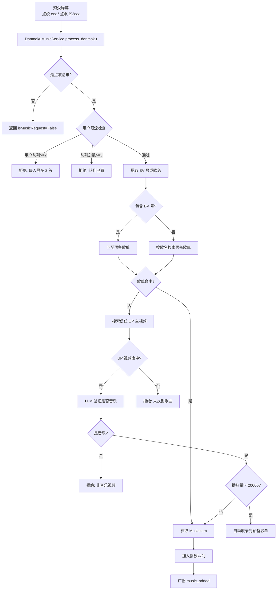

# 弹幕点歌系统

> **汇报板块四：弹幕点歌系统**
> 涵盖：点歌识别、歌曲解析、LLM 验证、队列管理
> 核心文件：`backend/apps/live/music/`

---

## 一、系统概述

弹幕点歌系统允许观众通过弹幕点歌，系统会自动搜索 B 站音频、LLM 验证是否为音乐、入队播放。

**核心能力**：
- 弹幕点歌识别（关键词匹配 + BV 号提取）
- 预备歌单快速匹配（MySQL 缓存）
- UP 主视频库搜索（定时刷新 + WBI 签名）
- LLM 验证是否为音乐（标题 + 简介 + 热门评论分析）
- 播放队列管理 + 自动播放循环

---

## 二、架构图



---

## 三、模块运作机制

### 3.1 点歌识别

- 匹配前缀："点歌"、"来一首"、"播放"
- 或提取 BV 号（`BV[a-zA-Z0-9]{10}`）
- 同时满足可提取歌名（去除前缀和 BV 号的剩余部分）

### 3.2 限流保护

两层限流：
- **用户级**：每人最多 2 首在队列（防刷屏）
- **队列级**：总队列上限 5 首

### 3.3 歌曲搜索路径

搜索分三级，逐步降级：

1. **预备歌单**（PlaylistManager）→ MySQL 表，命中直接获取音频直链
2. **UP 主视频库**（UpVideoManager）→ 定时刷新信任 UP 主的视频缓存到 MySQL
3. 两级都未命中 → 拒绝

### 3.4 LLM 音乐验证

验证视频是否为音乐，避免错误点歌：

1. **时长预检**：60-480 秒范围外跳过 LLM
2. **获取信息**：标题、简介（截断 500 字）、热门评论（按点赞排序，最多 3 条）
3. **LLM 分析**：判断是否为音乐，返回歌曲名 + 歌手
4. **自动收录**：验证通过且播放量 ≥ 20000，自动加入预备歌单

### 3.5 音频代理

- B 站音频直链有防盗链限制
- 前端通过 `/music/proxy/audio?url=...` 代理播放
- 后端加 `Referer: https://www.bilibili.com` 头绕过防盗链

### 3.6 播放队列与自动播放

- 队列结构：`_queue`（deque, maxlen=200）+ `_current` + `_history`（deque, maxlen=100）
- 自动播放循环：播放当前 → 睡眠 duration+2 秒 → 取下一首
- 队列空时从预备歌单随机选歌
- 管理员可通过 `/next`、`/pause`、`/rm`、`/sound` 控制播放

---

## 四、关键数据流

```
点歌弹幕 → DanmakuMusicService
              │
         ┌─────┴─────┐
         ▼            ▼
    预备歌单匹配   UP视频搜索
         │            │
         └─────┬──────┘
               ▼
          LLM 验证
               │
          ┌────┴────┐
          ▼         ▼
      音频获取   拒绝点歌
          │
          ▼
      加入播放队列 → 前端广播
          │
          ▼
      自动播放循环 → B站音频代理 → 前端播放
```

---

## 【讲解稿】

### 开场（约 1 分钟）

弹幕点歌系统是 FeinaLive 中一个相对独立但功能完整的能力模块。

它做的事情概括起来就是一句流程——观众发"点歌 xxx"，系统去找到对应的音乐文件，验证它确实是音乐，加入播放队列，自动播放。整个过程不需要人工介入。

这个系统的设计有几个有趣的地方：用 LLM 来做音乐验证、通过三级缓存加速搜索、处理 B 站复杂的防盗链机制。

### 点歌识别逻辑（约 1.5 分钟）

先看点歌识别。

弹幕在 process_danmaku 中被拦截后，交给 `DanmakuMusicService.is_music_request()` 判断。

判断规则很简单：匹配前缀"点歌"、"来一首"、"播放"之一，或者检测到 BV 号。这里有一个细节——BV 号的匹配优先于前缀匹配。如果弹幕是"我点歌 BV1xx411c7mD"，前缀"点歌"被匹配，同时 BV 号也被提取出来。优先使用 BV 号，因为 BV 号是精确标识。

如果只有歌名没有 BV 号，比如"点歌 晴天"，系统会提取"晴天"作为搜索关键字。

**支持两种输入方式：**
- BV 号：精确到 B 站的唯一视频 ID，不会搜错
- 歌名：模糊匹配，需要后续搜索和验证

### 三级搜索路径（约 3 分钟）

识别后进入搜索阶段。我们设计了三级搜索路径，每级的响应速度和搜索代价不同。

**第一级：预备歌单匹配（毫秒级）。**

预备歌单是一张 MySQL 表，定义很简单：bvid（B 站视频 ID）、title（标题）、artist（歌手）、enabled（是否启用）。

如果弹幕中的歌名或 BV 号匹配到预备歌单中的记录——注意搜索是 title、artist、bvid 三个字段的 ilike 模糊匹配——直接调用 `BilibiliMusicClient.get_music_item_with_overrides()` 获取完整的 MusicItem，包括音频直链、封面 URL、时长等。

预备歌单在系统初始化时，如果表为空，会从配置文件 `config.default_playlist` 中读取默认歌单填充。这意味着系统"开箱即用"时就有一批可点的歌。

**第二级：UP 主视频库搜索（秒级）。**

预备歌单未命中时，搜索 UP 主视频库。这同样是一张 MySQL 表——up_videos，定时从 B 站拉取信任 UP 主的视频列表。

这个刷新机制值得展开说一下。B 站的 API 有反爬限制，不能无限制调用。我们用了 WBI 签名算法来解决这个问题。

WBI 签名的过程是：
1. 从 B 站的 nav 接口获取 img_key 和 sub_key
2. 用 B 站规定的算法——对 key 做 OE 数组重排得到 mixin_key
3. 对请求参数计算 MD5 签名，得到 w_rid
4. 请求时带上 wts（时间戳）和 w_rid

这个签名算法隔一段时间会变，所以我们需要定期从 B 站更新 key。

搜索时按视频标题做 ilike 匹配，取最佳匹配返回。如果匹配到视频，进入 LLM 验证流程。

**第三级：拒绝。**

如果两级都没命中——预备歌单没有、UP 主视频库也没有——直接返回错误消息。不存在无限等待或兜底逻辑。因为提供一个不确定是否存在的音乐，比拒绝更糟糕。

### LLM 音乐验证——防止点错视频（约 3 分钟）

找到了视频，不能直接播。这是点歌系统中最容易被忽视但是最关键的一步。

为什么需要验证？B 站上什么样的内容都有。搜"晴天"可能搜到的是周杰伦的 MV，但也可能搜到游戏实况里恰好有晴天这首歌作为 BGM。搜"极乐净土"可能搜到的是原版 MV，但也可能搜到一支舞见跳极乐净土的舞蹈视频。直接播这些非音乐内容对直播来说是不可接受的。

所以验证流程是这样的：

**第一步：时长预检。** 视频时长必须在 60 秒到 480 秒之间。小于 60 秒的不可能是完整歌曲（可能是片段或铃声），大于 480 秒可能是播单、电影、或者课程。这道预检非常高效，能过滤掉大约 30% 的误搜结果，而且不需要调 LLM。

**第二步：收集上下文。** 系统从 B 站获取三部分信息：
- 标题：完整标题
- 简介：截断到 500 个字符
- 热门评论：按点赞排序，取最多 3 条，每条截断到 50 个字符

选热门评论是因为评论能反映内容类型——音乐视频的评论通常是"好听""喜欢这首歌"，而游戏视频的评论通常是"主播好菜""这个操作秀"。

**第三步：LLM 判断。** 把标题、简介、评论拼成一段文本，发给 LLM。使用了一个专门的 prompt——`config.llm_prompts["music_verify"]`。LLM 需要返回结构化的 JSON：

```json
{"is_music": true, "song_name": "晴天", "artist": "周杰伦", "reason": "标题明确标注为 MV，时长 4 分 29 秒"}
```

如果 `is_music` 为 false，返回拒绝原因。

**LLM 验证的容错：** 如果 LLM 服务不可用——比如 API key 过期或网络故障——系统会跳过 LLM 验证，直接基于时长判断。只要时长在范围内就通过。这是一个有意的权衡：宁可错放一个非音乐视频，也不要在 LLM 故障时完全拒绝点歌。

**第四步：自动收录（自我进化）。**

验证通过后，如果视频播放量超过 20000，系统会自动将其加入预备歌单。下次有人点同样的歌，直接命中预备歌单的第一级搜索，不需要再走搜索和 LLM 验证。

这个机制让系统的点歌能力随时间逐步提升——点过的歌越多，预备歌单越丰富，响应越快。是一种很实用的自我进化。

### B 站音频防盗链处理（约 2 分钟）

通过验证后，系统从 B 站获取音频直链。但 B 站有防盗链：前端直接请求音频 URL 会返回 403，因为缺少 Referer 头。

我们是怎么处理的？做了一个音频代理。

具体来说，前端获取到 MusicItem 后，其中的 audioUrl 在播放前会经过 `toProxyUrl()` 函数的转换——如果 URL 包含 `bilivideo.com` 或 `biliplus.com`，就替换为 `/music/proxy/audio?url=...`。

后端收到这个代理请求后：
1. 用 httpx 创建一个流式请求，转发到 B 站 CDN
2. 请求头中添加 `Referer: https://www.bilibili.com`
3. 收到 B 站响应后，以流式方式转发给前端
4. Content-Type 设置为 `audio/mp4`

这里的"流式转发"是关键——后端不把完整音频下载到内存再转发，而是用 httpx 的流式读取和 Starlette 的 `StreamingResponse`，边读边发。对于几 MB 到几十 MB 的音频文件，这样的内存开销很小。

还有一个关于音频质量的选择：B 站 dash 信息中可能包含多个音频轨道，id 最高的质量最好。我们优先选 id 最高的，如果获取失败回退到 `durl[0].url`。

### 播放队列与自动播放循环（约 2.5 分钟）

最后是播放管理。

**队列结构：**
- `_current`：当前正在播放的歌曲
- `_queue`：等待队列（deque，maxlen=200）
- `_history`：播放历史（deque，maxlen=100）
- `_volume`：音量（0.0 到 1.0 的浮点数）

**限流策略：**
- 用户级：每人最多 2 首在队列（通过 `queue.count_user_requests(user)` 统计）
- 队列级：总队列上限 5 首

这两个限制都是有理由的。每人 2 首防止刷屏，同时给忠粉留了连续点歌的空间。总队列上限 5 首是为了播放体验——队列太长的话当前观众要等很久才能轮到自己的歌。

**自动播放循环：**

这是一个运行在后台的异步协程。逻辑很直接：

1. 检查有没有当前歌曲
2. 如果没有，从队列取下一首
3. 如果队列为空，从预备歌单随机选一首
4. 如果预备歌单也为空，等待（每 30 秒重试）
5. 有当前歌曲时，调 `play_callback` 播放
6. 睡眠 duration+2 秒后自动切到下一首

这里 `duration+2` 的作用是在歌曲结束后留 2 秒缓冲，避免切歌过于生硬。

**管理员控制：**

管理员通过弹幕指令控制播放，这些指令不直接操作队列，而是通过弹幕交互系统提到的回调机制执行：
- `/next`：跳过当前 → `on_next_track` 回调 → `queue.skip()`
- `/pause 1/0`：暂停/恢复 → `on_pause_change` 回调 → `queue.stop_auto_play() / start_auto_play()`
- `/rm`：移除并禁用 → `on_remove_track` 回调 → `queue.skip_and_disable_current()` 返回 bvid → 在预备歌单中禁用该 bvid
- `/sound 0-10`：音量 → `on_volume_change` 回调 → `queue.set_volume()`

每次控制操作都会广播 `music_control` 消息到前端 WebSocket，让前端音乐播放器同步状态。

**前端播放的浏览器策略问题：**

这里有一个所有 web 音乐系统都会遇到的问题——浏览器的自动播放策略。Chrome、Edge 等浏览器要求用户必须先与页面交互（点击、触摸等），才能播放音频。

前端的 music store 通过 `unlockAndPlay` 机制解决这个问题：先尝试播放无声的 AudioContext，如果不成功就等待用户交互事件。用户点击播放按钮或页面上任意位置后，AudioContext 被解锁，开始真正播放。

这个解锁过程对后端是透明的，但前端需要在状态管理中处理好播放按钮的启用/禁用状态。
