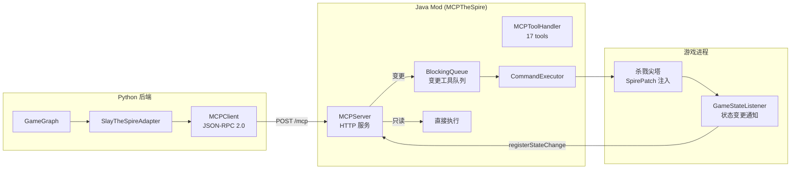

# 游戏 AI 系统

> **汇报板块五：游戏 AI 系统**
> 涵盖：MCP 协议、杀戮尖塔适配、状态机决策、解说协调
> 核心文件：`backend/apps/ai/game_graph.py`、`backend/apps/ai/mcp/`、`backend/apps/ai/commentary.py`

***

## 一、系统概述

游戏 AI 系统让 AI 主播能够自动游玩《杀戮尖塔》（Slay the Spire），并在游玩过程中实时解说。这是 FeinaLive 中最具技术挑战性的子系统。

**核心能力**：

- 通过 MCP 协议操控游戏（JSON-RPC 2.0）
- LLM 驱动的自主决策（状态机编排）
- 与主播系统的解说协调（异步 ACK 机制）
- 三层游戏记忆管理（单局/长期/图谱）
- 17 种游戏控制工具

***

## 二、架构图

```mermaid
flowchart TB
    subgraph 启动阶段
        AdminCmd[管理员 /mcp 1] --> GameRouter[/game/start/]
        GameRouter --> HealthCheck[SlayTheSpireAdapter.health_check]
        HealthCheck -->|不可用| Fail[日志警告]
        HealthCheck -->|可用| Start[GameManager.start]
        Start --> HostStart[HostGraph 消费循环]
        Start --> GameStart[GameGraph 决策循环]
    end

    subgraph 游戏决策循环 GameGraph
        Loop[_game_loop] --> Collect[_node_collect_data<br/>并行收集状态]
        Collect --> Guard[_node_guard_turn<br/>回合守卫]
        Guard -->|非己方回合| Wait[等待 min_step_interval]
        Guard -->|己方回合| GameOver[_node_handle_game_over]
        GameOver -->|GAME_OVER| Proceed[proceed + start_game]
        GameOver -->|进行中| Pending[_node_execute_pending_action]
        Pending --> Build[_node_build_prompt<br/>构建 prompt + 收集 tools]
        Build --> Decide[_node_llm_decide<br/>LLM 决策]
        Decide --> Route[_node_route_tool_calls<br/>分类动作]
        Route --> Execute[_node_execute_tools<br/>执行工具]
        Execute --> Update[_node_update_history]
        Update --> Loop
    end

    subgraph 主播消费循环 HostGraph
        HostLoop[_host_loop] --> GetMsg[queue.get]
        GetMsg -->|commentary_request| Commentary[_handle_commentary<br/>生成解说]
        GetMsg -->|danmaku| Danmaku[_handle_danmaku]
    end
```



### MCP 通信架构



***

## 三、模块运作机制

### 3.1 MCP 协议层

MCP（Model Context Protocol）是后端 Python 与游戏 Java Mod 之间的通信协议，基于 JSON-RPC 2.0。

**Python 侧**：

- `MCPClient`：HTTP 客户端，发送 `POST /mcp` 请求
- `SlayTheSpireAdapter`：适配器，将 MCP 响应转换为统一的 `UnifiedGameState`

**Java 侧（MCPTheSpire Mod）**：

- `MCPServer`：嵌入式 HTTP 服务，监听 8080 端口
- `MCPToolHandler`：定义 17 个工具的执行逻辑
- `CommandExecutor`：通过 SpirePatch 注入游戏逻辑

**线程模型**：Java 侧采用双线程架构——HTTP 线程接收请求，只读工具直接执行，变更工具入 `BlockingQueue` 等待游戏线程消费。

### 3.2 17 种游戏工具

| 类别 | 工具                                                            | 说明    |
| -- | ------------------------------------------------------------- | ----- |
| 只读 | `get_game_state`、`get_screen_state`、`get_available_commands`  | 状态查询  |
| 只读 | `get_card_info`、`get_relic_info`                              | 详情查询  |
| 变更 | `play_card`、`end_turn`、`choose`、`use_potion`、`discard_potion` | 战斗操作  |
| 变更 | `proceed`、`confirm`、`skip`、`cancel`                           | UI 操作 |
| 变更 | `start_game`、`abandon_run`、`save_game`                        | 游戏管理  |
| 变更 | `execute_actions`                                             | 批量执行  |

### 3.3 GameGraph 状态机

GameGraph 是一个**8 节点状态机**，每次循环走完所有节点：

| 节点                 | 功能        | 说明                                         |
| ------------------ | --------- | ------------------------------------------ |
| `collect_data`     | 并行收集      | `adapter.get_state()` + 主播历史 + 游戏历史 + 记忆注入 |
| `guard_turn`       | 回合守卫      | 判断是否轮到 AI 行动，否就等待                          |
| `handle_game_over` | 游戏结束处理    | 自动 proceed + start\_game 开新局               |
| `execute_pending`  | 执行缓冲动作    | 执行上轮未执行的缓冲动作                               |
| `build_prompt`     | 构建 prompt | 系统指令 + 三层记忆 + 当前状态 + 可用工具                  |
| `llm_decide`       | LLM 决策    | 调用游戏专用 LLM（低 temperature 保证稳定性）            |
| `route_tool_calls` | 分类动作      | 解说/记忆/只读/游戏，分别处理                           |
| `execute_tools`    | 执行工具      | 记忆+只读并行，游戏动作串行                             |
| `update_history`   | 更新历史      | 写入 SharedContext                           |

**工具执行策略**：

- 解说请求：合并后入消息队列，等待主播播报完成
- 记忆 + 只读：并行执行
- 游戏动作：**串行**，第一个立即执行，其余入缓冲队列下一轮执行

### 3.4 解说协调

GameGraph 与 HostGraph 之间的**跨 Graph 协同机制**：

1. GameGraph 的 LLM 决策产生解说请求
2. `CommentaryCoordinator` 合并多个请求（去重 key\_points，选非 neutral 的 mood）
3. 限流检查（距上次解说至少 15 秒）
4. 注册请求 → 入消息队列（HIGH 优先级） → 等待 ACK
5. HostGraph 消费解说请求 → 生成解说话术 → TTS 广播
6. HostGraph 通知 `SharedContext` 播报完成 → GameGraph 继续

### 3.5 记忆管理

> 记忆系统的完整专题汇报详见 [`07-记忆系统.md`](./07-记忆系统.md)。

| 层级   | 内容                                      | 管理方式                             |
| ---- | --------------------------------------- | -------------------------------- |
| 单局记忆 | core/important/recent 三层 + pending 事件   | 每 12 个事件 LLM 压缩摘要                |
| 长期记忆 | GAME\_MECHANIC（180 天）、GAME\_LORE（365 天） | LLM 通过 `memorize` 工具主动记录，FTS5 检索 |
| 知识图谱 | 卡牌/遗物/敌人/事件的协同克制关系                      | 从游戏状态自动提取节点                      |

### 3.6 操作节奏控制

为模拟真人操作，避免被检测为脚本：

| 参数                    | 默认值   | 说明     |
| --------------------- | ----- | ------ |
| `min_step_interval`   | 3.0s  | 操作最小间隔 |
| `step_jitter`         | ±0.5s | 随机误差   |
| `commentary_interval` | 30.0s | 解说建议间隔 |

***

## 四、关键数据流

```
管理员 /mcp 1 → GameManager.start
                    │
            ┌───────┴───────┐
            ▼               ▼
       HostGraph       GameGraph
      (主播消费循环)   (游戏决策循环)
                           │
                    ┌──────┴──────┐
                    ▼              ▼
              SlayAdapter → MCPClient → MCPServer → 杀戮尖塔
                    │
              ┌─────┴─────┐
              ▼           ▼
        SharedContext   解说请求 → 消息队列 → HostGraph → 广播
```

***

## 【讲解稿】

### 开场（约 1 分钟）

游戏 AI 系统是 FeinaLive 技术挑战最大的子系统。它让 AI 能够自己玩杀戮尖塔，自己做决策——出什么牌、选什么路线、什么时候结束回合——并且在过程中实时解说自己的操作，比如"看我打出这张重击！"。

整个系统的核心挑战有三个：第一，Python 后端和 Java 游戏进程怎么通信；第二，AI 怎么理解游戏状态并做出有效决策；第三，游戏决策和主播解说怎么协同工作。

### 通信层：MCP 协议（约 2 分钟）

先说通信。

游戏进程是杀戮尖塔，它运行在 JVM 上，是一个 Java 程序。我们的后端是 Python FastAPI。两个不同语言的进程怎么通信？

答案是我们自研了一个基于 JSON-RPC 2.0 的协议，叫做 MCP。

Python 侧有 MCP 客户端和适配器层。适配器的作用是把 MCP 返回的原始 JSON 转成统一的游戏状态对象，上层的决策逻辑不需要关心通信细节。

Java 侧是一个 Mod——MCPTheSpire，通过 ModTheSpire 的补丁机制注入杀戮尖塔进程。内部有一个嵌入式 HTTP 服务，暴露了十几个游戏操控工具。

**工具分两类：只读类和变更类。** 只读工具查状态，HTTP 线程收到后直接执行并返回。变更工具要操作游戏状态，不直接执行，而是入队到一个队列，由游戏线程在每帧的更新循环中逐个取出执行。

这样做的目的是**配合操作节奏控制**——命令的执行节奏和游戏帧循环同步，不会出现 Python 侧连续发指令导致游戏来不及响应的情况。Python 侧也有自己的节奏控制——每轮决策循环之间有最小间隔，单次决策产生的多余动作会缓冲到下一轮。两层队列配合，共同实现真人般的操作节奏。

### GameGraph 决策循环（约 3 分钟）

通信层有了，来看 GameGraph——游戏决策循环，它是游戏 AI 的大脑。

GameGraph 是一个循环执行的状态机，每轮循环做这几件事：

**第一步：收集信息。** 并行获取三方面数据：游戏当前状态（战斗还是商店、HP 费用手牌等）、主播最近的发言、以及注入游戏相关的记忆。这样 AI 在做决策时既知道游戏里发生了什么，也知道主播刚才说了什么。

**第二步：判断时机。** 检查是不是 AI 的行动回合——战斗中是否轮到出牌、商店里是否可以买东西等。如果不是，等待几秒后重试。这个等待本身就是节奏控制的一部分。

**第三步：构建决策上下文。** 把所有信息——游戏状态、记忆、可用工具——拼成一个完整的 Prompt，发给 LLM。Prompt 中包含了双重角色要求：AI 既要当好游戏玩家（做出最优决策），也要当好直播主播（记得解说）。

**第四步：LLM 决策。** 调用游戏专用的 LLM 模型，参数设得比主播更低，确保决策稳定性。LLM 返回的结果是一系列工具调用——出牌、结束回合、请求解说等。

**第五步：分类执行。** 把 LLM 的决策结果分四类处理：解说请求走协调器、记忆操作用记忆引擎、只读查询并行执行、游戏动作串行执行。

这里的关键策略是**游戏动作串行 + 缓冲**——一次决策产生的多个动作，只有第一个立即执行，其余的缓冲到下一轮。因为打出一张牌后游戏状态可能变化，下一张牌是否还适用需要重新评估。

### 解说协调——跨 Graph 协同（约 2 分钟）

GameGraph 只负责游戏决策，解说播报是 HostGraph 的职责。两者通过消息队列 + SharedContext 协同。

流程是这样的：GameGraph 的 LLM 决策产生了解说意图——比如"打出重击造成 18 点伤害，应该解说一下"。解说请求先经过 CommentaryCoordinator，它做三件事：合并同一轮中多个解说请求（去重）、检查是否说得太频繁（限流）、然后注册到 SharedContext。

接着把合并后的解说请求以高优先级入消息队列，然后异步等待播报完成。

HostGraph 从队列取出解说请求，生成解说话术并 TTS 播报，播报完成后通知 SharedContext。GameGraph 收到播报完成的信号后，继续下一轮决策。

如果播报超时——比如 LLM 响应慢了——协调器会取消请求，GameGraph 不会无限等待。

### 游戏记忆（约 1.5 分钟）

游戏 AI 的记忆分三层：

**单局记忆**记录当前这局游戏的关键信息，按核心、重要、最近三个等级组织。游戏过程中事件不断追加，累积到一定量后由 LLM 压缩总结一次。

**长期游戏知识**存的是游戏机制和背景知识——比如某张卡的效果、某个遗物的作用。这些由 LLM 在游戏过程中主动记录，有有效期，用全文搜索引擎检索。

**知识图谱**存的是结构化的关系网络——哪些卡牌之间有协同效果、哪些遗物克制哪些敌人。图谱的节点从游戏状态自动提取，关系通过 LLM 分析构建。

每轮决策前，系统从这三层记忆中检索相关信息，注入到 LLM 的 Prompt 中，让 AI 带着"经验"做决策。

### 操作节奏与异常处理（约 1 分钟）

为了模拟真人操作、避免被检测为脚本，系统通过几个参数控制节奏：操作之间最小间隔 3 秒，加随机抖动；解说建议间隔 30 秒，硬限制 15 秒。

异常处理方面：MCP 服务不可达就不启动游戏 AI；调用超时会指数退避重试；游戏崩溃时停止循环并通知管理员；LLM 决策失败跳过本轮；游戏结束后自动重开新局。
