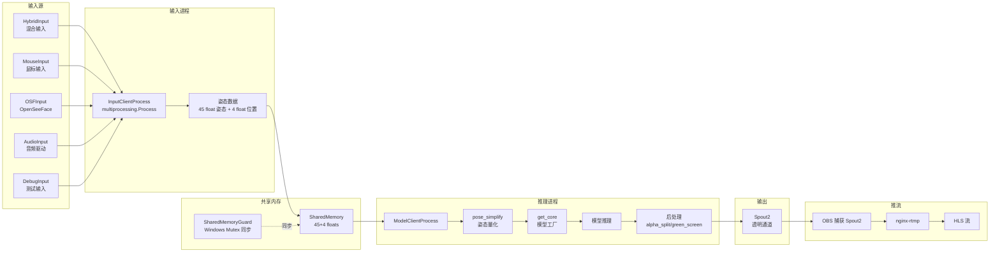
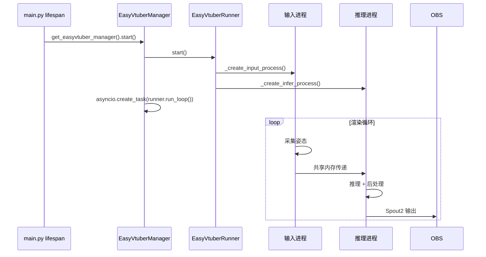

# 数字人渲染系统

> **汇报板块六：数字人渲染系统**
> 涵盖：EasyVtuber 渲染管线、多进程架构、口型联动、直播推流
> 核心文件：`backend/EasyVtuber/`、`backend/apps/easyvtuber/`

---

## 一、系统概述

数字人渲染系统负责驱动虚拟主播的视觉形象。它从姿态采集到模型推理，再到画面输出和推流，构成了一个完整的渲染管线。

**核心能力**：
- 多进程渲染架构（输入进程 + 推理进程，共享内存通信）
- THA3/THA4 模型推理（ONNX Runtime / TensorRT 加速）
- 多种输入模式（混合漫步、鼠标追踪、面部捕捉、音频驱动）
- 实时口型联动（TTS 音频电平驱动嘴部动画）
- Spout2 纹理共享输出到 OBS

---

## 二、架构图

### 渲染管线

### 后端集成流程

---

## 三、模块运作机制

### 3.1 多进程架构

EasyVtuber 采用**双进程架构**，这是解决 Python GIL 限制的关键设计：

| 进程 | 职责 | 关键技术 |
|------|------|----------|
| **输入进程** | 采集姿态数据（鼠标/音频/面部） | `multiprocessing.Process`，写入共享内存 |
| **推理进程** | THA3/THA4 模型推理 + 后处理 | `ModelClientProcess`，读取共享内存 |

**进程间通信**：
- 共享内存：45 个面部姿态 float + 4 个位置 float
- `SharedMemoryGuard`：Windows Named Mutex 保证读写互斥
- 输入进程写前获取锁，推理进程读前获取锁

**设计理由**：单进程中 GIL 会阻塞推理线程，导致输入采集不实时。输入和推理分离到不同进程后，各自独立利用 CPU 核心。

### 3.2 输入模式

| 模式 | 说明 | 适用场景 |
|------|------|----------|
| **hybrid**（推荐） | 随机漫步 + 鼠标控制 + 音频驱动 | 无人值守直播 |
| **mouse** | 鼠标位置追踪 + 可选音频 | 有人值守直播 |
| **osf** | OpenSeeFace 面部捕捉（UDP） | 真人驱动 |
| **cam** | MediaPipe FaceMesh 摄像头捕捉 | 真人驱动 |
| **audio** | 纯音频驱动 | 仅声音场景 |
| **debug** | 正弦波测试 | 开发调试 |

**HybridInput 细节**：
- 自动漫步模式：随机生成鼠标移动目标，模拟自然头部运动
- 说话时根据音频电平生成嘴部姿态
- 含呼吸动画（周期性微动）和眨眼动画（随机间隔）

### 3.3 模型推理

| 模型版本 | 说明 | 性能 |
|----------|------|------|
| THA3（v3） | Talking Head Anime 3 | 成熟稳定 |
| THA4（v4） | Talking Head Anime 4 | 质量更高 |
| THA4 Student（v4_student） | 蒸馏模型 | 速度更快 |

**推理管线**：
1. `pose_simplify`：姿态量化（level 0-4），降低精度换取性能
2. 模型推理：优先 TensorRT（需 pycuda），回退 ONNX Runtime GPU
3. RIFE 帧插值（x2/x3/x4）：平滑动画
4. 超分辨率（waifu2x / Real-ESRGAN / Anime4K）
5. 后处理：alpha_split（透明通道）/ green_screen（绿幕）

**性能优化**：
- VRAM 缓存（`VRAMCacher`）：LRU 缓存推理结果到显存
- RAM 缓存（`Cacher`）：LRU + Brotli 压缩缓存到内存
- 动态帧率控制：根据推理耗时调整，跳帧避免积压

### 3.4 口型联动

TTS 音频播放时驱动数字人嘴部动画，有两条路径：

**路径 A（后端直接控制）**：
- TTS 开始时调用 `set_speaking(True)`，结束时 `set_speaking(False)`
- EasyVtuber 的 hybrid/audio 模式根据 speaking 状态生成嘴部姿态

**路径 B（前端音频电平驱动，更精细）**：
- 前端 `AudioPlayer` 播放 TTS 音频
- 通过 `AnalyserNode`（fftSize=256）计算实时音频电平
- 通过 WebSocket 发送电平数据到 EasyVtuber 输入进程
- 嘴部张开程度与音频电平实时联动

### 3.5 画面输出

| 方式 | 说明 |
|------|------|
| **Spout2**（推荐） | Windows 纹理共享，OBS 可直接捕获，透明通道 RGBA |
| pyvirtualcam | 虚拟摄像头，回退方案 |

---

## 四、性能指标

| 指标 | 目标 | 说明 |
|------|------|------|
| 输出帧率 | 30 FPS | 配置项 `easyvtuber_frame_rate` |
| 口型延迟 | < 100ms | 前端 AnalyserNode 实时计算 |
| 模型精度 | half（FP16） | 平衡质量与性能 |
| 缓存 | VRAM 2GB + RAM 2GB | LRU 缓存减少重复推理 |

---

## 【讲解稿】

### 开场（约 1 分钟）

数字人渲染系统是观众**直接看到**的部分——屏幕上那个会说话、会眨眼、会动的虚拟形象，就是由这个系统驱动的。

它基于 EasyVtuber 引擎，核心任务是：把一张静态的角色立绘，通过 THA3/THA4 模型实时渲染成动态的数字人画面，并通过口型联动让画面与 TTS 语音同步。

这个系统的技术挑战在于：要在有限的硬件资源下，实现 30 FPS 的实时渲染，同时保证口型延迟在 100 毫秒以内。

### 多进程架构（约 3 分钟）

先从架构层面理解 EasyVtuber 的设计。

EasyVtuber 采用了**双进程架构**。两个进程通过共享内存通信。

**输入进程**的职责是采集姿态数据。它支持多种输入模式——hybrid 混合模式、鼠标追踪、音频驱动、面部捕捉等——采集到的数据是一组 45+4 个 float 值的姿态向量：45 个面部参数（眼睛开合、眉毛位置、嘴部形状、头部旋转）和 4 个位置参数（x/y/z 平移和缩放）。

输入进程计算好姿态后，写入共享内存。

**推理进程**的职责是从共享内存读取姿态数据，运行 THA3/THA4 模型推理，生成数字人画面，然后输出到 Spout2 或虚拟摄像头。

**为什么要分成两个进程？**

答案很简单——Python 的 GIL。Python 的全局解释器锁意味着一个进程里同一时刻只有一个线程能执行 Python 字节码。如果输入采集和模型推理放在一个进程，模型推理会阻塞输入采集——推理占用 CPU 时，输入线程无法及时采集鼠标移动和音频电平。结果是数字人反应迟钝：鼠标移动了半秒，数字人才转头。

分成两个进程后，每个进程独立跑在各自的 CPU 核心上，互不阻塞。输入进程负责实时采集，推理进程全力做推理。

**进程间通信方案：**

我们使用的是共享内存（`multiprocessing.shared_memory`），配合 Windows Named Mutex 做同步。为什么不直接用 multiprocessing.Queue 或 Pipe？因为 Queue 和 Pipe 涉及序列化和反序列化，对于每帧 49 个 float 的小数据来说序列化开销太大了。共享内存直接读写内存，零拷贝。

同步方面，`SharedMemoryGuard` 封装了 Windows 的 CreateMutexW 和 WaitForSingleObject 系统调用。输入进程写入前获取互斥锁，写入后释放；推理进程读取前获取互斥锁，读取后释放。这样避免了读写竞争——不会出现推理进程读到一半，输入进程覆盖了数据的情况。

**进程生命周期：**

两个进程由 `EasyVtuberRunner` 管理，通过 `multiprocessing.Process` 启动。进程启动后，Runner 进入一个异步循环，检查进程健康状态。后端关闭时，Runner 先 terminate 进程，再清理共享内存。

### 输入模式详解（约 3 分钟）

EasyVtuber 支持 6 种输入模式，通过配置项 `easyvtuber_input_type` 切换。

**Hybrid 混合输入（推荐模式）：**

这是默认模式，也是功能最丰富的模式。它内部有一个 `NaturalRandomWalk` 类，实现了几种"自然行为"：

首先是**自动漫步**。当 `auto_mode=True` 时，系统会随机生成鼠标移动目标点，让数字人的头部做缓动运动——就像一个人在看直播间不同位置的弹幕一样。移动轨迹不是直线，而是带缓入缓出曲线的自然路径。

其次是**呼吸动画**。基于正弦波周期性地微调数字人的肩部和胸部姿态，模拟呼吸起伏。

然后是**眨眼动画**。每 3-7 秒随机触发一次眨眼，眨眼动作持续约 100-200 毫秒。眨眼的间隔和时长都有随机性，避免机械感。

当 `set_speaking(True)` 时，嘴部根据音频电平做开合运动。`set_audio_level(level)` 接收 0-1 的电平值，映射到嘴部参数的开合程度。

当 `auto_mode=False`（鼠标追踪模式）时，漫步停止，数字人的视线跟随鼠标位置。鼠标位置通过前端的 mousemove 事件捕获，经 WebSocket 发送到 EasyVtuber。这是运营人员手动操作数字人时的模式。

**其他模式：**

- **Mouse 纯鼠标模式**：更轻量的鼠标追踪，不带呼吸和漫步
- **OSF（OpenSeeFace）面部捕捉**：通过 UDP 协议接收 OpenSeeFace 软件的面部关键点数据，实现真人的面部动作驱动数字人
- **FaceMesh 摄像头捕捉**：使用 MediaPipe FaceMesh 从摄像头画面中提取面部关键点
- **Audio 纯音频驱动**：只根据音频信号驱动嘴部，没有其他动画
- **Debug 测试模式**：用正弦波驱动所有姿态参数，用于调试渲染管线

### 模型推理管线（约 3 分钟）

推理进程的核心是模型推理管线，从姿态到画面经过多道处理。

**第一步：姿态量化（pose_simplify）。**

输入进程写入的 45+4 float 是浮点精度。推理进程的第一步是做量化——根据设定的 level（0-4），降低参数精度。level 0 不量化保持原样，level 4 量化到 4 bit。量化是为了提升推理速度——精度越低，推理越快，画质损失在可接受范围内。

**第二步：模型工厂（get_core）。**

系统根据配置选择推理后端。优先使用 TensorRT（`CoreTRT`），因为 TensorRT 对 GPU 利用率最高。如果 TensorRT 初始化失败——比如缺少 pycuda 或模型未转成 TensorRT engine——回退到 ONNX Runtime（`CoreORT`）。

**第三步：模型推理。**

支持三个模型版本：THA3（成熟稳定）、THA4（质量更高）、THA4 Student（蒸馏模型，速度更快）。

推理输入是角色立绘 + 姿态参数。输出是包含 RGBA 通道的图像帧。

**第四步：后处理管线。**

1. **RIFE 帧插值**：在推理输出帧之间插入额外帧。比如目标帧率是 30，但推理只能做到 15 FPS，RIFE 插值可以把 15 帧插成 30 帧。插值倍率有 x2、x3、x4 可选，倍率越高越平滑但需要更多算力。

2. **超分辨率**：用 waifu2x 或 Real-ESRGAN 或 Anime4K 提升画面分辨率。超分辨率对画质提升非常明显，但也是性能瓶颈之一。

3. **帧缓冲与缓存**：推理结果经过两级缓存。VRAM 缓存（`VRAMCacher`）缓存最近推理结果到显存，命中时直接返回，避免重复推理。RAM 缓存（`Cacher`）使用 LRU + Brotli 压缩，缓存到系统内存。两级缓存的命中率在典型直播场景下可以达到 60-70%——因为相邻帧的姿态变化通常很小。

4. **后处理混合**：
   - `alpha_split`：将 RGBA 帧拆分为 RGB + Alpha 通道，用于透明画面输出
   - `green_screen`：生成绿幕背景版本，适用于传统的抠图工作流
   - `debug` overlay：叠加姿态关键点、FPS 计数器等调试信息

### 画面输出与推流（约 2 分钟）

推理完成后，画面需要输出到 OBS 进行直播推流。

**输出方式：**

推荐方式是 **Spout2**。Spout2 是 Windows 平台的一个纹理共享协议，允许一个应用将 GPU 纹理共享给另一个应用。推理进程通过 PySpout（Spout2 的 Python 绑定）将 RGBA 帧发送到 Spout2 接收器。OBS 安装 Spout2 插件后，可以直接添加 Spout2 源捕获数字人画面，不需要额外编码。

回退方案是 **pyvirtualcam**——将画面输出为虚拟摄像头设备。

**帧率控制：**

配置目标帧率默认为 30 FPS。帧率控制通过 `timer_wait` 模块实现：每帧处理完后，计算距离下一帧目标时间还有多久，然后调用高精度等待。

这个等待机制比较特殊——用 `NtSetTimerResolution` 将系统定时器精度提升到 0.5ms，然后做 busy-wait 旋转变等待。为什么要用 busy-wait？因为 Windows 的标准 Sleep 精度只有 15ms 左右，对于 30 FPS（每帧 33ms）来说误差太大。busy-wait 虽然 CPU 占用更高，但帧率更稳定。

**推流链路：**

数字人画面 Spout2 → OBS 捕获 → RTMP 推流到 nginx-rtmp → nginx 切成 HLS 分片 → 前端 hls.js 播放。

OBS 在这一链路中不仅做推流，还负责画面合成——可以把数字人画面叠加到背景上、添加字幕、切换场景等。前端看到的最终画面是 OBS 合成后的结果。

### 口型联动的两种路径（约 2 分钟）

口型联动是数字人"像真人"的关键。我们实现了两种方式。

**方式 A：后端直接控制（简单模式）。**

TTS 开始合成时，HostGraph 调用 `easyvtuber_manager.set_speaking(True)`，Runner 将 speaking 状态写入输入进程的共享内存参数。输入进程检测到 speaking=True 后，将嘴部姿态参数设为"说话"状态（预设的嘴型）。

TTS 合成结束时，`set_speaking(False)`，嘴部恢复为闭合状态。

这种方式的优点是简单可靠，不需要前端参与。缺点是口型只有"开"和"关"两态，缺乏中间过渡状态，看起来不太自然。

**方式 B：前端音频电平驱动（精细模式）。**

前端播放 TTS 音频时，通过 Web Audio API 创建一个 `AnalyserNode`（fftSize=256）来分析音频频谱。

具体的实现是：在 AudioPlayer 的音频链中插入 AnalyserNode。播放时，每个动画帧（requestAnimationFrame）调用 `analyser.getByteTimeDomainData()` 获取时域数据，计算 RMS 电平值（0-1 之间），然后通过 `/avatar/input` WebSocket 发送 `{type:"audio", level: 0.8, speaking: true}` 给 EasyVtuber。

EasyVtuber Manager 收到后调用 `set_audio_level(level)` 和 `set_speaking(speaking)`，输入进程根据电平值动态调整嘴部开合程度——电平高时大张嘴，电平低时微张嘴，没有声音时闭合。

这种方式的优点是口型与音频精确同步，看起来非常自然。缺点是需要前端持续发送 WebSocket 消息（每秒约 60 次），增加了网络开销。

**实践中两种方式并用：** 方式 A 作为兜底——确保即使前端没有发送电平数据，口型也能基本同步。方式 B 提供更精细的控制。EasyVtuber 的 hybrid 输入模式下，两种方式同时生效。

### 性能指标与优化策略（约 1.5 分钟）

最后总结一下数字人渲染系统的性能指标和优化策略。

**关键指标：**
- 目标帧率：30 FPS — 对于直播场景足够了，再高对带宽和算力要求更高但画质提升不明显
- 口型同步延迟：< 100ms — 这是人类能感知到"声画不同步"的阈值
- 推理精度：FP16（half）— 相比 FP32 推理速度翻倍，画质损失可忽略
- 缓存大小：VRAM 2GB + RAM 2GB

**优化策略：**

1. **量化优先**：`pose_simplify` 在精度和速度之间做权衡，降低姿态参数精度换取推理速度
2. **缓存命中**：相邻帧的姿态变化很小，两级缓存在典型场景下命中率 60-70%
3. **选择性插值**：RIFE 插值只对运动明显的帧做高倍率插值，静止帧降倍率
4. **动态降级**：当推理速度低于目标帧率时，自动降低插值倍率和超分辨率级别
5. **GPU 回退**：TensorRT 不可用时回退 ONNX Runtime，GPU 不可用时回退 CPU（但帧率会大幅下降）

**部署注意事项：**

硬件方面，推荐 NVIDIA GPU（RTX 3060 或以上），CUDA 12.1+。运行时需要将 cuDNN 放在 Python 虚拟环境的 nvidia 目录下。模型文件从 Google Drive 下载后放在 `data/models/` 目录。
