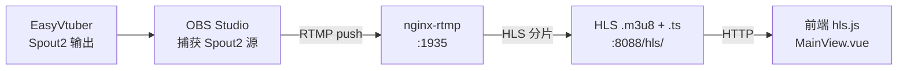

# 前端控制台与直播推流系统

> **汇报板块七：前端与推流系统**
> 涵盖：Vue 3 前端控制台、WebSocket 通信、nginx-rtmp HLS 推流
> 核心文件：`fronted/`、`backend/services/nginx_service.py`

---

## 一、系统概述

前端控制台是虚拟主播直播间的"驾驶舱"，负责展示弹幕、直播视频、音乐播放信息，并提供配置管理界面。推流系统将数字人画面通过 OBS + nginx-rtmp 转为 HLS 直播流供前端播放。

**核心能力**：
- 直播间实时弹幕展示（WebSocket 推送）
- HLS 直播流播放（hls.js）
- TTS 音频播放与文本动画同步
- 音乐播放器与队列展示
- 管理员控制面板与配置管理
- 数字人输入控制（鼠标 / 音频电平）
- nginx-rtmp 推流服务管理

---

## 二、前端架构图

### 前端模块结构

```mermaid
flowchart TD
    subgraph 前端 Vue 3
        App[App.vue<br/>根布局]

        subgraph Components
            DanmakuPanel[弹幕面板]
            MainView[主视频区]
            MusicPlayer[音乐播放器]
            PlaceholderPanel[信息面板]
            SettingsPanel[设置面板]
        end

        subgraph Composables
            UseDanmaku[useBilibiliDanmaku]
            UseHLS[useHlsPlayer]
            UseAvatar[useAvatarInput]
            UseAdmin[useAdminCommands]
        end

        subgraph Stores
            DanmakuStore[danmaku store]
            LLMStore[llm store]
            MusicStore[music store]
            StreamStore[stream store]
            MissionStore[mission store]
        end

        subgraph Types
            ConfigTypes[config.ts]
            DanmakuTypes[danmaku.ts]
            MusicTypes[music.ts]
            StreamTypes[stream.ts]
        end
    end

    subgraph 后端 FastAPI
        WSR[弹幕 WebSocket /bilibili/ws]
        REST[REST API]
        SSE[SSE /ai/reply]
        AvatarWS[/avatar/input]
    end

    App --> Components
    Components --> Composables
    Composables --> Stores
    Stores --> Types

    UseDanmaku --> WSR
    UseHLS -->|HTTP| Nginx[HLS 流]
    UseAvatar --> AvatarWS
    UseAdmin --> REST
    LLMStore --> SSE
    MusicStore --> REST
```

### 推流架构



---

## 三、模块运作机制

### 3.1 前端架构

前端基于 Vue 3 + TypeScript + Pinia + Tailwind CSS，固定 1920×1080 设计稿，用 transform 缩放适配不同屏幕。

**组件职责**：

| 组件 | 职责 | 关键交互 |
|------|------|----------|
| `App.vue` | 根布局、全局初始化 | fetchConfig、checkSessdata、connectToRoom |
| `DanmakuPanel.vue` | 弹幕列表展示 | danmaku store |
| `MainView.vue` | 主视频区域（HLS 播放 + MCP 开关） | stream store |
| `MusicPlayer.vue` | 音乐播放器 | music store |
| `PlaceholderPanel.vue` | 音乐信息 + LLM 文本展示 | music + llm store |
| `SettingsPanel.vue` | 集中配置管理 | GET/PUT /config |

**状态管理（Pinia Store）**：

| Store | 职责 | 数据源 |
|-------|------|--------|
| `danmaku.ts` | 弹幕列表、连接状态 | WebSocket（弹幕流） |
| `llm.ts` | LLM 生成、音频播放、文本动画 | WebSocket + SSE |
| `music.ts` | 音乐队列、播放控制 | REST API |
| `stream.ts` | 时钟、公告、直播状态 | REST API |
| `mission.ts` | 游戏任务数据 | 外部 GraphQL |

### 3.2 WebSocket 通信

前端通过多条 WebSocket 连接与后端通信：

| WebSocket | 职责 | 端点 |
|-----------|------|------|
| 弹幕流 | 接收弹幕/礼物/主播回复 | `/bilibili/ws/{roomId}` |
| 数字人输入 | 发送鼠标/音频电平控制 | `/avatar/input` |
| 测试弹幕 | 测试房间专用 | `/bilibili/ws/test/{roomId}` |

**消息分发**：前端收到 WebSocket 消息后，按 `type` 字段分发：
- `danmaku` / `gift` → danmaku store
- `start` / `text` / `audio` / `end` → llm store（主播回复）
- `music_added` / `music_error` / `music_control` → 通知提示
- `config_update` → 配置更新

### 3.3 音频播放与文本动画

**AudioPlayer 核心逻辑**（llm store）：
1. `queueAudio(base64, index, text)`：音频数据入队，按 index 排序（保证句子顺序）
2. 播放时 `decodeAudioData` 解码 → 播放
3. `AnalyserNode` 实时计算音频电平 → 发送到 `/avatar/input` 驱动口型
4. `requestAnimationFrame` 同步文本逐字显示

**浏览器自动播放策略**：用户交互后才能播放音频，通过 `unlockAndPlay()` 机制处理。

### 3.4 管理员控制

- `useAdminCommands` 每 3 秒轮询 `GET /test/admin/state`
- 管理员弹幕通过 `POST /test/admin/command` 发送
- 前端根据 `is_hide_admin` 状态过滤管理员弹幕

### 3.5 直播推流

**nginx-rtmp 配置**：

| 端口 | 用途 |
|------|------|
| 1935 | RTMP 推流接收 |
| 8088 | HLS HTTP 服务 |

**推流链路**：
1. EasyVtuber Spout2 输出 → OBS 捕获
2. OBS RTMP 推流到 nginx-rtmp（`rtmp://localhost:1935/live/stream`）
3. nginx-rtmp 转 HLS 分片（2s 片段，10s 播放列表）
4. 前端 hls.js 播放 `http://localhost:8088/hls/stream.m3u8`

**NginxService**：
- `main.py` lifespan 中启动/停止 nginx 进程
- `subprocess.Popen` 管理 nginx.exe 生命周期
- 创建 HLS 输出目录，检查 nginx.exe 存在

---

## 四、端口总览

| 端口 | 服务 | 说明 |
|------|------|------|
| 9191 | 后端 FastAPI | 主服务 |
| 5173 | 前端 Vite Dev | 开发服务器 |
| 8088 | nginx HLS | HTTP HLS 流 |
| 1935 | nginx RTMP | RTMP 推流接收 |
| 8080 | MCPTheSpire | 游戏 MCP 服务 |
| 8765 | EasyVtuber WS | 数字人 WebSocket |

---

## 【讲解稿】

### 开场（约 1 分钟）

前端控制台和推流系统是 FeinaLive 的"用户界面层"。前端控制台是运营人员操作直播间的"驾驶舱"，推流系统负责把数字人的画面实时传输到观众屏幕。

虽然这两个系统的技术复杂度不如 AI 主播或游戏 AI，但它们的用户体验直接决定了系统的可用性。一个观众在 B 站看到的是经过 OBS 合成、nginx 切片的直播画面；运营人员在控制台上操作、调配置、看状态。这两个系统做不好，后面的 AI 再聪明也没用。

### 前端架构设计（约 3 分钟）

前端基于 Vue 3 + TypeScript + Pinia + Tailwind CSS 构建。设计稿固定为 1920×1080，通过 CSS transform 缩放适配不同的屏幕分辨率。选择固定尺寸而不是响应式布局的原因是：直播间控制台需要在各种屏幕上都有一致的布局——元素的位置、大小比例是固定的，缩放比自适应更可控。

**组件架构：**

前端从底层到顶层可以分为三层：

**第一层：Types 类型定义层。** 定义了与后端 Pydantic 模型对齐的 TypeScript 接口——`FullConfig`、`DanmakuMessage`、`MusicItem`、`StreamStatus` 等。这些类型确保了前后端数据格式的一致。

**第二层：Stores 状态管理层。** 五个 Pinia Store 各自管理一个功能域：
- `danmaku store`：弹幕列表、WebSocket 连接状态、弹幕过滤逻辑
- `llm store`：LLM 回复的文本展示、音频播放、文本动画
- `music store`：音乐队列、播放控制、音频元素管理
- `stream store`：时钟显示、公告跑马灯、直播连接状态
- `mission store`：游戏任务数据（通过外部 GraphQL API）

**第三层：Components + Composables 组件与逻辑层。** 组件负责 UI 渲染，Composables 封装可复用的业务逻辑。

**四个核心 Composables：**

1. `useBilibiliDanmaku`：管理弹幕 WebSocket 连接。连接建立后，onmessage 回调按消息类型分发——danmaku 类型更新 danmaku store，start/text/audio/end 类型更新 llm store，music_xxx 类型触发通知。

2. `useHlsPlayer`：管理 HLS 流播放。内部使用 hls.js，配置 `lowLatencyMode: false`、`liveSyncDurationCount: 3`、`maxBufferLength: 30`。还通过定时轮询 `/stream/status` 检测推流是否在线。

3. `useAvatarInput`：管理数字人输入控制 WebSocket。监听鼠标移动事件，归一化坐标后发送给 EasyVtuber。同时在 LLM store 的音频播放过程中，实时转发音频电平数据。

4. `useAdminCommands`：管理员命令与状态轮询。每 3 秒 GET `/test/admin/state` 刷新管理员状态。提供一个 `shouldHideDanmaku` 函数，根据 `is_hide_admin` 状态在前端层面过滤管理员弹幕。

**WebSocket 通信架构：**

前端与后端维持三条 WebSocket 连接：

1. **弹幕流**（`/bilibili/ws/{roomId}`）：接收弹幕、礼物、AI 回复等所有直播相关消息。这是最核心的连接。
2. **数字人输入**（`/avatar/input`）：发送鼠标位置和音频电平数据。这是一个单向（客户端→服务器）连接。
3. **测试房间**（`/bilibili/ws/test/{roomId}`）：测试模式下使用，接收 AI 回复的广播。

**为什么同时用 WebSocket 和 SSE？**

WebSocket 是双向的，适合弹幕这种需要双向通信的场景。SSE 是单向的（服务端→客户端），天然适合流式数据。AI 主播的回复是一个持续的文本和音频流，用 SSE 更合适——不需要握手，没有额外的消息头开销，实现也简单。

实际使用中，主路径走 WebSocket 广播，SSE 只在前端手动测试时使用。

### 音频播放与文本动画（约 3 分钟）

LLM store 中的 AudioPlayer 是前端最复杂的模块，负责 TTS 音频的播放管理。

**音频队列管理：**

HostGraph 广播的音频数据是 base64 编码的，每个句子独立广播，每条消息包含 sentence_index、text、charOffset、charLength。

前端收到后调用 `queueAudio(base64, index, text, charOffset, charLength)`。音频数据被放入一个按 index 排序的队列——这样即使句子 2 的音频比句子 1 先到达（网络乱序），也会等句子 1 播完再播。

**播放流程：**

1. `decodeAudioData` 将 base64 解码为 AudioBuffer
2. 创建 AudioBufferSourceNode，连接到 AudioDestinationNode 播放
3. 同时创建一个 AnalyserNode 插在音频链中，用于实时电平分析
4. 播放期间，每秒约 60 次通过 getByteTimeDomainData 计算 RMS 电平
5. 电平数据通过 useAvatarInput 的 WebSocket 发送给 EasyVtuber

**文本动画：**

LLM store 维护一个 `currentDisplayText` 用于逐字显示动画。播放音频时，根据 `charOffset`、`charLength` 和音频的播放进度，用 requestAnimationFrame 逐帧更新显示的字符数量。

具体做法：音频开始播放时，记录 `audioStartTime`。然后在 requestAnimationFrame 循环中，计算 `elapsed = currentTime - audioStartTime`，根据 `elapsed / totalDuration` 估算当前应该显示到哪个字符位置。这样文本动画和音频播放保持同步。

**浏览器自动播放策略：**

这是一个常见的坑。Chrome 和 Edge 等浏览器要求用户必须先与页面交互才能播放音频。我们通过 `unlockAndPlay` 机制处理：在根组件 App.vue 的 `onMounted` 中，监听用户的 click、touchstart、keydown 事件，一旦检测到用户交互，创建一个空的 AudioContext 并 resume，解锁音频播放能力。

### 管理员控制面板与配置管理（约 1.5 分钟）

**管理员状态同步：**

`useAdminCommands` 通过每 3 秒轮询 `GET /test/admin/state` 获取最新的管理员状态。轮询间隔 3 秒是基于经验值——太频繁浪费带宽，太慢会让操作反馈不实时。

获取到的状态包含：is_sleeping、face_mode、is_voice_mode、is_hide_admin、volume、is_paused、is_mcp_running、is_test_room_enabled。

**前端过滤：** `shouldHideDanmaku(uid, username)` 函数检查当前弹幕是否来自管理员且 is_hide_admin 为 true。如果是，在前端层面不显示这条弹幕。这是后端 process_danmaku 过滤的前端补充——后端不会广播隐藏的管理员弹幕，但测试房间模式下前端也需要这个过滤逻辑。

**设置面板（SettingsPanel.vue）：**

设置面板是运营人员的主要操作界面，提供：
- 配置读写：GET/PUT /config，支持热重载
- 管理员快捷指令：/sleep、/face、/mcp 等常用操作的一键按钮
- SESSDATA 管理：查看和更新 B 站登录凭证
- 配置导出/导入

配置的写入操作会触发后端的 YAML 文件重写和子系统热重载——更改 easyvtuber_enabled 后，数字人管理器会重新启动或关闭。

**弹幕测试面板（DanmakuTestPanel.vue）：**

开发调试用的面板。可以模拟任意用户发送任意弹幕内容，实时查看 AI 回复。显示完整的分发结果——是否被拦截、是否被接受、回复内容等。

### 推流系统（约 2 分钟）

推流系统的链路比较简洁，但每个节点都有值得注意的设计。

**完整链路：**

EasyVtuber 推理进程 → Spout2 纹理共享 → OBS Studio 捕获 → RTMP 推流 → nginx-rtmp → HLS 分片 → 前端 hls.js 播放

**节点一：Spout2 输出。**

EasyVtuber 的推理进程生成 RGBA 帧后，通过 PySpout 调用 Spout2 SDK，将 GPU 纹理发送到命名共享通道。OBS 安装 Spout2 插件后，可以添加一个 Spout2 源捕获这个通道。

Spout2 的好处是零拷贝——纹理在 GPU 内存中传输，不需要经过 CPU。对于 30 FPS 的全分辨率画面，这可以节省大量 CPU 资源。

**节点二：OBS Studio。**

OBS 不仅在推流链路中做"转发"，它还负责画面合成。运营人员可以在 OBS 中添加多个源——数字人画面、背景图、字幕、特效——合成最终画面后再推流。

**节点三：nginx-rtmp。** 

我们使用了 `nginx-rtmp-win32`——一个 Windows 版本的 nginx，编译了 RTMP 模块。nginx 的配置分两部分：

RTMP 部分监听 1935 端口，接收 OBS 推流，同时开启 HLS on-the-fly 切片：
```
hls_fragment 2s;
hls_playlist_length 10s;
```

每个分片 2 秒，播放列表保留 10 秒。这意味着观众看到的直播延迟大约在 5-10 秒——对于虚拟主播直播来说是可以接受的。

HTTP 部分监听 8088 端口，提供 HLS 文件的 HTTP 服务，配置了缓存禁用，确保前端总是获取最新的分片。

**节点四：前端 hls.js。**

前端通过 hls.js 播放 HLS 流。配置上我们选择了：
- `lowLatencyMode: false`——低延迟模式会增加服务器负载，对于我们的场景不必要
- `liveSyncDurationCount: 3`——保持 3 个分片的同步
- `maxBufferLength: 30`——最多缓冲 30 秒

**Nginx 进程管理：**

nginx 进程由后端的 NginxService 管理。在 FastAPI 的 lifespan 中，应用启动时调用 `NginxService.start()`——检查 nginx.exe 存在，创建 HLS 输出目录，然后 `subprocess.Popen` 拉起 nginx 进程。应用关闭时，调用 `NginxService.stop()`——向 nginx 进程发送停止信号并等待退出。

**流状态检测：**

前端通过 `useHlsPlayer` 定时轮询 `/stream/status` 接口，检测推流是否正常。如果 HLS 的 m3u8 文件长时间未更新，说明推流异常，前端显示"直播已断开"提示，并可以自动重试。

后端 `/stream/status` 的实现很简单——检查 HLS 输出目录中 `stream.m3u8` 的最后修改时间，如果在过去 30 秒内有更新就认为正常，否则认为异常。

### 端口与服务汇总（约 30 秒）

最后汇总一下整个系统的端口分配：

- 9191：后端 FastAPI 主服务
- 5173：前端 Vite 开发服务器
- 8088：nginx HLS HTTP 服务
- 1935：nginx RTMP 推流接收
- 8080：MCPTheSpire 游戏服务
- 8765：EasyVtuber WebSocket（可选）

所有服务运行在同一台机器上，通过 localhost 互相访问。外部只暴露了 B 站的 WebSocket 连接和 LLM/TTS API 的出站流量。
