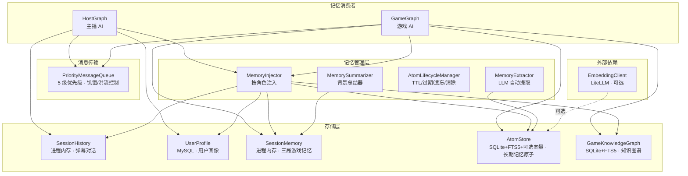

# FeinaLive 记忆系统

> **汇报板块七：记忆系统专题**
> 面向对象：技术管理者、架构师
> 目标：深入理解系统的多层级记忆架构——从会话上下文到长期知识图谱的完整设计

---

## 一、为什么要独立讲记忆

记忆系统是 FeinaLive 最容易被低估的模块。表面上它只是"存数据"，实际上它决定了 AI 能力的上限：

- **没有记忆**，AI 每句话都是独立的，观众感觉在和陌生人对话
- **记忆太粗糙**，AI 只能机械复述，无法体现个性
- **记忆结构不对**，主播 AI 和游戏 AI 互相干扰

我们设计的是一套**多时间尺度、按角色隔离、自动衰减与强化**的记忆体系，覆盖从毫秒级的弹幕上下文到跨周目的游戏知识图谱。

---

## 二、系统总体架构



---

## 三、五大存储组件

### 3.1 SessionHistory——会话级弹幕上下文

| 属性 | 值 |
|------|-----|
| 用途 | 主播 AI 的即时对话上下文 |
| 存储 | 进程内存，按 room_id 隔离 |
| 容量 | 最近 16 条对话（user + assistant 各半） |
| 生命周期 | 进程级别，随服务重启消失 |

每条弹幕被回复后，消息 ID 记入 `_answered_ids` 集合。AIHostBrain 的轮询逻辑通过 `is_answered(msg_id)` 过滤未回复弹幕，避免重复回答。

HostGraph 构建 Prompt 时，从 SessionHistory 取最近 10 条作为 history 消息拼入 LLM 调用。

### 3.2 UserProfile——观众持久画像

| 属性 | 值 |
|------|-----|
| 用途 | 记住每个观众的兴趣、印象、历史对话 |
| 存储 | MySQL，SQLAlchemy 异步写入 |
| 表名 | `user_profiles` |
| 生命周期 | 永久保存 |

每个 `UserProfile` 包含：

- **基本统计**：弹幕数、互动次数
- **话题列表**：自动从弹幕中正则提取（唱歌、游戏、动漫等 10 类）
- **AI 印象**：LLM 生成的 20 字以内的观众印象
- **长期记忆**：LLM 生成的观众背景描述
- **最近对话**：最近 16 条互动记录

**摘要触发**：当 `interaction_count - last_summary_count >= 10`，后台异步调用 LLM 生成新的印象和长期记忆，然后清空最近对话列表。避免用户画像随对话积累越来越长。

**注入方式**：HostGraph 处理弹幕时，`get_memory_context()` 拼接成文本注入 Prompt：

```
长期记忆：{long_term_memory}
印象：{impression}
关注话题：{key_topics}
最近对话：
{recent_messages 最后 6 条}
```

### 3.3 SessionMemory——游戏单局记忆

| 属性 | 值 |
|------|-----|
| 用途 | 游戏 AI 当前这一局的上下文 |
| 存储 | 进程内存，随 `MemoryEngine` 实例 |
| 生命周期 | 每局游戏开始时清空 |

三层文本块：

| 层级 | 更新方式 | 用途 |
|------|----------|------|
| Core（核心） | `update_core(content)` | 影响长期决策的规则 |
| Important（重要） | `update_important(content)` | 当前卡组、遗物、路线 |
| Recent（最近） | `append_recent(content)` | 最近战术动作 |

**待总结事件**：`pending_events` FIFO 队列（maxlen=40），每局游戏过程中的原始事件不断追加。当累积到 12 条时触发 LLM 压缩总结，将 pending 事件压缩为三层记忆结构，清空 pending。

**Prompt 文本格式**：
```
【核心记忆】
{core}

【重要记忆】
{important}

【最近记忆】
{recent}

【待总结近期事件】
{pending 最后 8 条}
```

### 3.4 AtomStore——长期记忆原子

| 属性 | 值 |
|------|-----|
| 用途 | 跨会话、跨周目的持久化知识 |
| 存储 | SQLite + FTS5 全文搜索 + 可选向量检索 |
| 表 | `memory_atoms` + `memory_atoms_fts` + `memory_atom_embeddings` |
| 生命周期 | 7~365 天，按类型和重要性动态 TTL |

**9 种记忆原子类型**：

| AtomType | base_ttl | 衰减方式 | 说明 |
|----------|----------|----------|------|
| GAME_MECHANIC | 180 天 | Exponential | 游戏机制知识 |
| GAME_LORE | 365 天 | Exponential | 游戏背景设定 |
| VIEWER_PREFERENCE | 60 天 | Exponential | 观众偏好 |
| VIEWER_FACT | 90 天 | Linear | 观众事实 |
| VIEWER_RELATION | 90 天 | Linear | 观众关系 |
| HOST_PERSONALITY | 365 天 | Exponential | 主播人设 |
| EPISODIC | 7 天 | Exponential | 情节记忆 |
| FACTUAL | 180 天 | Exponential | 一般事实 |
| UNKNOWN | 30 天 | Exponential | 兜底 |

**TTL 计算（`atom.py:132-147`）**：

每种原子类型有基座 TTL（`base_ttl`），最终 TTL 由两个因子动态调整：

```
ttl = base_ttl × importance_factor × reinforcement_factor

importance_factor = 0.5 + clamp(importance, 0, 1)
reinforcement_factor = 1.0 + min(0.5, reinforcement_count × 0.1)
```

`importance_factor` 范围 0.5–1.5：重要性 0.0 时 TTL 减半，1.0 时增长 50%。

`reinforcement_factor` 范围 1.0–1.5：强化次数越多 TTL 越长，上限 +50%。

最终取值 `max(1.0, ttl)`，确保最短不过 1 天。

实际存储时，`expires_at = created_at + ttl * 86400`。

**三种衰减曲线（`atom.py:47-64`）**：

`compute_decay_score(decay_type, ttl_days, days_since)` 计算时间衰减分数，范围 0–1：

- **Linear**：`max(0, 1 - days_since / ttl)`  
  每天等比例递减，适合观众事实这类随时间平滑消退的记忆。

- **Step**：`1.0` if `days_since ≤ ttl` else `0.05`  
  有效期全分保持，过期后瞬间跌至低分，适合需要硬性过期的场景。

- **Exponential**：`exp(-ln2 × days_since / half_life)`，其中 `half_life = ttl / 2`  
  半衰期按 TTL 一半计算，快速衰减后缓慢趋近 0，适合大多数记忆。

最终检索分数为 BM25 × 时间衰减分数，新访问（`touch()` 更新 `last_accessed_at`）会重置衰减窗口。

**向量检索（可选）**：

AtomStore 支持注入可选的 `EmbeddingClient`（基于 LiteLLM 的 embedding API 封装）。配置后在插入原子时自动生成向量存入 `memory_atom_embeddings` 表。已存在的原子可通过 `backfill_embeddings()` 批量回填。

检索算法升级为**混合检索**（`atom_store.py:search_fts`）：

```
1. FTS5 检索 + LIKE 回退 → BM25 scores（与纯 FTS5 模式相同）
2. 查询文本 → embed → query vector
3. 加载所有活跃原子的 embedding → cosine similarity
4. 混合融合：score = α × cosine_sim + (1-α) × BM25_norm（α=0.7）
5. 纯向量命中（FTS5 未匹配但语义相关）按 α × cosine_sim 记分
6. 最终排序：final_score = combined × temporal × (0.5 + 0.5 × importance)
7. 取 top-k
```

向量模型未配置或不可用时自动退化到纯 FTS5 检索，行为与原来完全一致。配置项可通过前端"AI 模型"标签页的"向量模型(Embedding)"区域或 config.yaml 的 `embedding:` 段设置。

**强化匹配（`lifecycle.py:84-137`）**：

新原子入库时，`run_manual_reinforcement()` 做相似度匹配：

1. 对新原子内容分词（tokenize），短文本或 CJK 使用字符 bigram 回退
2. 取前 8 个 token 做 FTS5 搜索，召回 5 个候选
3. 计算每个候选与新原子的 Jaccard 相似度：`|new ∩ existing| / |new ∪ existing|`
4. 相似度 ≥ 0.6 则强化：`reinforcement_count + 1`，置信度混合 `0.7 × old + 0.3 × new`，重算 TTL，更新 `last_reinforced_at`

这避免了 LLM 在多次决策中反复记录相同知识导致 AtomStore 膨胀。重复的高质量输入只会强化已有原子，而非新增冗余。

### 3.5 GameKnowledgeGraph——游戏知识图谱

| 属性 | 值 |
|------|-----|
| 用途 | 游戏实体间的结构化关系 |
| 存储 | SQLite + FTS5，按 game_id 隔离 |
| 表 | `graph_nodes` + `graph_edges` + `graph_nodes_fts` |
| 生命周期 | 持久化 |

**节点类型**：`card`(卡牌)、`relic`(遗物)、`enemy`(敌人)、`event`(事件)、`mechanic`(机制)

**边类型**：`synergizes_with`(协同)、`counters`(克制)、`belongs_to`(属于)、`found_in`(发现于)

**节点自动提取（`slay_the_spire.py:524-582`）**：

每次 GameGraph 获取游戏状态后，`SlayTheSpireAdapter.ingest_game_state_to_graph(state)` 自动执行：

```
1. 从 state.raw_state.combat_state.hand 遍历 → 每张卡创建 card 节点
   - 携带 properties: cost, type(攻击/技能/能力), rarity
2. 从 state.raw_state.relics 遍历 → 每个遗物创建 relic 节点
3. 从 state.enemies 遍历 → 每个敌人创建 enemy 节点
   - 携带 properties: hp, max_hp, intent(意图)
4. 所有节点组织成 [{type:"node", node_type:"card", name:"重击", properties:{...}}, ...]
5. 调用 graph.ingest(items) 批量入库
```

**节点入库（`graph_store.py:110-150`）**：

`add_node(node_type, name, properties)` 采用 upsert 语义：

1. `_canonicalize(name)` 规范化：去空格、小写，生成 `canonical_name`
2. `UPDATE graph_nodes SET properties=?, updated_at=? WHERE game_id=? AND canonical_name=?`
3. 更新影响行数 > 0 → 直接返回已有节点 ID（不做重复插入）
4. 更新影响行数 = 0 → `INSERT INTO graph_nodes` 新建 + `INSERT INTO graph_nodes_fts` 同步 FTS 索引

同名节点在同一个 game_id 内唯一，重复访问只更新 properties 和时间戳。

**边构建**：

边不是由游戏 AI 在决策过程中创建的——那样会把图谱构建绑定在游戏 AI 的调用行为上，频率不可控。我们设计了一个**独立的知识图谱构建器（`KnowledgeGraphBuilder`）**，它有自己的 LLM 调用和调度节奏。

构建器的工作方式：

1. **周期性扫描**（默认每 5 分钟）：从图谱中获取所有节点和已有边
2. **筛选未连接节点**：找出还没有被任何边关联的节点
3. **补充共现信息**：从 AtomStore 中查询本局的游戏知识原子（`GAME_MECHANIC` / `GAME_LORE` 类型），提取 entity 共现关系——如果"壁垒"和"金属化"同时出现在同一段记忆中，说明它们存在关系，作为提示传给 LLM
4. **LLM 批量推断**：将一批节点（最多 40 个）连同属性、已有边、共现提示一起发给 LLM，要求返回新的关系边
5. **写入**：调用 `add_edge_by_name()` upsert 入库

```sql
-- 边写入使用 upsert，重复写入取最大置信度
INSERT INTO graph_edges (source_id, target_id, relation, confidence, evidence)
VALUES (?, ?, ?, ?, ?)
ON CONFLICT(source_id, target_id, relation) DO UPDATE SET
    confidence = MAX(confidence, excluded.confidence),
    evidence = CASE WHEN excluded.evidence != '' THEN excluded.evidence ELSE evidence END
```

构建器通过 `MemoryEngine` 管理：`ensure_graph()` 创建图谱时同步创建并启动对应的构建器，`shutdown()` 时停止。

**查询注入（`injector.py:109-169`）**：

`_build_graph_context(session, graph)` 使用双策略提取当前游戏实体名：

1. **图谱反向匹配**（主力）：`graph.get_all_node_names()` 读取图谱所有节点名，检查哪些名称作为子串出现在 `session.important` + `session.core` 文本中
2. **正则文本解析**（兜底）：从记忆文本中解析 `牌组:xxx+yyy` 格式和 `- NAME` 遗物格式，用 `graph.search()` 确认图谱中存在后加入

两步的结果合并去重（取前 8 个），传入 `graph.get_related()`，对每个名称查询正向 `get_synergies` 和反向 `get_countered_by`，拼接为上下文文本注入 Prompt。

例如 SessionMemory 记录"目前走【力量战】，核心卡是【重击】"，构建器已写入了 `重击 --[synergizes_with]--> 燃烧` 这条边，图谱查询就会返回"与【重击】协同:   - 燃烧 (card)"——这个信息出现在 LLM 决策 prompt 中。

---

## 四、消息通道：PriorityMessageQueue

消息队列虽不存储"记忆"，但它是记忆流动的血管——解说请求、弹幕、礼物消息都通过它在 HostGraph 和 GameGraph 之间传递。

**五级优先级**：

| 优先级 | 数值 | 适用场景 | 丢弃策略 |
|--------|------|----------|----------|
| HIGHEST | 1 | 舰长礼物 | 永不丢弃 |
| HIGH | 2 | 解说请求 | 永不丢弃 |
| NORMAL | 3 | 普通弹幕 | 队列满且 allow_skip 时丢弃 |
| LOW | 4 | 洪流期弹幕 | 优先丢弃 |
| DISPOSABLE | 5 | 严重洪流 | 立即丢弃 |

**动态优先级算法**：

弹幕：
- 饥饿升级：超过 30 秒未消费，NORMAL→HIGH
- 洪流降级：20 秒内弹幕 ≥ 5 条，NORMAL→LOW；≥ 8 条 → DISPOSABLE
- 用户冷却：同一用户 3 秒内只处理一条

礼物：
- 按价值确定基础优先级（≥10000 金币→HIGHEST，≥5000→HIGH 等）
- 饥饿（60 秒未消费）→升一级
- 洪流（3 条/30 秒）→降一级

---

## 五、跨层编排

### 5.1 MemoryInjector——按角色注入

同一套存储，不同角色看到不同的记忆上下文：

| 角色 | 注入内容 |
|------|----------|
| 主播 AI（HostGraph） | HOST_PERSONALITY top 10 + 观众记忆 top 5 + EPISODIC top 5 |
| 游戏 AI（GameGraph） | SessionMemory 全量 + GAME_MECHANIC/GAME_LORE top 10 + 图谱关系 |

### 5.2 记忆工具

两个 LLM function-calling 工具，GameGraph 和 HostGraph 均可使用：

**`memorize`**：主动记录一条记忆，指定类型、重要性、实体。插入 AtomStore 的同时，如果是游戏类记忆则同步写入知识图谱。

**`recall`**：搜索已有记忆，按 FTS5 + 时间衰减排序返回 top-k。

### 5.3 思维链中的记忆操作

GameGraph 的 `request_memory_update` 工具允许 LLM 在决策过程中主动修改 SessionMemory：

- `rewrite` 模式：整体重写某一层（core/important/recent）
- `search_replace` 模式：在某一层中搜索替换特定内容

### 5.4 生命周期管理（`lifecycle.py` + `atom_store.py:625-677`）

**维护循环（`lifecycle.py:54-82`）**：

`AtomLifecycleManager` 是一个后台 asyncio 定时任务，默认每 24 小时执行一次 `run_maintenance()`，每次执行三步：

```
维护循环 → sleep(24h) → 维护循环 → sleep(24h) → ...
                          │
                          ├─ 1. expire_stale_atoms()
                          │     ACTIVE → EXPIRED
                          │     SQL: UPDATE SET status='expired'
                          │          WHERE status='active' AND expires_at < now
                          │
                          ├─ 2. forget_expired_atoms(older_than_days=7)
                          │     EXPIRED → FORGOTTEN
                          │     SQL: DELETE FROM memory_atoms_fts WHERE atom_id IN (...)
                          │     SQL: UPDATE SET status='forgotten' WHERE id IN (...)
                          │
                          └─ 3. cleanup_forgotten(older_than_days=30)
                                FORGOTTEN → DELETE
                                SQL: DELETE FROM memory_atoms_fts WHERE atom_id IN (...)
                                SQL: DELETE FROM memory_atoms WHERE id IN (...)
```

三步的间隔参数可通过配置调整：

| 参数 | 默认值 | 说明 |
|------|--------|------|
| `atom_maintenance_interval_hours` | 24 | 维护循环周期 |
| `atom_forget_delay_days` | 7 | 过期后多久标记遗忘 |
| `atom_purge_delay_days` | max(forget×4, 30) | 遗忘后多久物理删除 |

关键设计细节：

- **两步删除**：从 SQLite 删除记录时，先删 FTS 索引（`DELETE FROM memory_atoms_fts`），再删主表（`DELETE FROM memory_atoms`）。FTS 是虚拟表，外键约束不生效，需要手动同步。
- **状态递进不可逆**：ACTIVE → EXPIRED → FORGOTTEN → DELETE，单向流转，不提供恢复接口。
- **`forget_expired_atoms` 使用 `expires_at < cutoff` 而非状态时间**：以原始过期时间 + 遗忘延迟为判断基准，而非从过期那一刻起算 7 天。

**强化匹配（`lifecycle.py:84-137`）**：

新原子入库时，`run_manual_reinforcement()` 做相似度匹配：

1. 对新原子内容分词：空格分割取 token 集合
2. 中文短文本（token < 3）使用字符 bigram 回退：如"壁垒卡很强" → {"壁垒", "垒卡", "卡很", "很强"}
3. 取前 8 个 token 做 FTS5 搜索，召回 5 个候选
4. 每个候选与新原子计算 Jaccard 相似度：`|new ∩ existing| / |new ∪ existing|`
5. 相似度 ≥ 0.6 则执行 `reinforce(atom_id, new_confidence)`：

    ```
    reinforcement_count += 1
    新置信度 = old × 0.7 + new × 0.3
    新 TTL = compute_ttl(atom_type, importance, new_count)
    expires_at = now + new_ttl × 86400
    last_reinforced_at = now
    ```

强化效果叠加：加入多条关于"壁垒"的知识，每一条都与已有记忆做 Jaccard 匹配，匹配到的强化 +1。强化 5 次后达到 `reinforcement_factor` 上限（×1.5），TTL 不再增长。

### 5.5 知识图谱边构建器（`graph_builder.py`）

知识图谱的边不是由游戏 AI 在决策过程中创建的。我们把边推断独立为一个**KnowledgeGraphBuilder**，与 `memorize` 工具和游戏循环完全解耦。

**构建触发**：
1. 由 `MemoryEngine.ensure_graph()` 创建图谱时同步创建并启动对应的构建器
2. 构建器每 60 秒轻量轮询一次，检查图谱中新增节点数量
3. 当新增节点数 ≥ 5 时自动触发构建（首次启动不受阈值限制）
4. 新增节点不足时不浪费 LLM 调用；LLM 不可用时跳过但保留计数器，下次继续重试

**build_edges() 流程**：
1. `get_all_node_names()` + `search(name, k=1)` 获取所有节点及其属性
2. `get_synergies(name) + get_countered_by(name)` 收集已有边，避免 LLM 重复生成
3. 从 AtomStore 中查询本局游戏知识原子的 entity 共现信息，作为关系提示
4. **每次构建发送全部节点**（而非仅未连接节点），让 LLM 看到完整图谱——已连线的节点也可能与新节点形成新的边
5. 每批 ≤40 个，分批发给 LLM，已有边在 prompt 中标记为「不要重复」
6. LLM prompt 包含：全量节点列表（含属性描述）、已有边列表、共现提示
7. LLM 返回 `{"edges": [...]}` → `add_edge_by_name()` upsert 写入

**设计理念**：构建器的 LLM 调用与游戏循环的 LLM 调用互不干扰。构建器关心的是"这些实体之间有没有协同/克制"，游戏 AI 关心的是"当前这一手该怎么打"。两个 LLM 有不同的职责，不同的 prompt，不同的调用频率。改用按量触发后，没有新节点时不浪费资源。

### 5.6 解说协调（跨 Graph 记忆流动）

GameGraph 的 LLM 产生解说意图 → `CommentaryCoordinator` 合并/限流/注册 → 以 HIGH 优先级入消息队列 → HostGraph 消费 → 生成语言 + TTS 播报 → 通知 SharedContext → GameGraph 收到 ACK 继续。

解说请求从游戏 AI 流到主播 AI 的过程，本质上是记忆（解说意图）在系统内的流动。

---

## 【讲解稿】

### 开场：为什么要独立讲记忆（约 1 分钟）

记忆系统是 FeinaLive 最容易被低估的模块。从功能上看，它就是一个存数据的地方，但实际上一套直播 AI 系统的智商上限，很大程度上取决于记忆系统的设计水平。

我们设计了一套覆盖五层存储、按角色隔离、有自动衰减和强化机制的记忆体系。这套体系同时服务于两个 AI 角色——主播 AI 和游戏 AI——但它们看到的是完全不同的记忆上下文。

### 总体架构（约 1 分钟）

整个记忆系统由五层存储构成：

第一层，**SessionHistory**——弹幕对话的即时上下文，存在进程内存里。第二层，**UserProfile**——持久化的观众画像，存在 MySQL 里。这两层为主播 AI 服务。

第三层，**SessionMemory**——游戏单局记忆，存在进程内存里。第四层，**AtomStore**——长期记忆原子库，存在 SQLite 里，用全文搜索引擎检索。第五层，**GameKnowledgeGraph**——游戏知识图谱，存在 SQLite 里。这三层为游戏 AI 服务。

中间有一个 MemoryInjector，负责按角色从各层检索相关记忆，注入到 LLM 的 Prompt 里。

### SessionHistory——弹幕对话上下文（约 1 分钟）

SessionHistory 是最轻量的一层。它存在的目的只有一个：让主播 AI 知道刚才说了什么。

每个房间有自己的实例，记录最近 16 条对话。当 HostGraph 调用 LLM 时，最近 10 条作为 history 消息拼进去。它还能判断哪些弹幕已经回复过——通过一个 `_answered_ids` 集合——这是 AIHostBrain 轮询逻辑的关键。

### UserProfile——观众印象管理（约 2 分钟）

UserProfile 比 SessionHistory 重得多。每个观众在 MySQL 里有一条永久记录，包含弹幕数、互动次数、话题偏好、AI 生成的印象和长期记忆。

处理每条弹幕后，系统会更新这个观众画像。当互动累积到一定次数，后台异步调用 LLM 生成新的印象——比如"喜欢聊游戏，热衷杀戮尖塔"——然后清空最近对话列表，避免画像越来越长。

这个机制使 AI 对新老观众有截然不同的表现：老观众来了，AI 说"欢迎回来，最近又在玩什么？"；新观众来了，就是标准问候。

### SessionMemory——游戏逐局记忆（约 1.5 分钟）

SessionMemory 是游戏 AI 的现场笔记。

每局游戏开始时清空，然后不断追加事件：出了什么牌、掉了多少血、走了什么路线。事件累积到 12 条触发一次压缩总结，由 LLM 把这些原始事件浓缩为三层结构——核心、重要、最近。

比如原始事件是"打出重击，造成 18 点伤害，敌人剩余 12 HP"和"格挡，获得 10 点护甲"，LLM 可能总结为"核心：力量战路线，以重击为主要输出"。

### AtomStore——长期记忆的原子化存储（约 3 分钟）

AtomStore 是整个记忆系统中设计最复杂的部分。

它存储的是最小的记忆单元——"记忆原子"。每个原子有类型、内容、重要性、置信度、有效期、衰减方式。

**9 种类型**覆盖了游戏的机制和背景、观众偏好和事实、主播人设、情节记忆等。每种类型有基座 TTL，再乘以重要性和强化次数做调整。比如游戏背景知识最长达 365 天，日常情节最短只有 7 天。

**TTL 不是固定的**，而是一个动态计算公式：`ttl = base_ttl × (0.5 + importance) × (1 + min(0.5, count × 0.1))`。重要性越低 TTL 越短，强化次数越多 TTL 越长，上限是 base_ttl 的 2.25 倍。

**衰减机制**是区分"真记住"和"只是存了"的关键。我们实现了三种衰减曲线：线性衰减每天等比例递减，适合观众事实；指数衰减按半衰期快速下降后趋缓，适合大多数记忆；阶梯衰减在 TTL 内全分保持、过期后瞬间跳落，适合需要硬性过期的场景。

**检索方式**：默认走 FTS5 全文搜索（BM25 算法）+ 时间衰减。同时我们做了可选的**向量检索扩展**：配置了 embedding 模型后，每个原子入库时自动生成向量存入专用表，检索时使用混合策略——向量余弦相似度（权重 0.7）和 FTS5 关键词匹配（权重 0.3）融合排序。没配置向量模型时自动退化到纯 FTS5，行为和原来完全一致。向量模型的配置项通过前端"AI 模型"页面的"向量模型"区域设置，provider 支持 OpenAI、Azure、Ollama 等。

**强化机制**：新记忆入库时做 Jaccard 相似度匹配。如果新内容和已有记忆高度相似（Jaccard ≥ 0.6），就不新增，而是强化已有。一个细节是：对中文短文本，我们用字符 bigram 做 token 化——比如"壁垒卡很强"变成 {"壁垒","垒卡","卡很","很强"}。相似度达标后，强化次数 +1，置信度按 0.7:0.3 混合新旧，TTL 重算延长。

### GameKnowledgeGraph——游戏知识图谱（约 1.5 分钟）

长期记忆还有一种形式——结构化关系。

图谱存的是杀戮尖塔里实体之间的关系。节点是卡牌、遗物、敌人、事件、机制五类，边是协同、克制、属于、发现于四种。

节点如何构建？每次 GameGraph 获取游戏状态后，Adapter 自动执行一个提取函数：遍历手牌创建 card 节点（带费用、类型、稀有度属性），遍历遗物创建 relic 节点，遍历敌人创建 enemy 节点（带血量、意图属性）。所有节点调用 `add_node` 入库，采用 upsert 语义——同一个 game_id 内同名的节点不重复创建，只更新属性。

入库时有一个规范化步骤：名称去空格、转小写生成 `canonical_name`，确保"重击"和"重 击"被识别为同一实体。

边不是由游戏 AI 在决策时创建的——那会把图谱构建绑定在游戏 AI 的调用行为上。我们做了一个独立的知识图谱构建器，它有自己的 LLM 调用和调度节奏。它每隔 60 秒轻量检查一次图谱中新增的节点数，当新增达到 5 个时才触发 LLM 构建，没新节点时不浪费 token。构建时发送全部节点让 LLM 看到全景图——而不只是未连接的节点，因为已连线的节点也可能与新节点产生新关系。这个过程完全独立于游戏循环。

图谱信息如何注入到 LLM 决策中？MemoryInjector 用双策略：一是反向匹配——把图谱中所有节点名和当前 SessionMemory 文本做子串匹配；二是正则解析——提取"牌组:xxx+yyy"格式和遗物列表中的实体名。合并后去重，调用 `get_related` 查询协同和克制关系。比如图谱里已经有了"重击--[synergizes_with]-->燃烧"这条边，SessionMemory 里又有"重击"这个关键词，注入结果就是"与【重击】协同: 燃烧 (card)"——直接出现在 LLM 的决策 prompt 中。

### 消息通道与生命周期（约 1.5 分钟）

**PriorityMessageQueue** 虽然不存储记忆，但它是记忆流动的血脉。解说请求从游戏 AI 流到主播 AI 的整个过程——GameGraph 产生意图 → 消息队列 → HostGraph 消费播报——本质上是记忆在系统内的传递。我们为消息设计了五级优先级、饥饿升级和洪流降级，确保重要记忆不被淹没。

**生命周期管理**的核心是三步递进：第一步"过期标记"，把所有 `expires_at` 已过的 ACTIVE 原子改成 EXPIRED；第二步"遗忘"，EXPIRED 超过 7 天的改成 FORGOTTEN，同步删除 FTS 索引记录；第三步"物理删除"，FORGOTTEN 超过 30 天的直接从数据库 DELETE。状态只进不退。

同时入库时的智能匹配也会影响生命周期：高质量重复输入不做冗余存储，而是强化已有原子，延长它的 TTL。

### 总结（约 30 秒）

FeinaLive 的记忆系统覆盖了从毫秒级弹幕上下文到跨年游戏知识的全部时间尺度。五个组件各司其职——SessionHistory 管即时对话，UserProfile 管观众印象，SessionMemory 管游戏全局，AtomStore 管通用知识原子，知识图谱管结构化关系。它们通过 MemoryInjector 按角色差异化注入，配合原子生命周期管理，构成了一套完整的 AI 记忆体系。
