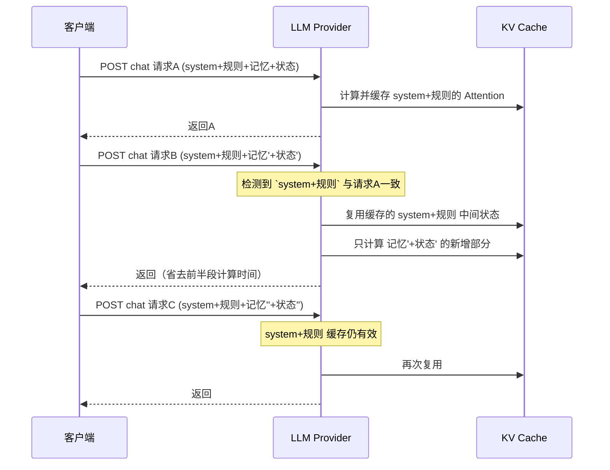

# FeinaLive 提示词工程

> **汇报板块八：提示词构建的艺术**
> 面向对象：技术管理者、架构师
> 目标：理解我们如何设计 Prompt 结构以最大化缓存命中率、降低延迟与成本

---

## 一、这个系统对 Prompt 的特殊要求

游戏 AI 每 1–3 秒决策一次，主播 AI 每秒处理多条弹幕。日 LLM 调用量在十万级别。

Prompt 结构的差异直接影响三件事：每次调用多几毫秒的延迟 × 十万级调用 = 显著的成本差异；前缀结构变了，LLM 提供商的服务端 Prefix Cache 就失效了；结构频繁变化，AI 回复风格也跟着飘。

---

## 二、两次消息之间的缓存复用机制

主流 LLM 提供商（DeepSeek、OpenAI、Claude、Google）都在服务端做了跨请求的 KV-Cache 复用：如果连续两次请求的 messages 数组**从第一条消息的头部开始**完全一致，服务端可以把已经算好的 Attention 中间状态直接复用，跳过前半段的重计算。

这个机制只对**多轮对话之间**的前缀复用作效。对于我们这种每次都是新请求的系统，关键在于把**尽可能多的不变内容放到 messages 的开头**，让每次请求的前缀都能命中缓存。



这个图中的 `system+规则` 只要不改变，就能持续命中缓存。设计 Prompt 的目标就是**让这个前缀尽可能长，且尽可能不变**。

---

## 三、三种 Prompt 类型的真实装配流程

### 3.1 游戏 AI 决策 Prompt——最重的装配流程

这是系统中最重要的 Prompt。装配流水线跨三个方法，分布在两个文件中：

**第一步：收集原料（`game_graph.py:_collect_data`）**

```python
# 并行拉取所有动态原料
game_state = await adapter.get_state()           # MCP 实时游戏状态
host_history = await shared.get_host_history(5)   # 最近 5 条主播对话
game_history = await shared.get_game_history(12)  # 最近 12 条操作记录
memory_text = await engine.inject_for_game(id)    # 三层记忆 + 图谱关系
# memory_text 是带 【】标记的文本
core, important, recent = _split_memory_text(memory_text)
```

同步流程注记：`inject_for_game` 内部还发了两次 FTS5 查询（AtomStore）+ 一次图谱查询（`_build_graph_context`），这步是异步但顺序等待的。

**第二步：组装 system prompt（`game_graph.py:build_game_system_prompt`）**

13 个参数注入一个 f-string 模板，输出大概结构如下（加 `>>` 标记的是动态内容）：

```
你是杀戮尖塔游戏AI，控制主播玩游戏并与观众互动。
                                                          ← 前缀稳定区开始
【你的双重角色】          → 静态：操作者+智囊角色描述
【战斗核心原则】          → 静态：斩杀优先、格挡判断、敌人索引
【游戏基础知识】          → 静态：费用机制、出牌规则
【核心记忆】              → >> core_memory 或「（暂无）」
【当前牌组/遗物】         → >> important_memory 或「（暂无）」
【近期操作细节】          → >> recent_memory 或「（暂无）」
【游戏记忆系统】          → 半静态：基于 eagerness 的选择性文本
【解说与互动指导】        → 半静态：距上次解说时间的提示
【操作历史】              → >> 最近 12 条游戏操作
【主播近期互动】          → >> 最近 5 条主播对话
【当前游戏状态】          → >> MCP 获取的实时状态（变化最大）
                                                          ← 前缀稳定区可能在此结束
返回格式要求 + JSON 示例  → 静态，但被上述内容隔断，不纳入前缀
```

**第三步：追加工具定义（`game_graph.py:_build_prompt`）**

```python
system_content = build_game_system_prompt(...)
system_content += "\n\n【可用MCP工具】\n" + formatted_tools
```

这一步在第二步的返回文本末尾追加工具定义列表。工具定义是半静态的——工具名和参数结构固定，但参数的 enum 取值可能随游戏进度变化。

**第四步：构造请求（`game_graph.py:_llm_decide`）**

```python
messages = [
    ChatMessage(role="system", content=system_content),
    ChatMessage(role="user", content="请返回JSON格式的决策。\n【可用动作】\n" + available_actions),
]
request = ChatRequest(messages=messages, tools=tool_definitions, ...)
```

注意这里 `tools=tool_definitions` 是作为 API 参数传递的，不在 messages 中——不影响消息级前缀缓存。

### 3.2 主播弹幕回复 Prompt——轻量一次性的装配

```
system: {人设文本 + 历史记忆}

user: 「请回复弹幕：{弹幕内容}」
```

人设文本来自 `get_host_system_prompt()`，加载顺序：`config.llm_prompts["host_chat"]` → `prompts/host.txt` → 内置默认文本。有缓存：`PromptManager._cache` 按文件名缓存。

历史记忆来自 `engine.inject_for_host(user_id)`，返回格式：

```
【关于自己】
- 主播人设原子 top 10

【关于这位观众】
- 观众事实/偏好 top 5

【最近互动】
- EPISODIC 原子 top 5
```

这三段拼接到 `DANMAKU_REPLY_PROMPT` 模板的 `{viewer_memory}` 占位符。弹幕回复时 `{viewer_memory}` 大多数情况为「（暂无）」——新观众没有积累。

### 3.3 解说/礼物感谢 Prompt——更简单的模板

两个模板共享相同的结构性：人设在前，上下文在后。区别只是上下文内容的来源不同：解说的 `key_points` 和 `mood` 来自 GameGraph 的 `request_host_commentary` 调用参数；礼物感谢的 `gift_info` 来自 B 站礼物消息的 `data.gift_info`。

无历史消息拼接——这两个场景不需要对话上下文。

---

## 四、三个实际的缓存优化策略

### 策略一：`（暂无）` 占位符保结构

这是代码中最直接的缓存优化。如果记忆 section 为空，不删除整段，而是呈现「（暂无）」：

```python
# game_graph.py:190-196
{core_memory or '（暂无）'}

【当前牌组/遗物】
{important_memory or '（暂无）'}

【近期操作细节】
{recent_memory or '（暂无）'}
```

代价是每次请求多传 9 个字符（「（暂无）」UTF-8 约 9 字节），换来的是系统 prompt 的**精确一致的前缀长度**。

对比不做占位的情况：新游戏开局时核心记忆为空，此时 prompt 从第 4 行直接跳到第 6 行；击杀了第一个敌人后核心记忆写入一行文字，prompt 变成 5 行。前后两次请求的系统 prompt 在第 4 行就出现了分歧——缓存从第 4 行开始完全失效。

有了 `（暂无）` 占位，新游戏开局和第一轮操作后，前缀在第 N 行之前是完全一致的。缓存从第 N+1 行才开始需要重新计算。

N 的值取决于哪些 section 是空的。在一个典型场景下（core 和 important 已填充但 recent 为空），`（暂无）` 只保护 recent 一个 section。但游戏刚开始时所有三层都为空，`（暂无）` 保护了三个 section，避免新游戏开始的几次决策全部缓存失败。

### 策略二：system 和 user 分离

所有 LLM 调用都遵循 `[system, user]` 的两消息结构。system 消息承载全部上下文和规则，user 消息承载本轮输入。

对缓存的意义：**user 消息的变化不会污染 system 消息的缓存**。每次游戏决策的 user 消息是"请返回JSON格式的决策"加上不同的 `available_actions`，其前缀 `"请返回JSON格式的决策"` 也能命中 user 级的 KV-Cache。

如果反过来——把游戏状态放到 user 消息，把决策指令放到 system 消息——user 消息每次完全变化，`请返回JSON格式的决策` 这段前缀缓存就浪费了。

主播侧更有代表性：`DANMAKU_REPLY_PROMPT` 模板产生 system 消息，内容是人设 + 历史记忆 + 弹幕。这里人设是稳定的，但历史记忆和弹幕内容都在变。所以我们做了一个细分：把从 `inject_for_host` 获取的观众记忆拼进 system 而不是 user——虽然它可能变化，但它是一个固定位置的完整 section，比放在 user 里支离破碎更有利于缓存。

### 策略三：Tool 定义走 API 参数而非消息文本

观察 `_llm_decide`：

```python
request = ChatRequest(
    messages=[system_msg, user_msg],
    tools=state.tools,           # ← OpenAI function calling 协议
    tool_choice="auto",
)
```

`state.tools` 包含 MCP 工具定义和系统内置工具定义。如果把这些工具定义拼到 system 消息的文本中（作为自然语言描述），MCP 工具的增减或参数变化会导致 system 消息的变化，从而破坏整个前缀缓存。

走 API 参数 `tools` 后，工具定义**不参与 messages 序列的拼接**——它们在请求体中是独立字段，不影响消息内容的连续性。

系统 prompt 中仍然有一段 `【可用MCP工具】` 的文本描述，但那主要是为 JSON mode 降级场景准备的。在正常使用 tool calling 时，真正起功能约束作用的是 API 参数 `tools`，文本描述段即使变化也不会破坏 messages 的前缀缓存结构。

---

## 五、缓存友好度的量化评估

按当前实现，一次典型的游戏 AI 决策请求中 messages 各段的缓存友好度：

| 消息位置 | 内容 | 长度 | 变化频率 | 缓存友好度 |
|---------|------|------|---------|-----------|
| system[0:3行] | 双重角色 + 战斗原则 + 基础知识 | ~800 chars | 几乎不变 | ★★★★★ |
| system[核心记忆] | 游戏规则总结 | ~100 chars | 每层总结时变 | ★★ |
| system[牌组/遗物] | 当前卡组 | ~100 chars | 选牌/拿遗物后变 | ★ |
| system[近期操作] | 战术路线 | ~100 chars | 每次操作可能补 | ★ |
| system[记忆系统] | eagerness 指引 | ~400 chars | 仅配置变更时变 | ★★★★ |
| system[解说指导] | 距上次解说时间 | ~200 chars | 每次解说请求后变 | ★★ |
| system[操作历史] | 最近 12 条操作 | ~300 chars | 每轮追加 | ☆ |
| system[主播互动] | 最近 5 条对话 | ~200 chars | 新弹幕时变 | ☆ |
| system[游戏状态] | MCP 实时状态 | ~500 chars | 每轮变化 | ☆ |
| system[工具文本] | MCP 工具描述 | ~500 chars | 半静态 | ★★★ |
| user | 决策请求 + 可用动作 | ~100 chars | 可用动作每轮变 | ★ |

缓存友好段（前缀 ~800 chars）基本稳定。中间三段（核心记忆、牌组、近期操作）按需变化，但通过 `（暂无）` 占位保结构。末尾最动态的几个段（操作历史、游戏状态）每轮必变，但它们通过 API 参数 `tools` 将工具定义从消息文本中剥离，减少了对前缀的冲击。

整体估计：在系统配置不变、不触发记忆总结的一轮战斗中，消息前缀的约 50% 可以持续命中服务端缓存。

---

## 六、四个可继续优化的方向

基于上述分析，还有四个优化空间：

1. **纯格式指令移到 user 消息**：`build_game_system_prompt` 末尾的返回格式要求（JSON 示例、字段说明）是纯静态的，但被夹在动态内容之后。如果将其移到 user 消息开头，system 消息可以完全由"规则 + 上下文"构成，user 消息前缀也更稳定。

2. **工具定义仅在 JSON 降级时拼入文本**：正常使用 tool calling 时，`【可用MCP工具】` 文本段是冗余的。可以只在 JSON mode 降级时才拼接这段文本，tool calling 模式下省略，减少 system 消息长度和变化源。

3. **游戏状态按变化频率分组**：当前游戏状态大段拼接，所有字段都在变化。如果分成"稳定信息（角色、楼层、金币）"和"动态信息（手牌、能量、敌人 HP）"，稳定信息放在前缀侧、动态信息后置，可以延长缓存命中部分。

4. **MCP 工具定义的文本描述静态化**：当前工具定义的 enum 参数值直接拼入文本描述，导致工具名一变化整段缓存失效。如果只写工具名和用途，enum 值抽到 user 消息的 available_actions 中，工具定义段就能完全静态化。

---

## 【讲解稿】

### 开场（约 30 秒）

这套系统日调用 LLM 在十万级别。Prompt 的结构直接影响延迟——多 200 token 的前缀差异，在服务端 Prefix Cache 失效时，每个请求多等几百毫秒，一天积累下来是一笔不应花的成本。我们把 Prompt 当成性能问题来对待。

### 服务端 Prefix Cache 的原理（约 1 分钟）

现在主流 LLM 提供商都有跨请求的 KV-Cache 复用机制：如果连续请求的前缀完全一致，服务端可以直接复用之前算好的中间结果，只算新增部分。这个机制不依赖我们做应用层缓存，只需要我们在**消息结构上为它创造条件**——把不变的内容尽量前置，且保持精确匹配。

（图示意：请求 A 计算并缓存 system + 规则，请求 B 检测到同样前缀直接复用，只算记忆和状态的增量）

### 游戏 AI Prompt 的四步装配（约 2.5 分钟）

这是最重的一条 Prompt。装配跨三个方法、两个文件，我们分步骤讲。

第一步，`_collect_data` 并行拉取四路原料：MCP 的游戏状态、主播对话历史、游戏操作历史、MemoryEngine 的三层记忆。第四路是同步中的最慢环节——`inject_for_game` 内部还发了两趟 FTS5 查询加一趟图谱查询。但这一步只做原料采集，真正的 Prompt 拼接在后面。

第二步，把 13 个参数注入一个 f-string 模板，产出系统消息。注意它的 section 排列顺序：前三个段（角色、战斗原则、基础知识）是纯静态的，中间三个段（核心、牌组、近期操作）是动态的但做了 `（暂无）` 占位处理，后面跟着记忆系统和解说指引两个半静态段，最后是操作历史、主播对话、游戏状态三个高动态段。格式指令和 JSON 示例在末尾。

第三步，追加工具定义。注意这部分是以文本形式拼在系统消息末尾的。MCP 工具有点特殊——它在 API 参数里有独立的 `tools` 字段传给 function calling 协议，又在系统消息文本里有一份中文描述。文本描述是为 JSON mode 降级准备的，正常 tool calling 下是冗余的。

第四步，构造最终请求：一个系统消息 + 一个用户消息。用户消息就是简单的"请返回JSON格式的决策"加上当前可用动作。

### 主播 AI 的轻量装配（约 1 分钟）

主播侧的装配简单得多：系统消息来自 PromptManager 缓存的人设文本加上 inject_for_host 的观众记忆；用户消息就是模板格式化后的弹幕内容。注入的历史记忆分三段——关于自己、关于这位观众、最近互动——每段取自不同类型的记忆原子。

### 三个缓存优化策略（约 2 分钟）

第一个策略是 `（暂无）` 占位保结构。游戏刚开始时三层记忆全部为空，如果没有占位，前几轮决策的 system prompt 长度每次都在变，缓存从第一段动态内容开始就彻底失效。有了占位，前三段动态内容维持固定长度和位置，直到记忆实际写入才发生变化。

第二个策略是 system 和 user 分离。所有调用统一使用 system 承载上下文、user 承载本轮输入。user 内容的变化不会污染 system 的缓存。如果把游戏状态放到 user 里、决策指令放到 system 里，效果是一样的——跨请求时 system 不动，变化的只有 user。

第三个策略是工具定义走 API 参数。MCP 工具名和参数结构的变化如果拼入系统消息文本，会破坏前缀缓存。通过 `tools=state.tools` 以 API 参数传递，工具定义不参与 messages 序列的拼接，增减工具不影响系统消息的缓存。

### 当前方案整体评估（约 30 秒）

按目前实现，一场战斗中的连续决策请求，前三段静态规则（约 800 字符）可以稳定命中缓存。三层动态记忆通过占位保结构，记忆不更新时不产生变化。末端的操作历史和游戏状态每轮必变、无法缓存。整体估算约 50% 的前缀长度可以持续命中缓存。

文档最后列了四个优化方向：格式指令移到 user 消息、双版本工具描述按模式选择、游戏状态按变化频率分组、工具 enum 值抽离到 user 侧——前两个改动不大，后两个涉及 MCP 适配器的拆分，优先级不高。
